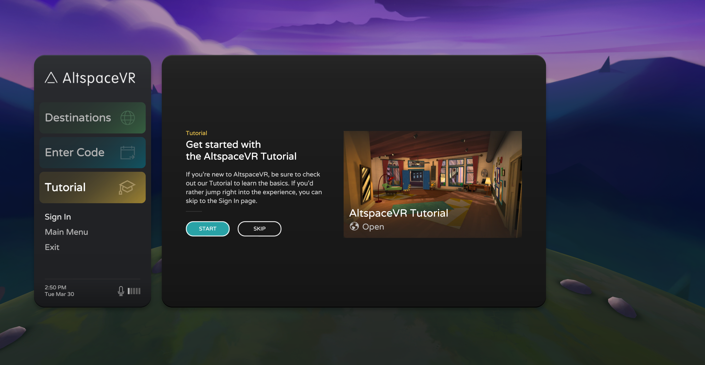
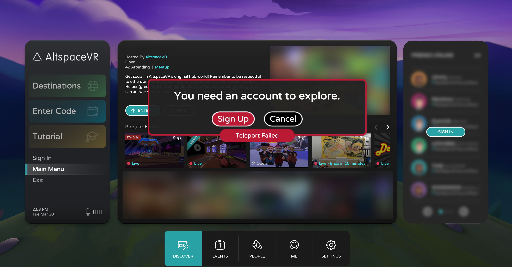
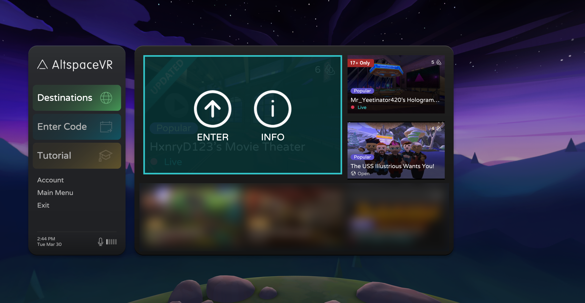
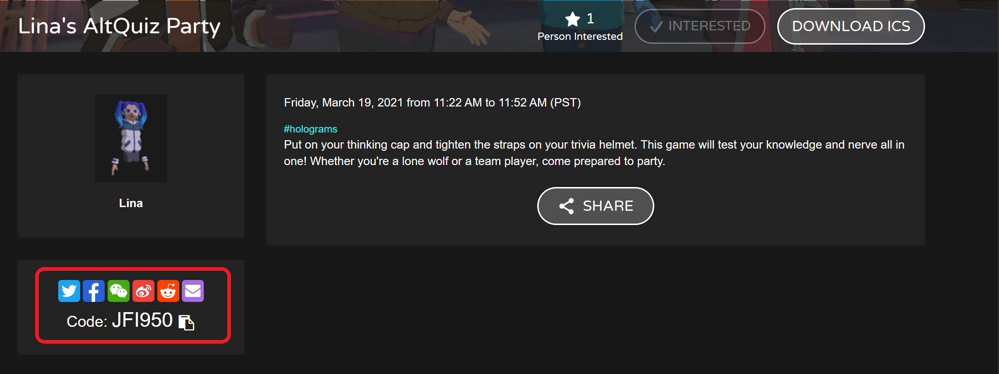
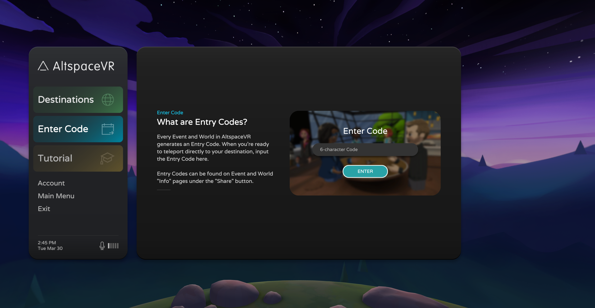
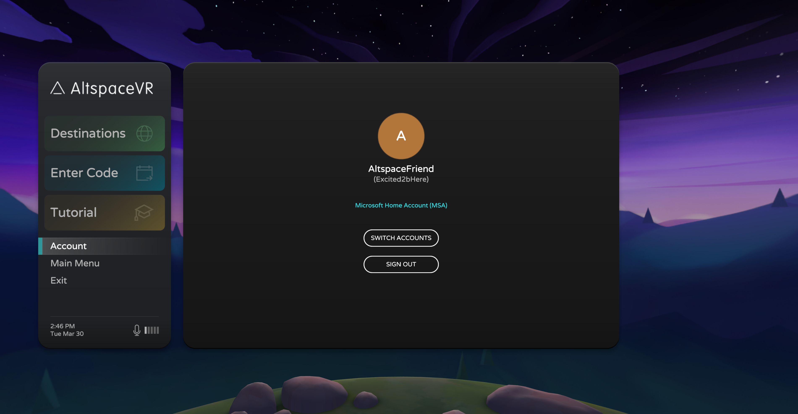
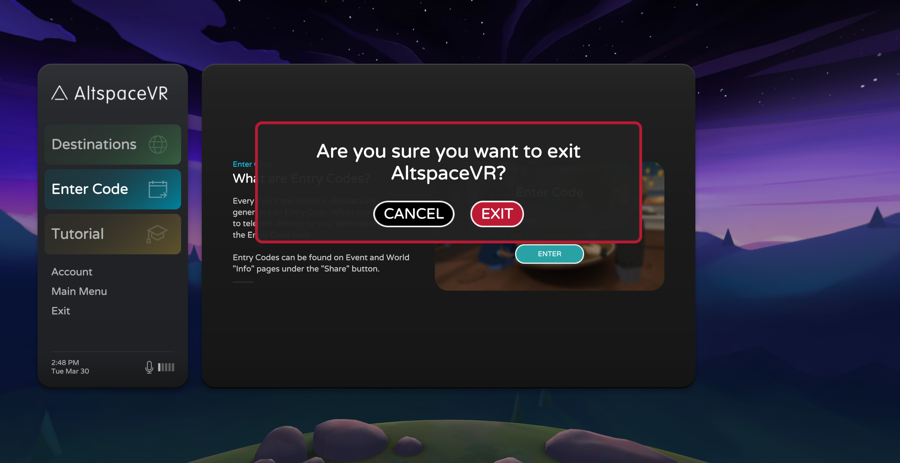

# Exploring the Title Screen

The AltspaceVR Title Screen is your primary starting point for exploring the platform. From here, you can do things like login, explore the Main Menu, enter an event with a code, customize your avatar, and more. Below is an overview of the Title Screen and its functions. 

## Tutorial Features & login 

If it's your first time launching AltspaceVR, you'll start your journey as a guest user. A guest user is a temporary identity granted to allow you to explore at your own pace before logging in to your AltspaceVR account. For new VR users that want to practice the basics before jumping into the action, try out our [tutorials](../tutorials/host-tools-overview.md). You can skip the tutorial and sign in if you feel comfortable jumping directly into AltspaceVR. 

You can also explore the Main Menu and view the events calendar as a guest, but you can't enter events. Account sign-in is required to navigate beyond the Title Screen. To continue, log in to your AltspaceVR account by selecting the **Sign In** option. 

If your AltspaceVR account links to your Microsoft Account, select the **Sign-in with Microsoft** option. If you don't have a Microsoft-linked account, select the **Sign-in with AltspaceVR** option. You can find step-by-step account linking instructions here: [Linking Your Microsoft Account](../getting-started/linking-microsoft-account.md). 

## Destinations 

The green **Destinations** button on the left is where you'll find things like AltspaceVR Hubs, your Homespace, upcoming Spotlight Events, or any events you've recently attended. You'll also find events that your friends may be attending. The **Destinations** panel makes navigating to key places quick and straightforward. 

## Entry Code 

In AltspaceVR Entry Codes are alphanumerical codes that allow for streamlined event entry. You can find an Entry Code by using the **Share** button on the event page in VR. You can also locate it just above the social-share icons on the event page on [altvr.com](https://altvr.com). 

If you have the code for the event, you'd like to attend, enter it into the Title Screen and teleport directly to your destination.  

## Other Functions 

The final few functions available in the Title Screen are **account** **Main Menu** and **Exit**. These options mimic the ones found in your radial HUD menu when you are in Events, Hubs, Worlds, or your Homespace. 

The **account** section gives you several options related to your AltspaceVR account. Here you can review your credentials, connect your AltspaceVR account to a Microsoft Account (or AAD for enterprise users), switch to another account, or sign out of your current account. 

The **Main Menu** option in the Title Screen is the same as the Main Menu that you access using your radial HUD elsewhere. Here, you can browse through the tabs for the following features:

* Discovering Hubs
* Exploring the events calendar
* Browsing worlds
* Managing your friends' list
* Viewing your account details
* Access your settings.

The **Exit** button closes the AltspaceVR app. By selecting this option, you're choosing to shut down AltspaceVR entirely. Once you confirm the exit dialogue, the app will close itself automatically. 

