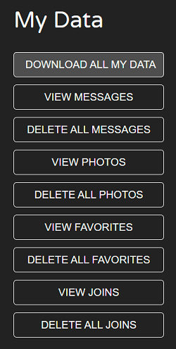
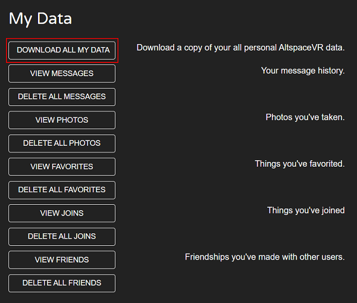

# How To, FAQs & Contact Support

>[!Important]
>Please download your content *before* March 10, 2023

AltspaceVR is shutting down on March 10, 2023. Below are the information you will need to:

* Download your content
* Answer your questions
* Contact support

## How to download your AltspaceVR content

For the quickest and easiest way to download all available data on AltspaceVR at once, see [**How to download my available data**](#how-to-download-my-available-data). Or, you can view and download several elements of your content, such as:

* Photos in bulk 
* Individual photos 
* Download **my data**
* Metadata from AltspaceVR Worlds
* Content from the AltspaceVR website 
* View metrics from previous events 

### How to download your Photos with the in-app Bulk Photo Downloader 

Launch the AltspaceVR app on your PC or Mac. If you are already signed into the AltspaceVR app, you will be automatically directed to the Bulk Photo Downloader page. You can then select Download All to begin the process of downloading all your AltspaceVR Photos to your computer. You can select **Stop** to pause the downloads if necessary.

>[!Note]
>This may be a time-intensive, and storage space-consuming process, so please plan accordingly.  

>[!Tip] 
>You cannot be in an event or World when using the Bulk Photo Downloader. If you need to come back to this menu, either do this when you start the AltspaceVR app next time, or if you are in an event or world, select the **Title Screen** button from the Radial Menu, then **Main Menu > Me > Download All Photos > Download All**. 

Once you have downloaded all your Photos with the downloader, you will not be prompted the next time you use AltspaceVR. If you want to download any new Photos after this point, please follow the instructions on **How to download individual Photos**. 

>[!Note] 
>The in-app Bulk Photo Downloader is not supported on Quest devices. Please use the AltspaceVR app on PC or Mac to download all your photos. 

### How to download your individual Photos 

Log into <https://altvr.com> on your PC or Mac, select Photos from the top menu. This will take you to your Photos page: <https://account.altvr.com/photos>.  

Select the Photo you want to download, select the Photo again, and the full-sized Photo will download from your browser. 

Alternatively, you can follow the instructions on **How to download all your available data at once**. The `my-data.zip` file will contain your `photos.csv` file. This has a list of URLs to all your individual Photos. Then, you can copy and paste the URL into your browser to download the full-sized Photo. 

### How to download my available data 

1. Log into <https://altvr.com>, and select your account. It can be your email or profile image, on the top right corner of the browser screen. Or once you're logged in visit: <https://account.altvr.com/user_profile>.

    
 
2. Select **My Data**. You will see the list of items you can either Download, View or Delete:

    

3. To download every available item at once, select **Download All My Data**: 

    

**Please wait a few moments while we build the file for you.** Then, you will see the `my-data.zip` file start downloading from your browser.

### What you can expect when you download the my-data.zip file

The downloaded my-data.zip file will look like this:

Select **Open file**, and then **Extract All** to a folder on your computer. You will be able to see your full list of .csv files.

>[!Note] 
>You may not see all listed file types. For example, if you’ve never created a Channel, you will not see the channels.csv file.

The table below lists the types of files you may find and the content in each file:
 
| Filename | File content |
| --- | --- |
| **admin_memberships.csv** | List of Events, Worlds or Groups you had Admin role |
| **avatars.csv** | Configuration data for your AltspaceVR avatar |
| **channels.csv** | List of Channels you created |
| **content_packs.csv** | List of your Content Packs  |
| **devices.csv** | Device IDs that you used to log into AltspaceVR  |
| **events.csv** | Events you created, including Name, Description, Instructions, Tagline, Code, Start/End Times, Interested, Attended, Peak Concurrent Users, Overall Rating, Main Event, Private, Mature, Tile/Banner URLs, Twitter handle, YouTube ID and Creation Date |
| **experiences.csv** | Activities you created  |
| **favorites.csv** | Events or Worlds you favorited |
| **friends.csv** | Your Friends List, including their Display Name, Username, date and time you Friended them |
| **group_memberships.csv** |  Groups that you were a member of  |
| **groups.csv** | Groups you created |
| **joinings.csv** | All the Events and Worlds that you attended |
| **kit_artifacts.csv** | Artifacts that you created  |
| **kits.csv** | Kits you created |
| **messages.csv** | Your message history  |
| **objects.csv** | List of objects in your Worlds, including Object ID, Type, World ID, World Name, Artifact Name, Artifact ID, Kit Name, Kit ID, Name, Uri, Position, Rotation and Scale  |
| **photos.csv** |  List of URLs to your Photos, date and time taken |
| **ratings.csv** | Your rating history |
| **shared_content.csv** | Content you’ve shared with others |
| **skyboxes.csv** | List of URLs to your Skybox images |
| **templates.csv** | List of Templates you created  |
| **universes.csv** |  List of your Universes |
| **user.csv** | Your AltspaceVR UserID information |
| **user_notes.csv** | Notes you added to other people's Profiles  |
| **user_reports.csv** | List of reports you made (blocking, kicking, or reporting events) |
| **user_roles.csv** | List of Roles you were given during Events or in Worlds | 
| **worlds.csv** | Worlds you created, including SpaceID, Name, Description, Instructions, World Type, Universe, Group, Code, Joins (Weekly, Monthly, All Time), Favorites (Weekly, Monthly, All Time), Overall Rating, Private, Mature, Tile/Banner URLs, Twitter handle, YouTube ID, and Creation Date. |

### How to download the available items from your AltspaceVR Worlds  

AltspaceVR Worlds are not able to be downloaded in full or ported directly to another platform because AltspaceVR is a mix of Worlds made up of a collection of assets owned by a variety of different entities. While you cannot download them in full, you are able to download items from your Worlds data, which we call meta-data. Follow the instructions for [**How to download my available data**](#how-to-download-my-available-data) above. The `my-data.zip` file will contain your `objects.csv` file. See the `objects.csv` file above for a list of what data you can export.  

### How to download all your past Events info and metrics at once 

Follow the instructions above on [**How to download my available data**](#how-to-download-my-available-data). The `my-data.zip` file will contain your `events.csv` file. This has a list of all your events and includes: Event Name, Description, Instructions, Tagline, Code, Start/End Times, Interested, Attended, Peak Concurrent Users, Overall Rating, Main Event, Private, Mature, Tile/Banner URLs, Twitter handle, YouTube ID and Creation Date.

### How to see all your individual past Event info and metrics 

Log into <https://altvr.com> on your computer, select **Events** from the top menu, then **My Events** and then **My Past Events**. This will take you to your My Past Events page at <https://account.altvr.com/events/my?state=finished>.  
 
Select the **Event** you want to look at, then scroll down the page and look on the left side of the page for **Metrics**. These stats include: **Interested**, **Attended** (unique people at your event), **Peak Concurrent Users**, **Joins** (total of all joins, including people joining the event multiple times) and **Overall Rating** (ratings for your event). 

### How to download your Friends List

We suggest you meet with your friends in AltspaceVR before March 10th, 2023, to exchange contact information to stay connected.  

To download your Friends list, you can follow the same instructions as **How to download my available data**. When you unzip the `my-data.zip` file you will see the `friends.csv` file containing your **Friends** List. 

If you’d like to remove your First Name and Username from all your friend’s Friends Lists, follow the instructions on [**How to download my available data**](#how-to-download-my-available-data) and select **My Data**, then **Delete All Friends**.

## Frequently asked questions

### When is AltspaceVR shutting down?

Friday, March 10, 2023.

### What do I need to do?

Please download your content from AltspaceVR by March 10, 2023.

### What AltspaceVR content can I download?

You can download things like your Photos, Events information and metrics, AltspaceVR Worlds meta-data and other files. Specifically, these .csv files include lists of your: admin_memberships, avatar customizations, channels, content packs, devices, events, experiences, favorites, friends, group memberships, groups, joinings, kit artifacts, kits, messages, photo URLs, ratings, shared content, skyboxes, templates, objects, universes, user, user notes, user reports, user roles and worlds. 

### How do I download all my Photos at once?

When you launch the AltspaceVR app on PC or Mac you’ll be automatically directed to the in-app Bulk Photo Downloader where you can download all your photos. Downloader is not available for Quest devices. Downloading this data may be a time-intensive and storage-consuming process, so please plan accordingly.

### How do I download all my available content at once?

Log into <https://altvr.com>, select your account (email or profile image, top right) or once logged in visit <https://account.altvr.com/user_profile>. Select **My Data > Download All My Data**.

### Can I download my Friends List?

Yes, when you choose to download all available data, the `friends.csv` file containing your Friends List will be included in the `my-data.zip` file.

### Can I remove my information from Friends Lists?

Yes. If you’d like to remove your First Name and Username from all your friend’s Friends Lists, follow the instructions on [**How to download my available data**](#how-to-download-my-available-data), and select **My Data**, then **Delete All Friends**.

### How can I review my Event stats?

Log into <https://altvr.com> and go to <https://account.altvr.com/events/my?state=finished>. Select the event you are interested in pulling stats for, scroll down and look to the bottom left for **Metrics**.

### Why can’t I export my AltspaceVR Worlds in full?

AltspaceVR is a mix of Worlds made up of a collection of assets owned by a variety of different entities. You can export meta-data of your AltspaceVR World, but not the World in full. When you download the meta-data, they will appear as the `objects.csv` file with a list of your World’s objects meta-data. See `objects.csv` above to look at what data is available.

### Can I export my AltspaceVR Worlds to use on another platform?

No. You are not able to export your AltspaceVR Worlds in full and/or port them to another platform. If you initially built your world in Unity, the AltspaceVR meta-data you download will include information about the objects from your world, including position, rotation and scale. Using that meta-data plus the Unity files that you brought to AltspaceVR may help you rebuild your World in another platform. See `objects.csv` above to review what AltspaceVR files and objects are available.

### Can I use Unity to rebuild my World using my AltspaceVR meta-data I just downloaded?

No. AltspaceVR data files are not compatible with Unity.

### Are there any other platforms where my AltspaceVR meta-data is compatible? Or that you suggest I try to rebuild my World in?

There are several other platforms available today for world building and we suggest you connect other world builders for recommendations.

### When is the final deadline to download my content?

The final deadline is Friday, March 10th, 2023. Please ensure you've downloaded all your data before this time. Downloading this data may be a time-intensive and storage-consuming process, so please plan accordingly.

### What will happen to my data if I don’t download it by March 10th, 2023?

After AltspaceVR closes, all remaining data will be deleted as per Microsoft data retention policies.

### I’m having trouble downloading my content. How do I contact the AltspaceVR Support Team?

Visit <https://altvr.com/support> for instructions on how to send in a support request.

### Can I still download the AltspaceVR app? 

Yes. The app will be available for download until Friday, March 10th, 2023.

### How can I learn more about Microsoft Mesh? 

To learn more about Microsoft Mesh, visit <https://mesh.com>. 

## Contact support

To contact our support team, please visit <https://altvr.com/support>.
