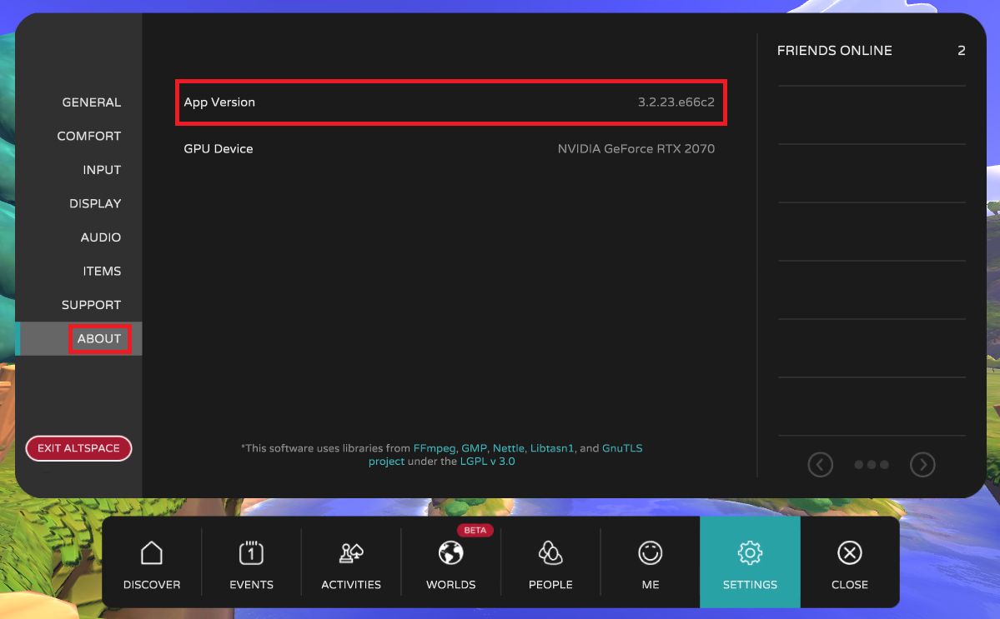
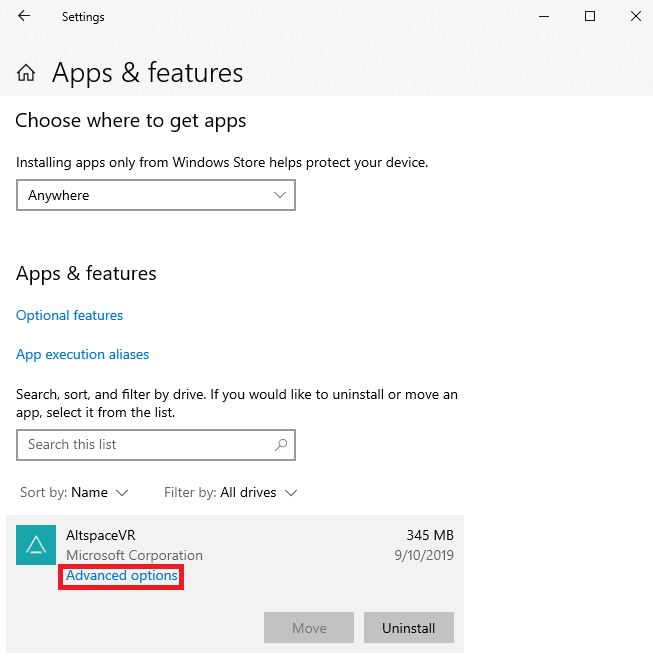
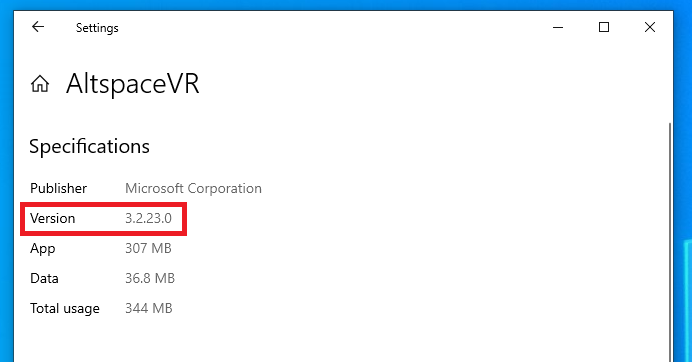

# Frequently asked questions about the AltspaceVR app

## Finding the AltspaceVR app version

In the course of troubleshooting an issue, you may be asked what version of the AltspaceVR app you're currently running.

### In AltspaceVR

To find the app version in AltspaceVR, navigate to the **settings menu** and select **About** in the left navigation bar. The 'App Version' is reported here, as shown in the screenshot below.



### In Windows System Settings

If you installed AltspaceVR via the Microsoft Store, you can additionally find the app version in the Windows system settings.  This scenario is a good fit when reporting the app version if you're unable to successfully log into the client.

To find the app version in Windows system settings, open the **Start Menu**, type in **Apps & Features**, and select the result. Navigate to **AltspaceVR** in the list of apps. Left-click AltspaceVR and select **Advanced Options** from the menu that appears.



In the **Advanced Options**, under the **Specifications** header, the **App Version** should be listed to the right of the **Version** label.



### App version in client logs

AltspaceVR reports the app version in the client logs file as "Altspace Version" during application startup. This would be a good option to get the app version if you can't successfully log into the client, but it did attempt to start before failing.

### Windows

On Windows, the client logs file can be found via Windows Explorer at:

```
%userprofile%\AppData\LocalLow\Microsoft\AltspaceVR\Player.log
%userprofile%\AppData\LocalLow\Microsoft\AltspaceVR\Player-prev.log
```

This file is overwritten each time you launch AltspaceVR. 'Player.log' represents your latest session, and 'Player-prev.log' represents the previous session.

### Via PowerShell

Advanced users can search the client logs for this string via PowerShell as follows:

Input:

```
gc $env:userprofile\appdata\locallow\altspacevr\altspacevr\Player.log | ? { $_ -match "Altspace Version" }
```

Output:

[2.047] AltspaceVR Version: 3.2.23.e66c2

## How do I upload my client logs?

The AltspaceVR client application keeps a log of diagnostic data and events that occur while you're using AltspaceVR. In the course of troubleshooting an issue, you may be asked to "upload your logs" so that our team can review them. This is a feature of AltspaceVR that allows you to send our team your local log content to help us troubleshoot your issue.

### In AltspaceVR

To upload client logs in AltspaceVR, navigate to the **settings menu** and select **Support** in the left navigation bar. Several options to upload logs are available here, as shown in the screenshot below.


### Fields

**"What Went Wrong?"**
Describe what happened - for example, if you find a bug, describe what you expected to happen in contrast to what actually happened). This information will be sent along with the log when you press upload.

**"Upload Logs"**
This button will upload logs from the current session. Use this option if you find an issue in this same session (for example, if you haven't closed the AltspaceVR client) and would like to report it.

**"Upload Last Logs"**
This button will upload logs from the previous session.

**"Upload Last Crash Log"**
This button will upload more log content from the latest crash you've experienced.

### In Client Logs

You can also retrieve your log files from your computer. Instructions on how to retrieve these logs can be found [here](#app-version-in-client-logs).


Once you've located those files, [open a support ticket](https://help.altvr.com/hc/en-us/requests/new) and upload your logs on your ticket request before clicking submit.

## What do I do if I can't launch AltspaceVR

There are several reasons why AltspaceVR may not launch for you. Try out the following steps to ensure the application is installed correctly with the necessary third-party software.

### If you're trying to launch AltspaceVR for the first time:

1. Verify that your device is supported and meets the [minimum specified requirements](../getting-started/system-requirements.md).
2. Make sure you have the latest [Oculus Software](https://www.oculus.com/setup) installed, and that Settings-> General-> Unknown Devices is set to ON. If launching in 2D mode, you don't need Oculus installed.
3. Make sure that you have a working internet connection. If you're attempting to launch Altspace from within a network firewall, open UDP ports 5055 and 5056, and TCP ports 80 and 443. If you are within the network of a corporate or educational firewall, you may need to contact the network administrator or IT department.
4. See also:
    * [Installing AltspaceVR for Oculus Quest](../getting-started/oculus-installation.md)
    * [Installing AltspaceVR for Windows Mixed Reality](../getting-started/wmr-installation.md)

### If AltspaceVR reports that the current version is out of date:

* The version of the application you're using is no longer supported. If you downloaded AltspaceVR through a storefront, the update may have launched recently before your store was able to update your client.
* If you would like to force update, you may do so through the various storefronts:
    * **Microsoft Store:** [Microsoft Store Support - Get updates for apps and games in Microsoft Store](https://support.microsoft.com/account-billing/get-updates-for-apps-and-games-in-microsoft-store-a1fe19c0-532d-ec47-7035-d1c5a1dd464f)
    * **Oculus:** Open your Oculus Library and navigate to 'Updates' in the left navbar.
    * **Steam:** [Steam Support - Update & Installation Issues](https://support.steampowered.com/kb_article.php?ref=2274-IFLV-5334)

### If the program was working, but ceased to launch after update:

* Do a 'Clean Reinstall' of the software. This requires you to uninstall or remove existing versions of the Application. Once fully removed from your system, install Altspace via Steam, Oculus, or Microsoft Store.
* If you do have a problem launching AltspaceVR, let us know via a [support ticket](https://help.altvr.com/hc/requests/new). Include a [log file](altspacevr-app-faq.md#how-do-i-upload-my-client-logs) from your session.

### If AltspaceVR fails to launch after customizing your home space:

* Navigate to your [home space's website](https://account.altvr.com/users/sign_in).
* Verify that your world's template still exists. If the template was shared with you, it may have been deleted by the owner, which would cause your home space to fail to load.
    * If the template has been deleted, simply 'Edit' the world from the left 'World Tools' panel, replace the existing template with another template, and 'Update' to save changes.
* Remove any objects that may be failing to load by selecting 'Objects' from the left 'World Tools' panel. Problematic objects may include:
    * Objects from deleted kits, or objects deleted from kits, that are still present in your world.
    * Experimental GLTFs.
* After addressing the items above, attempt to reenter AltspaceVR.

More advanced support for network administrators or IT departments, including Azure IP Ranges and Service Tags, can be found in our [download details](https://www.microsoft.com/en-us/download/details.aspx?id=56519).