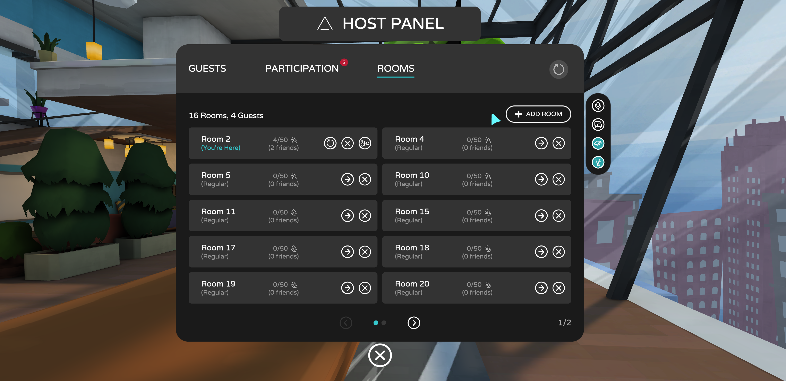

# Scaling your audiences with FrontRow feature

## What is FrontRow?

FrontRow is an AltspaceVR technology that allows your entire event to be ‘mirrored’ across multiple instances. FrontRow allows you to scale your audience beyond individual room caps, and can be used to accommodate large audiences in a single event. Without FrontRow, your audience size will be limited to the room-cap of your main environment.

## How does it work?

FrontRow adds extra features and abilities to the Host experience, giving you maximum control over your event and your audience. 

* The **On-Air** tool is added to your Host Panel.
    * With **On-Air**, you can choose who to 'mirror' (ex: presenters, performers, panelists, audience members, and so on) FrontRow also 'mirrors' content across all rooms. So if you have a panel of speakers and a slide presentation, you can 'mirror' your speakers and presentation across all your FrontRow rooms.
* A **Rooms** tab opens up in your Guest Panel.
    * This panel gives you an at-a-glance overview of how many rooms you have, how many guests are in each room, and who those guests are. From here, you can also choose to **Add Room** or **Delete Room** so you can manage the size of the setup that works best for your event.
    * You can teleport from room-to-room, and easily distribute your moderators across the spaces.
* Reactive audience distribution
    * As guests begin to enter your space, FrontRow will intuitively distribute them. It can be configured to fill up one room at a time, or to simultaneously fill several rooms for more even audience distribution.

## When to enable FrontRow

Convert to FrontRow when you need to scale beyond your environment room-capacity.

* Official AltspaceVR template environments allow for a maximum of 50 avatars per space. If you expect an audience larger than 50, use FrontRow to create multiple rooms of 50 avatars.
* Custom Words (Unity Uploader/Custom Space Templates), also allow for a maximum of 50 avatars per space if used as an event environment. If you expect an audience larger than 50, use FrontRow to create multiple rooms of 30 avatars.

## How to enable FrontRow

1. [Create your event](https://account.altvr.com/events/new).
2. Enter your event.
3. Once inside your event, open the **Host Tools** in your lower right-hand corner.
4. Select on the **Participation Panel** button.
5. Navigate to the **Rooms** tab and from here you can **Add Room**
    * Note, it may take up to 30 seconds to generate another room. 
6. Once your new room is open, you'll see it appear in the **Rooms** tab. 

## How to use FrontRow

Converting your event to a FrontRow event adds some extra tools and abilities to your Host Panel. Most notably, a **Rooms** tab will appear. From this tab, you can:

* **Add Room** - Add an extra room to your event. 
* **Delete Room** - Remove an entire room from your event.
* **Reset Space** - Reset the room you've selected. This causes guests to reenter the same space.
* **Redistribute** - Redistribute all guests currently in a room, into other rooms. (Good for crowding.)
* **Teleport** - Go to another room.

In a FrontRow event, hosts will also see some other tools and features like **On-Air**. This button, located next to **Host Tools**, allows a host or moderator to mirror audience members and other participants so they can be visible across all spaces. (As a host, you probably want to be **On-Air** yourself, as well. (Pro Tip: [Use Host Zones](https://altvr.com/holiday2020/) to automatically enable On-Air for anyone inside the zone.)

Check out the [Host Tools Overview for FrontRow Events](../tutorials/host-tools-for-events.md) article for a complete and in-depth look at each of the features and functions available to hosts in FrontRow events.

If you need a hand along the way, submit a ticket to our support team at [altvr.com/eventsupport](https://help.altvr.com/hc/en-us/requests/new?ticket_form_id=360001833313)

* Include your Event ID URL (ex: [https://account.altvr.com/events/1461193283454632537](https://account.altvr.com/events/1461193283454632537))
    * You can get this by logging into our website www.altvr.com and going to Events/My Events/*Your Event* and copying the URL in the address bar of your browser or clicking on the SHARE button to get your URL.
    * Ticket-response can take 3-5 business days, so submit your request as far in advance as possible.
 
## How will I know when FrontRow is on?

You’ll know your event has been converted once you begin to see other rooms added to your **Rooms** tab. If you want 
 
## Can I turn off FrontRow?

You sure can. You can **Delete Room** as easily as you can **Add Room.** The **Delete Room** button is found next to each of the rooms in your **Rooms** tab. When you delete a room with people in it, FrontRow will notify them of the deletion and redistribute them into other, active rooms. By scaling your event all the way back down to one room, you effectively turn off FrontRow. 
 
## Any pro tips or helpful hints to be aware of?

The setup for an event depends on different factors. While there isn't an exact formula for success, here are some pro tips and helpful hints when hosting events (FrontRow or not) in AltspaceVR:
* Think about your audience's experience and do what you can optimize for all. For example, if your environment isn't mobile-friendly it can ruin the experience for someone on a mobile headset. To grow your audience, you want to make a great first impression.
* Practice makes perfect. Before hosting a live event, do as many run-throughs as possible. Make sure you feel comfortable with all the tools at your fingertips so you can feel confident when you're in the limelight. If your event features talent (speakers/performers) includes them in your run-throughs too.
* Avoid last-minute changes. It may seem tempting to drop in an addition or rearrange the setup of your event minutes before the start time; but you may be one mis-click away from an event-breaking change. 
* Don't forget about moderation. Review your moderation tools (Kick, Report, Block, Mute), assign moderators to help keep an eye on things, share the rules of your event with your guests. Remember, people who are new to VR may not always know what the social norms of virtual gatherings are.