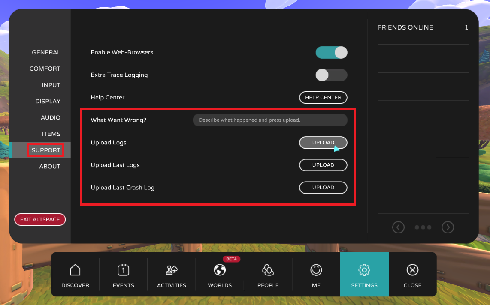

# How do I upload my client logs?

The AltspaceVR client application keeps a log of diagnostic data and events that occur while you are using AltspaceVR. In the course of troubleshooting an issue, you may be asked to "upload your logs" so that our team can review them. This is a feature of AltspaceVR that allows you to send our team your local log content, which will further help us to assist in troubleshooting various issues.

## In AltspaceVR

To upload client logs in AltspaceVR, navigate to the **settings menu** and select **Support** in the left navigation bar. Several options to upload logs are available here, as shown in the screenshot below.

## Fields

**"What Went Wrong?"**
Describe what happened (for example, if you encountered a bug, describe what you expected to happen in contrast to what actually happened). This information will be sent along with the log when you press upload.

**"Upload Logs"**
This button will upload logs from the current session. Use this option if you encountered an issue in this same session (for example, if you haven't closed the AltspaceVR client) and would like to report it.

**"Upload Last Logs"**
This button will upload logs from the previous session.

**"Upload Last Crash Log"**
This button will upload additional log content from the latest crash you've experienced.