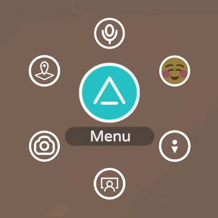
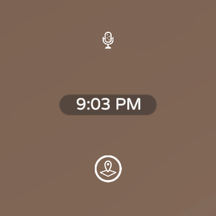
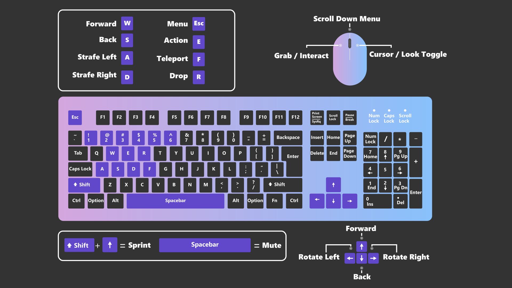

# Avatar controls with mouse/keyboard in 2D PC mode

There are two different control schemes for 2D PC Mode using a mouse and keyboard:
* New PC Controls, which is the default for new accounts
* Classic PC Controls

You can switch between New/Classic Controls by going to **Menu > Settings > Input > Classic PC Controls** and toggling the option on or off.

## New PC controls

You have two different modes when using the New PC controls: Cursor Mode and Look Mode. Right-click on your laptop or mouse to use the **Cursor/Look Toggle** to toggle between the two modes.

* **Cursor Mode** lets you interact with the menus. You’ll know you're in Cursor Mode when you see the AltspaceVR Logo/Menu button at the bottom left of your view:

    

* **Look Mode** lets you look around and is great if you're using a laptop trackpad. You can use Look Mode and the keyboard to look/move at the same time. You’ll know you're in Look Mode if the bottom left your view looks like the screenshot below:

    

### New PC Controls for Keyboard / Mouse

## Classic PC controls 

### Mouse controls

**Movement**

| Input | Action |
|---|---|
| Left click | Teleport to targeted location |
| Hold left click | Preview targeted location |
| Middle click | Move forward |
| Right-click + Move mouse | Rotate/Pan camera to look around |
| Right click + Middle wheel scroll forward/back | Zoom camera in/out |

**Menu options**

| Input | Action |
|---|---|
| Left click (over buttons) | Select button |
| Hold left click + right-click | Hide AltspaceVR menu |

### Keyboard controls

**Movement**

| Action | Key | Alternate key |
|---|---|---|
| Move forward | W | Up arrow |
| Move backward | S | Down arrow |
| Strafe left | A | N/A |
| Strafe right | D | N/A |
| Run forward | Shift + W | Shift + Up arrow |
| Run backward | Shift + S | Shift + Down arrow |
| Run left | Shift + A | N/A |
| Run right | Shift + D | N/A |
| "Comfort Mode" rotation left | Q | Left arrow |
| "Comfort Mode" rotation right | E | Right arrow |

**Menu options**

| Action | Key | Alternate key |
|---|---|---|
| Toggle menu | Esc | N/A |
| Toggle app fullscreen | Alt + Enter | N/A |
| Toggle microphone | Spacebar | Ctrl + Alt + T |