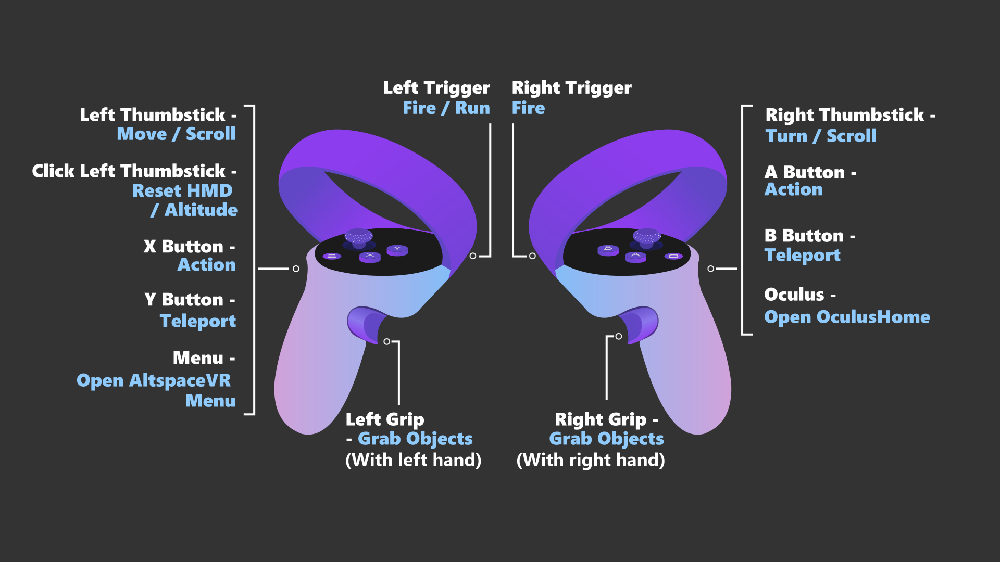
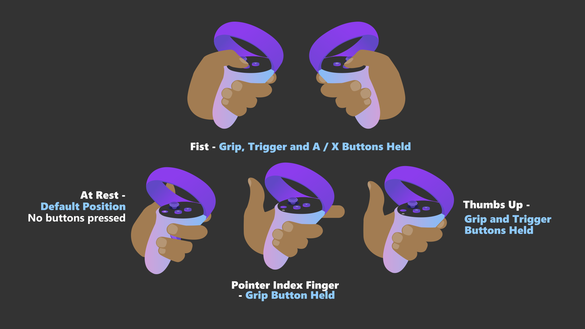

# Oculus Quest/Quest 2 controls and permissions

## Basic controls

| Left hand | Right hand |
|---|---|
| Left thumbstick - Move/Scroll | Right thumbstick - Turn/Scroll |
| X - Action | A - Action |
| Y - Teleport | B - Teleport |
| Menu - Open AltspaceVR menu | Oculus - Open OculusHome |
| Left grip - grab object with left hand | Right grip - grab object with right hand |
| Left trigger - Fire/Run | Right trigger - Fire |
| Click left thumbstick - Reset HMD and Altitude |  |

## Hand gestures

| Gesture | Input |
|---|---|
| At rest | Default position |
| Point index finger | Grip button held |
| Thumbs up | Grip & trigger buttons held |
| Fist | Grip, trigger, and A/X buttons held |

## Managing permissions

To manage your permissions on the Oculus Quest on a per-app basis from your Oculus library:

1. Navigate to the app in your Oculus library.
2. Select the **three-dot icon** to open the app's menu.
3. Select **permissions** from the drop-down menu that appears.

A 'Permissions' UI will load, which you can toggle on and off for each app.