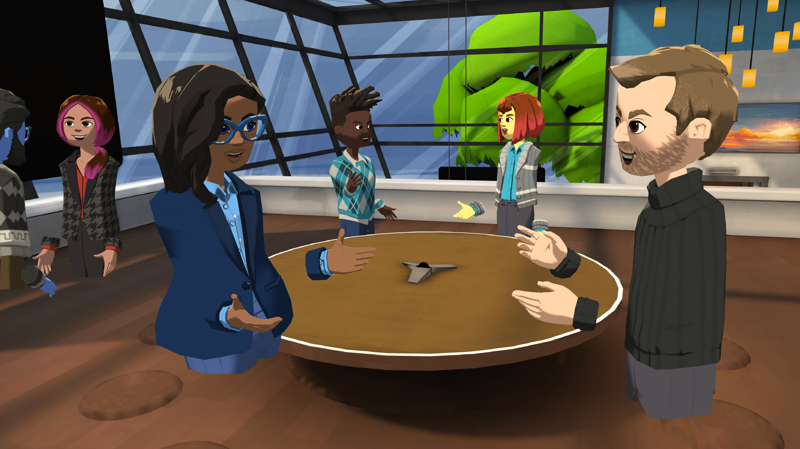

# What is AltspaceVR

AltspaceVR is the leading platform for live mixed reality experiences. AltspaceVR allows artists, creators, brands, and businesses to easily create their own virtual events. This social app allows people from all over the world to connect and collaborate in real time with a true sense of presence. Expressive avatars, engaging eye contact, spatial sound, and immersive virtual environments allow people to feel like they’re together even when oceans apart. Sitting at the intersection of experience, content, and community, AltspaceVR is the premier place for live concerts, conferences, comedy shows, festivals, tech talks, team meetings, remote collaboration, and more.  

Currently, AltspaceVR allows for large groups of individuals to be copresent in a single space.  [FrontRow](faqs/scaling-audiences.md) technology allows for audience-scaling into the thousands.

## Virtual reality events

With AltspaceVR, you can have shared VR experiences, whether it is in your personal or professional life. You can either [attend public events](community/exploring-title-screen.md#destinations) scheduled by others, or [host your own private or public events](tutorials/creating-an-event.md) open to the entire online virtual community.

Here's what AltspaceVR has to offer for your VR experience.

### Public events calendar

AltspaceVR offers scores of [events on its calendar](https://account.altvr.com/events/main) at any given time. These events range from spiritual meetups like a church service or group meditation, to learning events like sessions on cryptocurrency, general science, creative writing, business networking, and so on. In entertainment, there are stand-up comedy events, happy hours sessions, live music, karaoke, and more – all in VR.

### VR worlds

In AltspaceVR, you can visit many pre-built VR environments, called [worlds](community/exploring-title-screen.md#other-functions). These worlds cover common public areas like streets and rooftops, and more fantastical locations like an enchanted meadow or a mythical library. Event hosts on AltspaceVR can choose from these worlds when planning an event.

### Content channels

AltspaceVR offers various [content channels](https://account.altvr.com/channels/popular) to suit your area of interest. Content topics are diverse, such as humanism, diversity & inclusion, spirituality, stand-up comedy, and music festivals.  You will be notified when a channel has a new event added, and an email reminder will be sent 1 hour before the event start time.

## Microsoft Mesh compatibility

AltspaceVR for Business will be [Microsoft Mesh-enabled](/mesh/). You will soon be able to enjoy 3D photorealistic presence and spatial multiplayer experiences. AltspaceVR will turn into a business VR platform for collaboration, corporate events, and employee engagement gatherings.

## See also

Are you new to AltspaceVR? Start your journey here.
> [!div class="nextstepaction"]
> [Exploring AltspaceVR](./explore/beginners-guide.md)

Do you have virtual events to bring to the world? Follow the steps here.
> [!div class="nextstepaction"]
> [Exploring AltspaceVR](./explore/host-events.md)

See hardware requirements for your VR experience.
> [!div class="nextstepaction"]
> [System requirements](getting-started/system-requirements.md)
