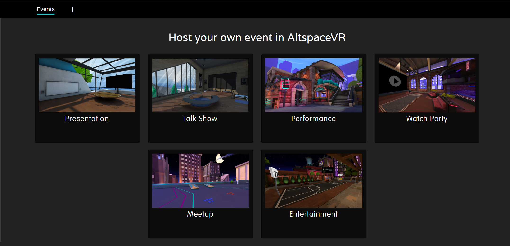
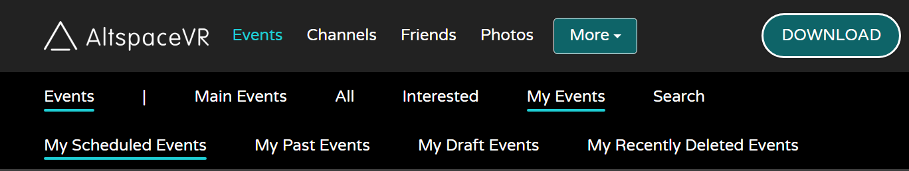
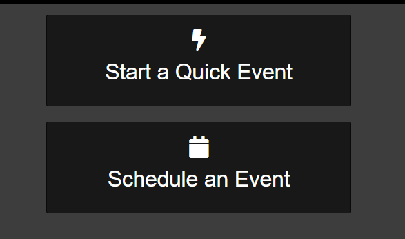

# Creating an event

>[!Important]
>AltspaceVR is shutting down on March 10, 2023. For more information, please visit https://aka.ms/altvr.

This is a step-by-step guide for creating events in AltspaceVR. It's highly recommended that you attend several events in AltspaceVR to get a feel for how they work. Check the [AltspaceVR Events Calendar](https://account.altvr.com/events) for a list of all our Main Events.

In this article, you'll learn:

* AltspaceVR Event Terminology
* Creating Your Event and Event Space or World
* Using the Multimedia Console for a slide presentation
* Branding Your Event with Images
* Adding 3D Objects Using World Editor/Kits
* How to Record or Live Stream My Event

## AltspaceVR Event Terminology

The following are terms you'll need to be familiar with for creating your event and event space:

 

| Term | Definition |
|---|---|
| World Building | AltspaceVR offers the ability to create and customize virtual worlds. AltspaceVR has support documentation, Discord channels, and in-world Events to help you [learn more about how to get help and start building worlds](../world-building/world-building-faq.md). |
| World | A World is a virtual space in AltspaceVR. It may be an office or a vast mountain range. It's a highly customizable environment. It sits within a Universe and there may be multiple Worlds within that Universe. If you wish to have multiple Event spaces for special events, training centers, and different meeting spaces to spice things up, add the Worlds under the same Universe to keep them organized. |
| Universe | A Universe in AltspaceVR world building vernacular represents the categorization of your Worlds. Each Universe may hold multiple Worlds. The Worlds inherit the settings of the Universe, making it easy to add people to the allowlist for multiple Worlds and other control features. For more information see [Managing Your Worlds](../world-building/managing-worlds.md). |
| Template | A Template (or Space Template) is a pre-made World or environment that may be used instead of creating one using the World Building features. AltspaceVR offers a wide range of Templates for different experiences and Events. |
| Event space | An Event space is a synonym for World in AltspaceVR. In general, it refers to a World used to host events. |
| Website | References to the "website" are to [AltspaceVR's website](https://altvr.com/). It's often easier to create and edit events through the [Events web page](https://account.altvr.com/events/my) on a computer or tablet rather than through your VR device. You'll need to access the website for [world building](../world-building/managing-worlds.md) as well. |
| Contextual roles | [Contextual Roles](../getting-started/roles.md) are assigned by the Event Creator or World Builder. These Roles give users in a World or Event space extra features and capabilities. Currently, these consist of Host, Moderator, Pilot (flight), Terraformer (world building), and Megaphone Only. These may be assigned individually or globally, allowing everyone to have the same Roles in the Event space or World. |
| User Interface (UI)/Menu | When you are in AltspaceVR in-world, within the immersive environment, there are menus on the left and right of your screen. The circle or main menu with the AltspaceVR logo opens up the main user interface (UI) or menu to access different screens for exploring AltspaceVR and customizing your experience. Optional UI items are found on the right size of the screen and typically include World Editor and Host Tools. These are opened and interacted with by clicking them with your cursor. |
| SDK/MRE | These are World Building terms associated with the Software Development Kit and [Mixed Reality Extensions](../world-building/using-mixed-reality-extensions.md) used to add features and functionality to the World Building experience. These are typically for more advanced users. |

## Understanding events

AltspaceVR makes it easy to create a World in which you may use a pre-made Space Template, customize one for your specific needs or create a World from scratch. This article will cover using a pre-made Template to create your Event. The sections below on [Branding Your Event with Images](#branding-your-event-with-images) and [Adding 3D Objects using World Editor and Kits](#adding-3d-objects-using-world-editor-and-kits) include tips for further customization. For information on building a custom world from scratch, attend the World Building Tour meetups in AltspaceVR and [check out the World Building support documentation](../world-building/world-editor-getting-started.md).

AltspaceVR offers two ways to create a space for your Event.

* **One-time use:** Create an Event and select a Template.
* **Repeated Use:** Create a World space and import it into the Event.

The process of creating an Event is the same for both, with one exception: the [creation of a world and importing it](../world-building/managing-worlds.md) as a repeat-use event space. You also need to know:

 

| Term | Definition |
|---|---|
| World copied | Using a World space for a repeated Event permits persistent customization. Signs, images, spawn points, and other customizations are maintained from Event to Event rather than customizing the Event space each time. |
| Customize Event World | When an Event is created, the Template or imported World is copied and locked into that Event. You may make changes to the Event World and not affect the original World, and the other way around. Consider adding holiday decorations, pictures, or other decorative one-time use World Editor elements to make the Event space more enjoyable and appropriate to the Event. |

Modifications made to the original World won't be reflected in the Event World unless the Event space is updated:
1. Use the **RE-IMPORT WORLD** button on the Event web page.
2. Allow 2-3 minutes for the sync to complete. 
3. If the Event space hasn't changed, go to **Settings > Moderate > Reset Space** to reset the event space. You'll Reset Space a lot as a World Builder!

If you have technical issues, like elements not loading properly, go to your AltspaceVR menu and select **Settings > Moderate > Reset Space** to reset the Event space and see the new changes. Windows PC users in 2D may use the keyboard shortcut: **CTRL + ALT + R** in AltspaceVR to quickly Reset Space.

## Creating Your Event and Event Space or World

The following are step-by-step instructions for creating an Event for a one-time or repeated Event. By selecting the Template or importing a World for the Event. 

> [!NOTE]
> The AltspaceVR Events web page offers instructions on every aspect of the form through the use of green question mark buttons. Roll your cursor over them for specific instructions.

On the [Events > My Events](https://account.altvr.com/events/my) web page on AltspaceVR's website, select **Schedule an Event** or go straight to the [Create Event in AltspaceVR web page](https://account.altvr.com/events/new).

1. **Event Title:** Type in the name of the Event. Keep it specific and concise for viewing on the various calendar views on the AltspaceVR website and in-world interface. Try to keep your title under 23 characters including spaces between words.
2. **Description:** Type in the description of the Event.
    * Must have at least 10 characters in the description or your Event won't be created.
    * Add an empty space between paragraphs.
    * To add a link to your Event's YouTube, Discord, website, or other resources, use the following format (this Markdown only works on your Event's Promotion Page on the website, Markdown won't properly render in the AltspaceVR menus):
    `[Event Name](http://example.com/)`

3. **Start Date / End Date:** Set the start time and make sure the end time is after the start time.
4. **Category:** Choose the category that best describes your event type. 
5. Set the Event to **Unlisted** or **Public**.
    * Visibility: Public Events are visible on the AltspaceVR website event calendar's [All tab](https://account.altvr.com/events/all) and are open to the public.
    * Unlisted events aren't visible on the AltspaceVR event calendars and require the event URL or Entry Code to enter the event space.
    * If you want to 'Add as Main Event' the Event must be set to public.
6. **Select a Template:** Along the right side of the web page is a list of thumbnail images of the available Templates in AltspaceVR. There are game rooms, offices, meeting spaces, presentation spaces, and fun meetup spaces. Select one that looks interesting. If you don't like it, go ahead and just create a new event with a new Template. If you wish to create your own custom Event World, select the **Cool Sky** as your default template and following the instructions below for importing your world.
7. Select **ADVANCED OPTIONS**

### Advanced options

1. **Promote:** Each Event requires two branding images (these images appear on the AltspaceVR website and don't appear in your Event inside AltspaceVR):
    * **Tile Image:** The tile image is required to be 1920x1080 pixels. This image will be scaled to various thumbnail sizes and shown on the AltspaceVR Events Calendar with other Events. Ensure the image is clear and doesn't have much text on it. Don't use copyrighted images/logos that you don't own.
    * Another (quicker) option is to **Copy Tile Image to Background Banner Image**, this will use your Tile image as your Banner image as well. Give it a try :). If it doesn't look good, then you can create a new Banner image.
    * **Background Banner Image:** The banner images are required to be 1920x576. This will be resized automatically as necessary and visible on the Event's webpage. A semi-transparent overlay covers the lower 25% of the image. Avoid placing text in that area.
2. **In VR:** This section includes features that apply to the virtual experience during the event inside the AltspaceVR app:
    * **Default Contextual Roles:** The green question mark lists the specific roles available to *all audience members in the event*. The most common is *megaphone_only*. Add this to give the 'Amplify My Voice' option under the Host Tools button to all audience members so they may be heard across your event if it's a large space. If your event requires flight, add *pilot*. To add them both, the format is: *megaphone_only, pilot*. Each user needs to enable Fly mode in the AltspaceVR app by going to Settings/Input/Fly.
    * **Per Room Capacity** This dropdown lets you choose maximum number of concurrent users per Event Room. 10, 20, 30, 40 or 50. Don't worry, if you want to have a massive Event you can Add Rooms!
    * **Instructions:** The [Instructions](../world-building/adding-welcome-messages.md) is for text that generates a welcome image upon arrival in the space. Users must select 'OK' to remove it from their view. This is often used to provide audience instructions such as "Please stay muted until invited to speak" or "Welcome to XYZ event where we'll be covering ABC." This isn't required, so use judiciously. You can also use Markdown to add color and font sizing, more details: [http://digitalnativestudios.com/textmeshpro/docs/rich-text](http://digitalnativestudios.com/textmeshpro/docs/rich-text)
3. **Advanced:** The following is a quick explanation of the advanced features for Events (Some of these features won't display until after your Event is created and you EDIT the Event):
    * **Admins:** Admins are AltspaceVR users you trust to help you manage your Event. They may be your cohosts or backup hosts. By adding their username to the Admins list, they can:
        * Change the Event title, description, and other features.
        * Add and remove Contextual Roles for moderators, hosts, and other roles.
        * Delete the Event.
    * **Groups:** Choose from your private [Groups](group-features.md) using the drop-down menu. Will only display if your account has created/been added to a Group.
    * **Tagline:** This concise sentence will be displayed on the Event web page under the title.
    * **Source World:** To use a World space for repeated use, this is the section of the form to use to import that World's layout and customization into your Event. Be aware of the following considerations:
    
    **Import Your Own World:** To import a World, you created and own:
    * Select the dropdown arrow to see a list of Worlds you created.
    * Select the World.
    * After completing the rest of the event form, wait at least 2 minutes before visiting the Event space in AltspaceVR to ensure database information is updated and the environment is generated.
    
    **Use Someone Else's World:**
    * Contact the World owner to request they use the **Share with Friends** feature on an individual World and share it with you. You need to be Friends with each other in order to share.
    
    **YouTube Video ID:** Visible on the Event's web page, this adds YouTube event trailers or videos to the Event web page, not in-world. You'll only need the video ID part of the URL: dQw4w9WgXcQ
    
    **Twitter Handle:** This adds your Twitter stream to the Event's web page. If the Twitter account is personal and not related to the Event or association, you may be over-sharing. You'll only need the Twitter handle: @elonmusk

    **Exclude from Search and Popular Events:** If you prefer not to have your Event be searchable or show up in the Popular Events section, tick this.

    **Disable portals:** Prevent audience members from spawning Event Portals to other Events during your Event.
    
    >Once your Event is created, select EDIT to be able to edit Admin, Contextual Roles and Block Listed Users for your newly created Event. These fields are not available until your Event is created.

    **Contextual Roles:** This is where you control the super powers or [contextual roles](../world-building/granting-roles.md) of your Event hosts, moderators, and other roles within the Event. To add them, enter in their AltspaceVR username and assign them a role in the drop-down menu. To remove them, select the checkbox to Remove and save the Event web page. NOTE: If you wish to grant a host moderation capability, you must add them as a host and moderator. The following Contextual Roles are currently available:
    * **Host:** Adds the [Front Row features](../faqs/front-row-events.md) to the individual's interface in AltspaceVR to add those features.
    * **Moderator:** Adds moderation features to the individual's interface including the ability to message each attendee, globally mute them for the event, or remove them from the Event.
    * **Megaphone Only:** Adds the Amplify My Voice button to their interface via the Host Tools button.
    * **Terraformer:** Adds the World Editor button to their interface.
    * **Pilot:** Adds flight capabilities for that individual. NOTE: they must enable this in Settings/Input/Fly
    * **Musical Performer:** Adds capabilities and features associated with concert and musical events.
    
    **Block Listed Users:** If you wish to block a user from access, or a user has been previously removed from the Event by a moderator or host and the Event is duplicated, the block listed username will be listed. Event hosts or Admins may add or remove a block listed user at any time.

Once the form is complete and triple checked, select **CREATE EVENT**.

> [!IMPORTANT]
> If your event is not correctly being created, make sure you have at least 10 characters in your Description and/or you've selected a Template, the name of the Template will turn from white to blue if selected.

## Event page actions

On the Event web page, you have the following actions and options:

1. Select **EDIT** to make changes to the Event settings.
2. Select **ROOMS** to see what Rooms you already have and to Add Rooms for FrontRow Events.
4. If you'd made an update to your imported World, you'll need to select **RE-IMPORT WORLD** for those changes to appear in your Event, don't forget to Reset Space in the Event :)
5. Select **DUPLICATE EVENT** to duplicate the Event for future Events. This duplicate will then appear in My Events/My Draft Events, you'll need to update the new day/time and Activate it from there.
4. Select **REPEAT EVENT** and create repeat daily, weekly, bi-weekly, or monthly Events.
3. Select **SET TO DRAFT** to set your Event to Draft instead of Active.
2. Select **END EVENT** to end the Event (if your Event is over early, for example).
7. Select **DELETE EVENT** if you wish to completely delete the Event (you can't recover this).
6. Select **ADD AS MAIN EVENT** to add your Event into the Main Events calendar listing. Must meet eligibility requirements.

When you're ready, go to the **Events > My Events** menu in the AltspaceVR in-world interface and Enter the Event. Feel free to Reset Space, inspect your changes, or continue customizing. 

> IMPORTANT! Customizations to the Event space are for this Event only! If you're spending lots of time customizing your Event's space, it might be better to create a World for your **Repeated Use Event**.

For more information on customizing your Event space or creating an original Event space World to import:

* [How do I grant roles to other people in my Worlds?](../world-building/granting-roles.md)
* [How do I let people fly (or have other abilities) in my World?](../world-building/adding-user-abilities.md)
* [Where can I get help with world-building?](../world-building/getting-help.md)
* [How do I manage my Worlds?](../world-building/managing-worlds.md)
* [World-Building FAQ](../world-building/world-building-faq.md)
* [How do I add custom spawn points to my Worlds?](../world-building/adding-custom-spawn-points.md)
* [How do I upload my own Kits?](../world-building/uploading-custom-kits.md)
* [How do I get started with the World Building Toolkit (Unity Uploader)?](../world-building/world-building-toolkit-getting-started.md)

## Using the Multimedia Console for a slide presentation

The Multimedia Console is a great way to organize your content for a presentation including images, audio, or video. Follow the [Multimedia Console instructions](multimedia-console.md) to get that set up for your Event.

## Branding Your Event with Images

Adding images, your company's branding, photographs of yourself, your team or other visual content to your Event is easy in AltspaceVR.

The image requirements are:
* JPG or PNG files are accepted
* Maximum image size: 1920x1080
* Resolution: 72 DPI
* File size: Less than 250 KB per file

The process involves uploading images to your [AltspaceVR Photos](https://account.altvr.com/photos). Then using Photos in the World Editor in the AltspaceVR app to import and place them into your Event or World.

1. Go to [Photos](https://account.altvr.com/photos) on the AltspaceVR website.
2. Select **Upload**.
3. Select **Choose File** to locate and select the image you'd like to upload.
4. Select **Open**.
5. Select **CREATE PHOTO**.
6. Repeat this for all your images.

In AltspaceVR, travel to the Event/World where you'd like to place the Photo. Position yourself near where you wish to place the image. (If you're creating this for a **Repeated Use event**, make sure you are in your World and not in the Event space!)

1. On the user interface, in the lower right corner, select **World Editor/Editor Panel**
2. Select the **Mine** tab at the bottom.
3. Select **Photos**.
4. Photos are stored in the chronological order of upload, so the latest image uploaded should be the first image in the list. Select it to add it into the World.
5. Using your device cursor, grab the image and place it where you wish it to be.
    * You may resize it using your controllers (typically moving the right analog stick in VR or using your mouse's scroll wheel in 2D mode).
    * To fine-tune the position and rotation of the image, select the **GEAR** symbol on the image in the Editor and set the Rotation and Position appropriately.
    * You may also resize the image with the Scale feature.

> NOTE!
> When Edit Mode is on (Edit Mode with bee in orange text), you will automatically have the ability to fly, allowing easier movement for placing images higher in the Event/World.

6. Repeat this for each image placement.
7. When the images are set in place, select **Lock All**, if you didn't already lock them individually. Turn off Edit Mode and close the editor.
8. Only use a maximum of 10 Photos per Event/World. Too many Photos can cause performance issue.

## Adding 3D Objects Using World Editor and Kits

AltspaceVR allows importing 3D objects into Worlds with the World Editor. There are many World Editor Kits currently available for use, and more on the way. There are spaceships, rockets, animated animals, sculptures, trees, plants, and many different objects. Or you may add your own Kits to the public collection or for your own personal usage. Consider using one of the [AltspaceVR MRE apps](../world-building/using-mixed-reality-extensions.md), which bring interactable objects into your World such as helmets, wings, clothing, hats, or other interactable objects. Expect the list of objects to expand soon.

The instructions here focus on using items already in the Kits. For more information on importing 3D objects into AltspaceVR, see ["How to import glTF models into my Worlds?"](../world-building/importing-models.md) and ["How do I upload my own Kits?"](../world-building/uploading-custom-kits.md).

To add an existing 3D object from the World Building Kits into your Event/World, with the World Editor/Editor Panel open and Edit Mode enabled:

1. Explore the kits for the object you wish to import and select it.
2. Select on the kit object with your cursor and position it. Use the GEAR icon on the object in the World Editor to use the Position, Rotate, and Scale options for manual number entry.
3. When the object is placed in the right position, lock it by clicking the Lock icon.
4. Add another object if you wish. Be judicious in adding 3D objects, keeping your selections to no more than items from five different individual kits, for better Oculus Quest user support. Don't use more than 200 objects in a world.
5. When done, lock all items, turn off Edit Mode, and close the World Editor. Wander around. Invite a few testers to visit and check it out, and get ready for your great Event!

For more information on the World Editor Kits and adding 3D objects to AltspaceVR:

* [What is the Early Access Program?](../world-building/early-access.md)
* [How to import glTF models into my Worlds?](../world-building/importing-models.md)
* [How do I use an MRE in my World?](../world-building/using-mixed-reality-extensions.md)

## How to Record or Live Stream My Event

See the following support document for instructions on recording or live streaming your event:

* [How to Record or Live Stream My Event](recording-and-live-streaming.md)

Feel free to make as many test Events as you'd like. It won't cost you anything and you'll learn from each Event you create!