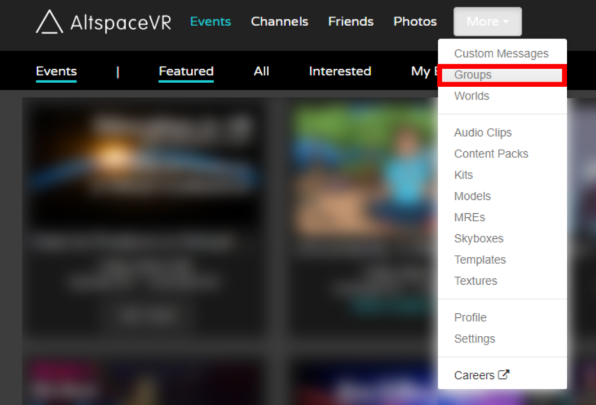
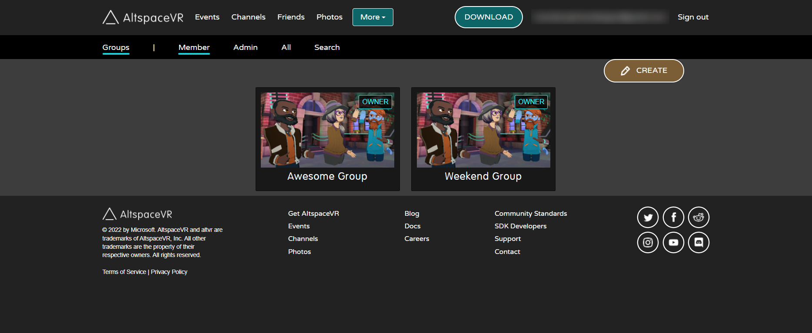
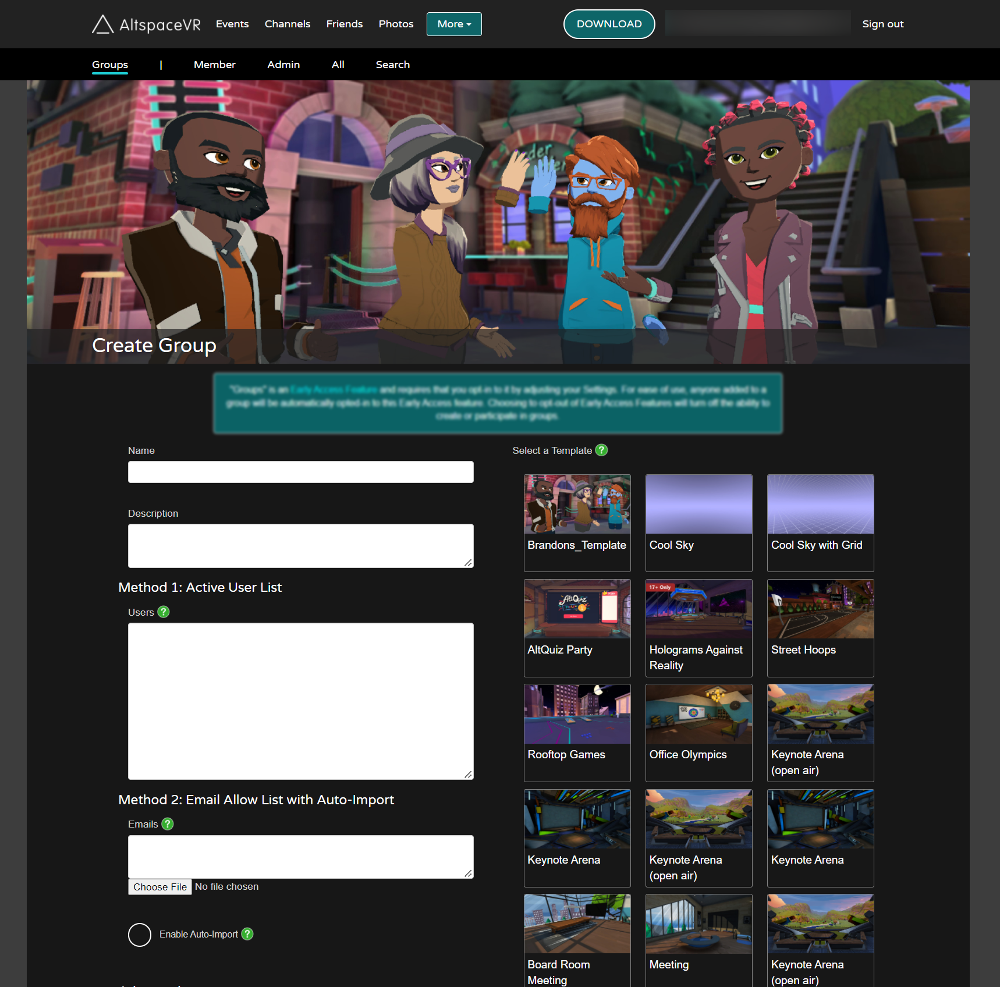
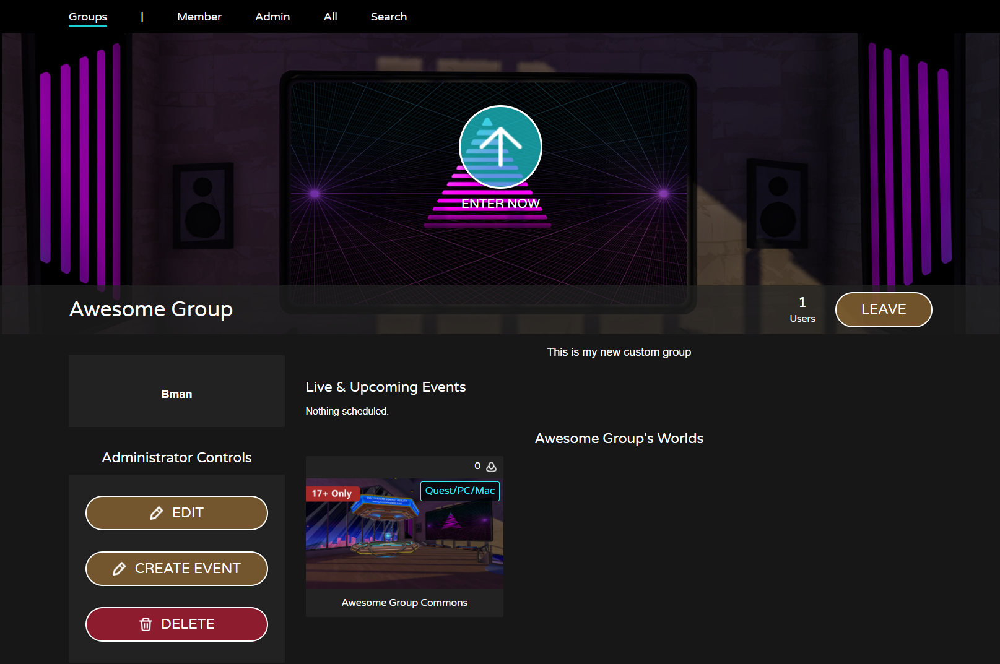
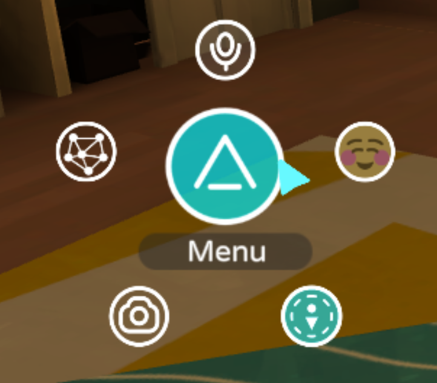
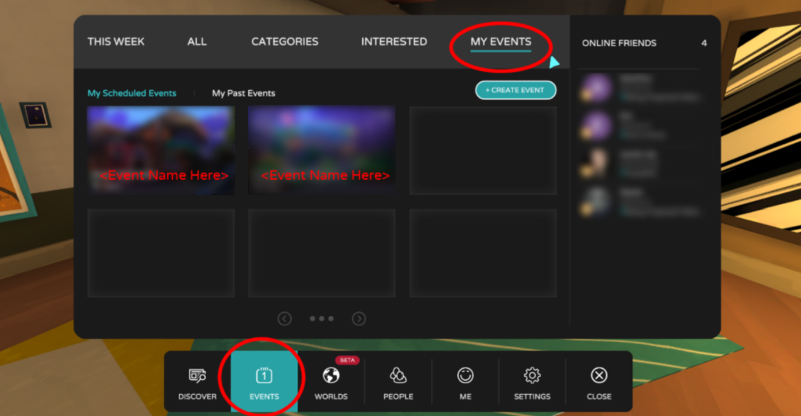
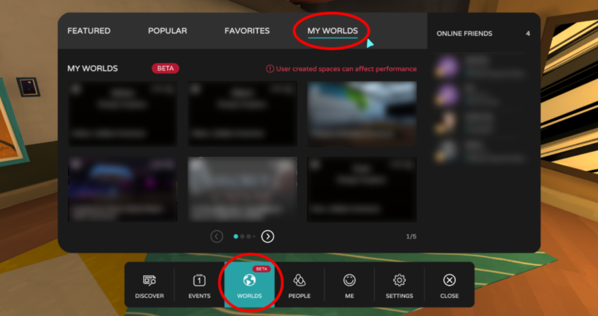
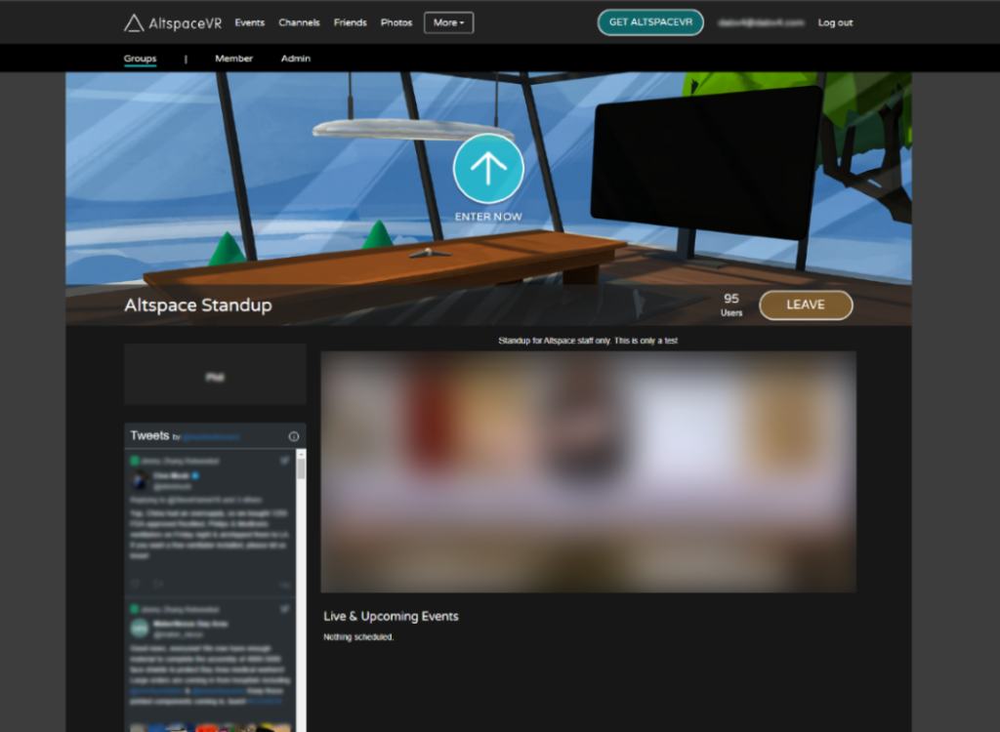

# Using the Groups Feature to Create Private Events

>[!Important]
>AltspaceVR is shutting down on March 10, 2023. For more information, please visit https://aka.ms/altvr.

Our Groups Feature gives hosts the ability to create a VR space that is open to an approved list of guests. Hosts can manually add any AltspaceVR usernames/emails they’d like to grant access to their space. Here’s how you can use this feature to host events, meetings, and conferences:

> [!NOTE]
> Before you can access “Groups” you need to opt-in to Early Access features by logging into altvr.com, editing your User Profile on the website and selecting Early Access. Or inside the AltspaceVR app, Settings, General, Participate in Early Access Program.

1. On your browser, go to [https://altvr.com](https://altvr.com) and log into your account. 
2. Find the **More** pull-down menu.
3. Select **Groups**

    

4. Once in the Groups page, you can see a list of groups that you're a part of or an admin of. 

    

5. Select on the **Create** button to make a new Group.
6. Fill out fields to create group.

    

> [!NOTE]
> You can hover over the green “?” to get additional information about the fields that have them.

7. Send an email to all attendees and have them create an AltspaceVR account using the same email address. They can either make an AltspaceVR account in-world or on our [website](https://account.altvr.com/users/sign_up).

## How to Create a Private Event from a Group 

1. Once in the Member or Admin page, select the group you want to access. 
2. **As an Administrator**, you can modify all the options you configured previously to create the Group. Go to the “Edit” button on the group’s page to access them.  
3. **Adding Other Admins for a Group:** When editing, you can add other users as Admins to help manage the group.  
    * This must be the AltspaceVR username for the user and not their account e-mail.  
4. Select **Create Event**.  

    

## How to attend a Group Event, as an Invitee 

1. Open the Main Menu in the AltspaceVR app: 

    

2. Select **Events** at the bottom of the Menu.
3. At the top, look for **My Events**
4. Find the event by its **Name** provided by the Event creator in the main view with the tile images. Select it to enter the Event if it's live.

    

## How To find the Group World (Commons):  

1. Open the Main Menu:  
2. Select **Worlds** at the bottom of the Menu.   
3. At the top, look for **My Worlds**.
4. Find the name of your group and select it to enter the Group World.

    

## How to Add an Email List to a Group 

If you have a large group and need to add them in bulk, you’ll first need to create a list of e-mail addresses for all those associated with your group. Keep in mind that if they are signing up with Microsoft Account Linking, you will need their Microsoft Account address for this step to work.

### Creating a list

Use a spreadsheet program to create a single column with all the e-mail addresses. Once you've this, do the following:  

1. Create or edit your group.  
2. Find the **Member Emails** field.  
3. Find the **Choose File** option to import your emails from a *.csv file.
4. Your list should be imported with one email per line.

> [!NOTE]
> If you choose, you can also copy and paste emails into the field instead of importing from a *.csv file.

### Importing a list

Some platforms may allow you to export a *.csv file (comma-separated value) that has a dedicated “e-mail” column. You can select this column for use. Once you've this available, the steps are mostly the same, they are:  

1. Create or edit your group.  
2. Find the **Member Emails** field.  
3. Find the **Choose File** option to import your emails from a *.csv file.
4. Your list should be imported with one email per line.

> [!NOTE]
> If you choose, you can also copy and paste emails into the field instead of importing from a *.csv file.

## FAQ 

### I’m having trouble filling out the fields in groups. What do they mean?

(*You can hover over the green “?” to get additional information about the fields that have them.) 

* **Name** – The name of the group that will be visible to all members.   
* **Description** – A field to describe the purpose of the group. Visible to all members.
* **Users** – This field allows you to list group members for the Group either as a username OR e-mail address as long as it's one per line. It's one way to define the group members.
    * Fill in a username or e-mail per line.  
    * To find a username in AltspaceVR, have the user open the “Main Menu” and go to the “Me” section. It's the name in parenthesis.  
    * To find the username on the website, have the user go “Profile” from the “More -> Profile” option. You can find it on the left column of the Profile page.  
    * The field is case-sensitive so “username” and “Username” are considered different.  
    * This field accepts both usernames and e-mails associated with valid accounts. Make sure there's one item per line. You don't need to put both an e-mail or username if they're the same person, either will work.  
    * The accounts must be in good standing.  
    * The list can be searched with the find option of your browser “Ctrl + F”  
* **Image** – Used as the promotional banner image for the group. It's visible on the Group webpage and in VR.  
    * We recommend 1920 x1080 for better image fidelity.  
    * JPEG or PNG preferred.  
    * Images must be 16:9 aspect ratio.  
    * We autogenerate thumbnails from your upload and use them in various UI screens in AltspaceVR and the website.  
* **Profile Image** – Used as the groups profile image. It's visible on the Group webpage and in VR.  
    * We recommend 512×512 for better image fidelity.  
    * JPEG or PNG preferred.  
    * We autogenerate thumbnails from your upload and use them in various UI screens in AltspaceVR and the website.  
* **Select an Environment** – Located on the right side of the page, you'll see various thumbnails of the available environments to use. This environment will act as your group’s primary hangout World and will appear in “Worlds -> My Worlds -> <Name from “Name” field> Commons” for you and your group members.  
    * If you want to create your own World, you must do it via [the Website](https://account.altvr.com/worlds/my), you'll see those Worlds as possible options. 

> [!NOTE]
> This feature is in Beta. We encourage groups to utilize preexisting Worlds in the Environment selection dialog.

* The word “Commons” will always appear as a suffix to any group’s hangout world.  
* **Member Emails** – This field allows you to list users by the e-mail associated with an AltspaceVR account. **Using this list overrides the “Users” list described above.** This is the recommended way to manage membership of a group.  
    * When filling out this field, make sure your AltspaceVR account associated e-mail is listed in it, or you may lose access to the group. If you have linked your account with Microsoft Account Linking, you will need to make sure that the email addressed used is your Microsoft Account address.  
    * When pasting addresses into his field, make sure there's one e-mail per line.  
    * This list accepts e-mails without a valid AltspaceVR account. AltspaceVR usernames get verified, e-mail addresses don't. However, when that e-mail is used to create an AltspaceVR account, then the user it's associated with will gain access to the Group.  
    * You can import a list from a *.csv file. Select the “Choose File” option and select your file.
    * We recommend using Member Emails as the way to manage large groups, as it's a more definitive way to reconcile your members. Note, Group Admins will need to inform their users/members that they must use the same EXACT e-mail address that they used on the payment platform to create an AltspaceVR account.  
    * See the Importing Users into Groups section to see instructions on how to get your list of users.   
* **Enable Auto Import** – Auto import is a recurring process run on the E-mail Allow List. It reconciles whether an e-mail now has a valid AltspaceVR account associated with it and grants access.   
    * We recommend that you enable it if you're using a csv file upload.
* **YouTube Video ID** – Allows you to embed a YouTube video onto the Group’s landing page on the website. Note, this is for the Group website only and doesn't appear inside AltspaceVR.
    * You must use the video id, not the full address. The video id is the set of characters that appear after the “=” (equal) sign-on YouTube.  
* **Twitter Handle** – embed the latest tweets from a Twitter account onto your Group’s landing page on the website. Note, this is for the Group website only and doesn't appear inside AltspaceVR.
* **Create Group** – The button at the bottom of the page. When you've completed the fields described above, select this button to create your Group.  

### I’m having trouble managing my groups. What do I do?

If you're a Member or Administrator of a Group, you have extra tools to manage your events. To access these options, go to the Groups page on the [website](https://account.altvr.com/groups).  

1. Select either Member or Admin from the top bar and select the Group you want to manage/update. 
2. Once in the Member or Admin page, select the group you want to access by clicking on its tile image.

    

This is the main page to see all your group memberships either as a Member or Administrator. Select a group to see its specific options.

The Group page you see when you're a member of a group.

**As a Member:**

* You can access the group’s landing page on the website to see updates for the group.* You have a button to “Leave” the group. Once you do, the following will result:  
    * You'll no longer have access to the Group’s landing page.  
    * You'll no longer see or enter the Group “Commons” hangout World.  
    * You can't see Group Events.

    

The group page you see when you're an Admin of a group. Note that you'll see the admin options regardless of how you enter the group’s page.

**As an Administrator:** You have the same options as a Member but have extra capabilities.  

* You can modify all the options you configured previously to create the Group. Go to the “Edit” button on the group’s page to access them.  
    * **Adding Other Admins for a Group:** When editing, you now have the option to add other users as Admins to help manage the group.  

> [!NOTE]
> This must be the AltspaceVR username for the user and not their account e-mail.  

* You also have access to a **“Create Event”** button.  
    * **Creating an Event from the Group’s page will automatically set the group permissions for the Event.**  
    * In-depth documentation for creating an Event via the website is [here](https://altvr.com/support).
* **You can also get rid of the Group by pressing the “Delete” button.**

> [!NOTE]
> This is a destructive action, you have to recreate the group if you want to restore it.

* This is only available to the Group Owner, meaning the user who originally created the group.
* It isn't available to Admins of the Group.

This is a group page with an Event scheduled. Events created for the group will appear here.

> [!IMPORTANT]
> This is a beta feature. AltspaceVR is a free experience and is not responsible for any technical issues that may arise with the experience which might prevent attendees from accessing private events.
