# Host tools for FrontRow events

This article is based on you having FrontRow enabled for your event. To enable FrontRow for your event, see this article: [Scaling Your Audiences with the FrontRow Feature](../faqs/scaling-audiences.md).

If you'd like to learn about the Host Tools for a non-FrontRow event look here: [Host Tools Overview](host-tools-overview.md)

Now that you have your event set as FrontRow, lets go through how to use all the awesome features that are enabled with FrontRow!

When you originally created your event you were set up with the Host 'Role' for that event. You can also give the Host role to anyone else you'd like to help run your event, they will have all the same hosting abilities as you then (See more about Roles here: [Roles in Events, Worlds, Groups and in AltspaceVR](../getting-started/roles.md)). The Host role grants you access to special features and abilities created specifically to make hosting a live virtual event simple and easy.

Below is a detailed overview of these features and abilities, as well as additional helpful hints for hosting FrontRow events in AltspaceVR.

## Host tools overview

The Host Tools appear on the bottom right-hand side of your field-of-view. It is available to you immediately after your event has been created, so you can enter your event anytime (event start-time does not apply to the Hosts or Moderators of an event) and get comfortable with the tools before showtime. The Host Tools will give you quick-click access to things like going On-Air (required for running FrontRow events), muting and messaging your audience, toggling your stage blockers on and off, megaphoning yourself, allowing your guests to “raise their hands” to ask questions or offer feedback, the ability to move from FrontRow Room to Room and much more.

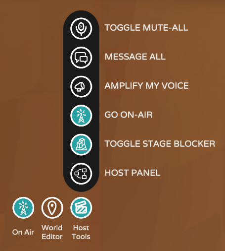

*You can tell your event is set to FrontRow if you see the GO ON-AIR button.*

### Toggle Mute-All

By muting your attendees, you can limit distracting sounds and keep things nice and quiet in your FrontRow event. The mute function will last for as long as a Host allows, or when the Host leaves the space. When an attendee enters the event or tries to unmute, attendees will receive an on-screen message letting them know they’ve been muted by the Host. When the Host unmutes, the attendees will receive a message letting them know that they are unmuted as well.

### Message All

Hosts can send a message to all the attendees present across their FrontRow event. Use any of our quick-notes or write an original one. Once sent, everyone will receive the message as a pop up.

### Amplify My Voice

Hosts can amplify their microphones to ensure that everyone in your Front Row event will hear what you are saying regardless of distance.

### Go On-Air

Anyone with the Host or Presenter roles will be able to see this button. Clicking Go On-Air will 'Mirror' your avatar to all the FrontRow Rooms. Once you are 'Mirrored' everything you say and do will be seen across all instances of your FrontRow event.

Being On-Air for the entirety of your FrontRow event is VERY IMPORTANT. You must be On-Air for the Host Tools to properly work across all of your FrontRow Rooms, otherwise, they will only work in the Room you are in.

> [!NOTE]
> If you need to rejoin your event, go to the Campfire and back, lose your Internet connection, move from Room to Room, when you to come back you will NOT be On-Air. Make certain you click Go On-Air again once you are back.

### Toggle Stage Blocker

Decide when and where attendees can stand. Choose to hog the spotlight, take turns presenting, or invite everyone on stage for a group dance party.

> [!IMPORTANT]
> Not all worlds contain a stage blocker, so pick your event templates wisely. Make yourself familiar with our event templates on test events prior to creating your official event.

## The host panel

Clicking on the Host Panel button will open additional advanced options for your FrontRow event:

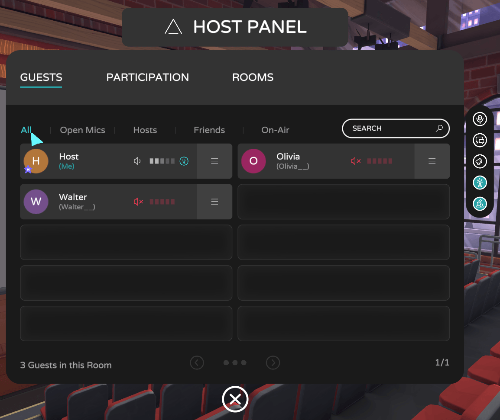)

## Guest panel

This allows you to keep track of everyone in your Event's 'Room'. In a FrontRow event there are multiple Rooms, the Guests Panel only shows you the guests in the Room you are currently in. You can filter what is shown by clicking All / Open Mics / Hosts / Friends / On-Air. It is an interactive list that gives you a multi-page breakdown of who is in your Room.

Trying to find someone with bad audio? Click Open Mics to see who is unmuted. Want to make sure everyone you need is Mirrored in your FrontRow event? Click On-Air to see everyone that is currently On-Air and Mirrored. 

### Moderation Tools

As an Event Host you are responsible for managing the experience of others. To do this efficiently, you and your Moderators need robust moderation tools. As the Host of a FrontRow event you can mute disruptive individuals, kick rule-breakers out of your event (temporarily and/or for the duration of your event) and even assign the Moderator/Host role to others during the event to get help managing the audience.

You can mute guests from the Guest Panel right away by clicking on the speaker icon beside their name or for additional options click the hamburger menu on the right side of the guest's panel:

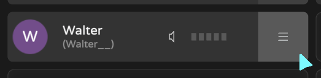)

*Click the hamburger menu to open up all Moderation Tool options.*

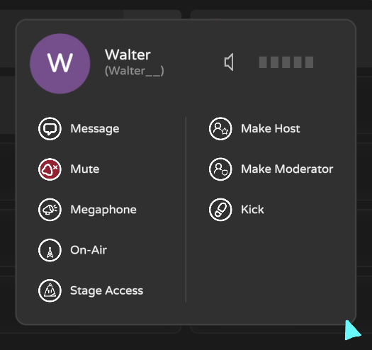)

Now you're able to work your FrontRow Hosting Magic and be able to use these features on your attendees:
    * **Message** - Normally you need to be Friends to be able to message another user, but as a Host you can send/receive messages with anyone in your event.
    * **Mute** - Mute them for everyone in the event.
    * **Megaphone** - Give them the ability to Amplify My Voice.
    * **On-Air** - You can 'Mirror' this guest, this will let their avatar be seen and heard by everyone in all Rooms in your FrontRow event.
    * **Stage Access** - Let them be able to get through any Stage Blockers and go into the stage area.
    * **Make Host** - Gives them the Host role in your FrontRow event. Add a Co-Host on the fly, make sure they go On-Air and they can help you run things or have them travel to the other Rooms to check on things. Is everyone On-Air and showing up in the secondary Rooms? Is your presentation in sync across all active Rooms? Have them go On-Air when they are in the other Room and you'll be able to talk avatar to avatar from Room to Room!
    * **Make Moderator** - Gives them the Moderator role in your Front Row event, to help you with crowd control. Moderators will have access to a limited Host Tools, so they can move from Room to Room to check on things, but don't need to go On-Air. 
    * **Kick** - Kick rule-breakers out of your event, temporarily or for the duration of your event.

## Participation panel
 
You can use this to help interact with your event attendees. You can have a Q&A, form a queue to perform for an Open Mic or to make sure the guest you are talking to is also Mirrored, so everyone can hear the both of you talk to each other from across all of your FrontRow Rooms:

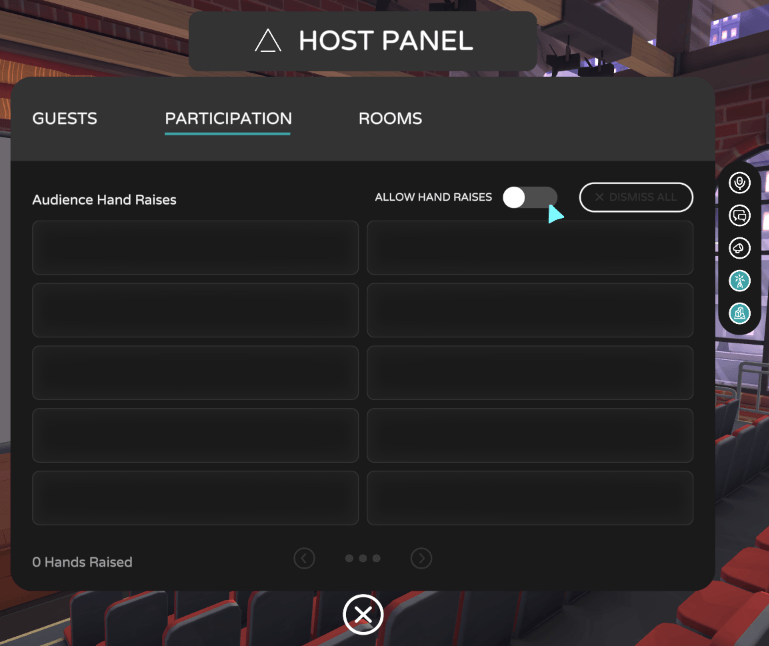)

The Participation Panel is designed to help you manage interaction and participation from your audience. Here you can toggle on the “Allow Hand Raises” option in order to unlock audience participation. **In FrontRow events you'll need to be On-Air first to activate this, otherwise this button will appear greyed out.**

When the “Allow Hand Raises” function is activated, a “Raise Hand” button then appears for everyone in your FrontRow event, in the bottom right-hand section of their field-of-view:

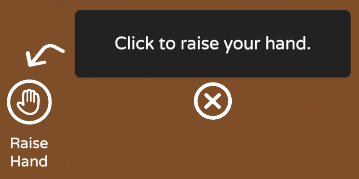

*Clicking 'Raise Hand' puts the guests in a queue that you control.*

When a guest clicks this button, they show up in your Participation Panel:

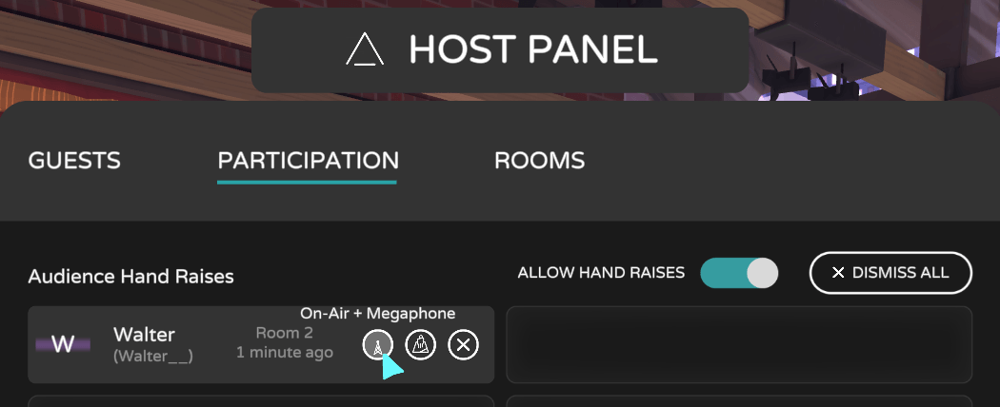)

To help you keep track, the Participation Panel will even light up a red notification when you have guests waiting to be called on, and it will let you know how long each of your guests has been waiting, too.

Now you can call on them by clicking the 'On-Air + Megaphone' button, this will turn the button blue once activated. This action will send two messages to the Hand Raiser, to confirm that they want to un-mute their microphone and 'The host has called on you and made you louder.' Once they accept, the button will turn blue and this puts them On-Air 'Mirrored' and Amplify My Voice 'Megaphoned' for all to see and hear!

Once you are finished interacting with them, 1st click the blue button again to take them Off-Air, the button will no longer be blue, then 2nd, click the X to Dismiss them from the list. Now you are ready for lucky contestant number two, and so on and so on :)

You can also give them temporary Stage Access or click the big Dismiss All button to the right, to completely clear out the list of Hand Raisers and start fresh.

## Room panel

Get a quick look at the info/buttons you need to manage Rooms during your FrontRow event:

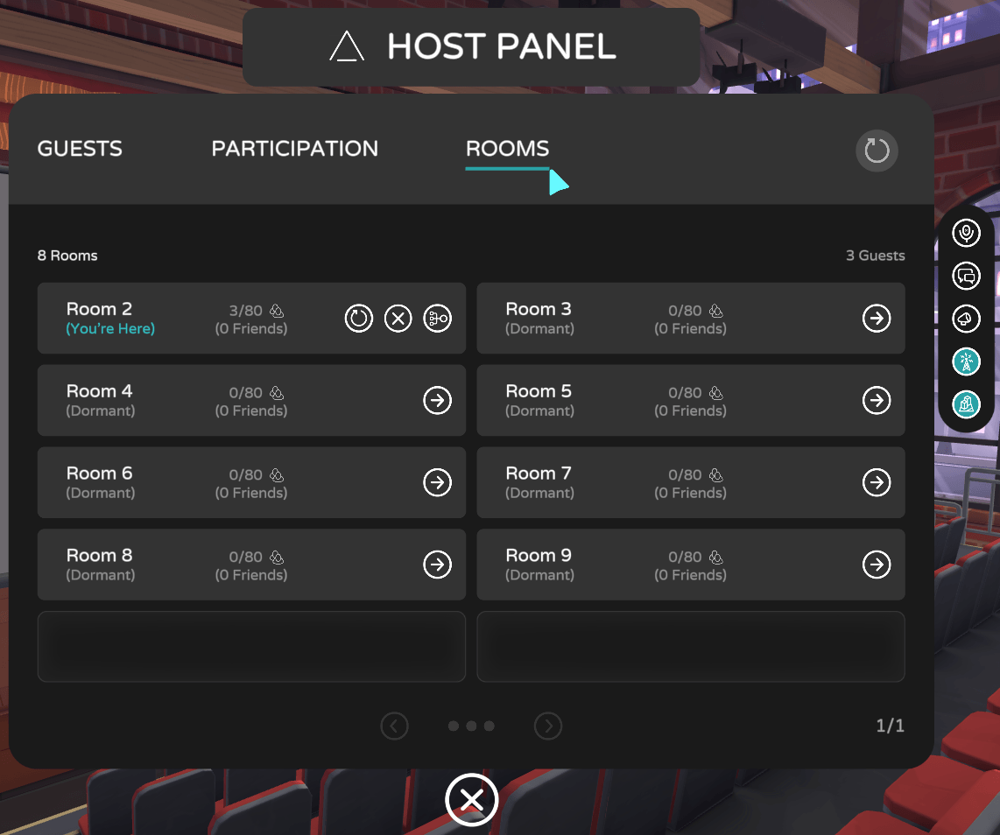)

*Notice it says **(You're Here)**, that is the Room you are currently in.*

Rooms have buttons for Reset Space, Delete Space, Redistribute Users and Teleport There:

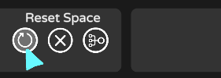)

Will do a 'Reset Space' in the Room you are currently in. You can not Reset Spaces for all Rooms at once, you'll need to travel to each Room to do a reset.

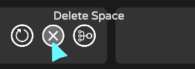)

Permanently deletes the Room you are currently in. Everyone in the deleted Room will automatically rejoin the event and join a different Room.

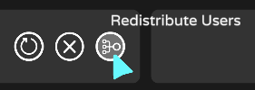)

Sometimes, after your FrontRow event has been on for awhile, the first few Rooms are almost at capacity but the last Room or two may only have a small amount of guests per Room. Clicking this button gives the guests in that Room the option of staying in their current Room or going to a more populated Room.

> [!NOTE]
> You do not have to travel to the Room you'd like to redistribute, you can click the Redistribute Users button on any Room right from the Rooms Panel. Try not to do this too many times to the same Room, the guests in there may want to just be with a few people and may not want to keep getting messages asking to move rooms.

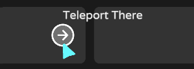)

This is how you travel from one Front Row Room to another. Moderators will want to use this to bounce around from Room to Room to check on the crowds. During rehearsals, you can have one Host, On-Air, in the Primary Room and have the rest of your crew go to the other Rooms to see how everything looks. Is everything in sync in the other Rooms and looking just like it does in the Primary Room? If everyone helping test has the Host Role, they can also travel to the other Rooms, go On-Air and you'll be able to see and hear everyone so you can communicate across Rooms that way.

> [!IMPORTANT]
> You will get a warning when you try to go to a Room that is empty: "Open additional room? Teleporting to an empty room will open it up to others too." **During your actual FrontRow event, you and your event crew MUST all be in the Primary Room five minutes before event start time** (doors open 3 minutes before Event Start Time, so to be safe, make it 5 minutes) or else guests coming in won't fill into the event's Primary Room as expected and this will throw off the sorting for the rest of the event.

Feeling jazzed to try it all out? Great! Go forth and stretch those FrontRow event host muscles.