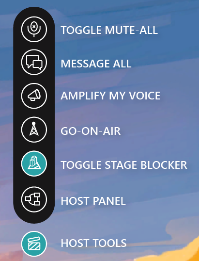
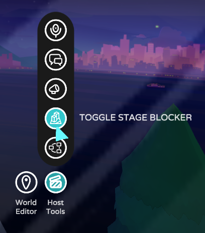
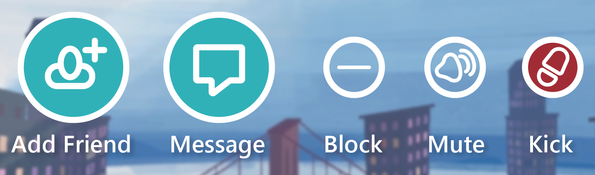
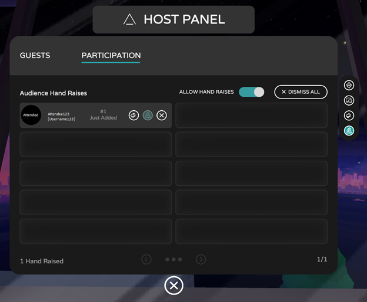

# Host tools overview

When you create an event, you are the automatic Host of that event. The Host role grants you access to special features and abilities created specifically to make hosting a live virtual event simple and easy. Below is a detailed overview of these features and abilities, and other helpful hints for hosting events in AltspaceVR.

## Understanding host tools

The host tools appear on the bottom right-hand side of your field-of-view. It's available to you immediately after your event has been created, so you can enter your event anytime (event start-time don't apply to the Host) and get comfortable with the tools before showtime. The Host Tools will give you quick-click access to things like muting and messaging your audience, toggling your stage blockers on and off, megaphoning yourself, allowing your guests to “raise their hands” to ask questions or offer feedback, and more.

 

Enhanced moderation tools and features are now available in AltspaceVR.  **Personal bubble** and **Mute** are on by default.

### Toggle Mute All

By muting your attendees, you can limit distracting sounds and keep things nice and quiet in your space. The mute function will last for as long as a host allows, or when the host leaves the space. When an attendee enters the space or tries to unmute, attendees will receive an on-screen message letting them know they’ve been muted by the host. When the host unmutes, the attendees will receive a message letting them know that they're unmuted as well.

### Message All

Hosts can send a message to all the attendees present. Use any of our quick-notes or write an original one. Once sent, everyone will receive the message as a pop-up.

### Amplify My Voice

Hosts can amplify their microphones to ensure that everyone in your event will hear what you are saying no matter the distance.

### Go On-Air

When you add the [Frontrow](../faqs/scaling-audiences.md) feature to your event by adding multiple rooms, the **Go On-Air** icon will appear in the **Host Tools** menu.  Your voice will be heard by all participants regardless of which room they are located.

### Stage Blocking (On/Off)

Decide when and where attendees can stand. Choose to hog the spotlight, take turns presenting, or invite everyone on stage for a group dance party.

> [!IMPORTANT]
> To activate stage blocker for your event, pick your event template that contains a stage. Make yourself familiar with our event templates on test events prior to creating your official event. You can also add stages and stage blockers to your event in the **World Editor -> Editor Panel -> Altspace Kits -> Event Tools -> Stage Blocker**.

## Safety and moderation tools

As an Event Host you're responsible for managing the experience of others. To do this efficiently, you need robust moderation tools. 

 

<iframe width="940" height="530" src="https://www.youtube.com/embed/tm_33u2wGm8" title="YouTube video player" frameborder="0" allow="accelerometer; autoplay; clipboard-write; encrypted-media; gyroscope; picture-in-picture" allowfullscreen></iframe>

 

As the Host of an event you can mute disruptive individuals, kick rule-breakers out of your event (temporarily or during your event) and even assign the Moderator role to others to get help managing the audience.

* **Add Friend** - Add a participant as your friend.
* **Message** - Send a private message only that participant can see.
* **Block** - Block the user from your event.
* **Mute** - You can mute participants in your event.
* **Kick** - If you decide to kick someone from your event, a dialog box will appear for you to select the reason for kicking.

    

## Host Panel

Clicking on the Host Panel button will open more advanced options for your events.

### Guests Tab

The Guests Tab allows you to keep track of the guests, moderators, and hosts in your space. It's an interactive list that gives you a multi-page breakdown of who is in your event. Clicking on a guest gives you more options (the hamburger menu) which lets you mute and megaphone by individual.

## Audience Participation Panel

The Participation Panel is designed to help you manage interaction and participation from your audience. Here you can toggle on the “Allow Hand Raises” option to unlock audience participation. 

In FrontRow events you'll need to be [On-Air](#go-on-air) to activate this, otherwise this button will appear as grayed-out. When the “Allow Hand Raises” function is on, a “Raise Hand” button appears in the bottom right-hand section of your guests’ field-of-view. When a guest selects this button, their First Name and Username pop up in your Participation Panel. 

From here you can call on them, megaphone them, mute them, dismiss them, and—if your event is a Front Row event—put them “On Air” to mirror them across multiple rooms. To help you keep track, the participation panel will even light up red when you have guests waiting to be called on, and it will let you know how long each of your guests has been waiting, too.
 

Feeling jazzed to try it all out? Great! Go forth and stretch those host muscles.