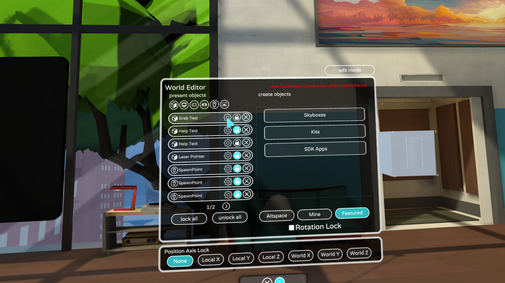
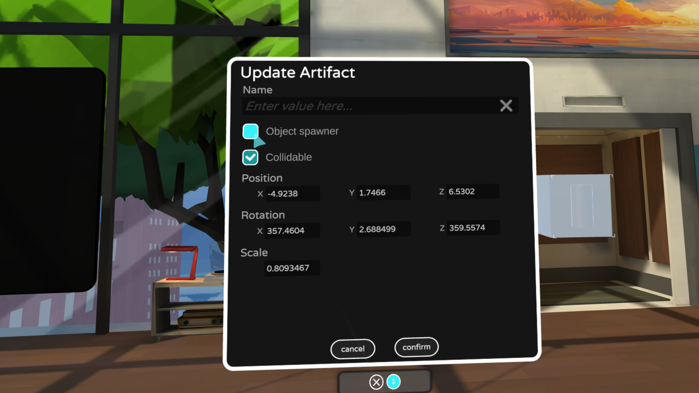
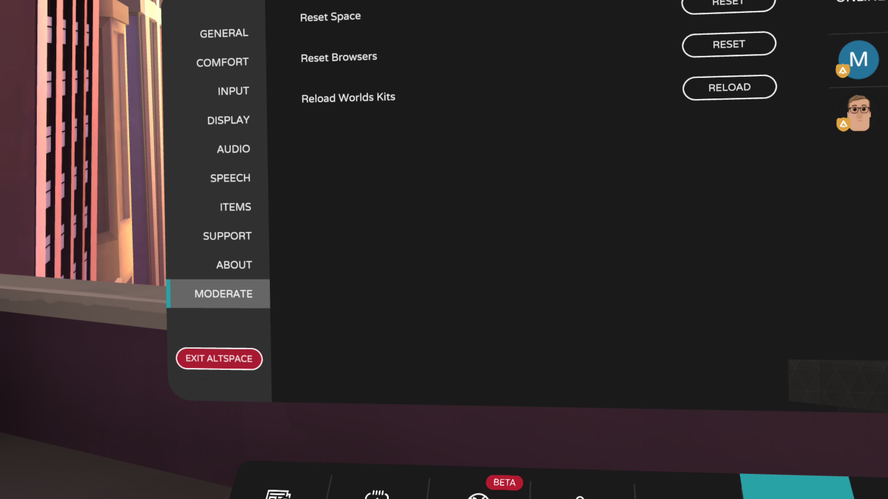

# Using the Interactables Spawner

The Interactables Spawner allows you to place interactable items in your event, world, or home-space. This feature is currently part of our [Early Access Program](../world-building/early-access.md) and won't be available unless you've opted in through your Main Menu.

> [!NOTE]
> While we continue to pilot this feature please be aware that spawning too many interactables may affect the performance of your environment or event. 

## Creating an interactable

To turn your object into an interactable object:

1. Place the object in your space.
2. Then, find the entry in the object list, and select the **gear icon** next to it to open its settings:

On the settings page you’ll find a new checkbox **“Object spawner“**, which is used to make it an interactable object.

1. Check the box and select **confirm**.
2. While in edit mode, you can move around the object’s spawn location in the space.
3. **Exit edit mode** to enable item interaction.

## Other customizations

After enabling **“Object spawner”** when you go back into the properties for that object, there will be an extra setting you can apply to how the spawned object behaves.

> [!NOTE]
> Interactable object scale: This sets the scale of the object when it gets picked up, compared to “Scale” which is the scale of how the object appears in the world prior to picking it up for the first time.

Kit makers may notice that changes to your Kit while AltspaceVR is running won't take effect until you restart AltspaceVR.

Recently we’ve added a button under the **Moderate Settings** tab called **“Reload Worlds Kits“**. Clicking this button causes (just you) to reenter the space, reloading all Kits again, which will download only new versions of the Kits that have been updated while you were in AltspaceVR.

