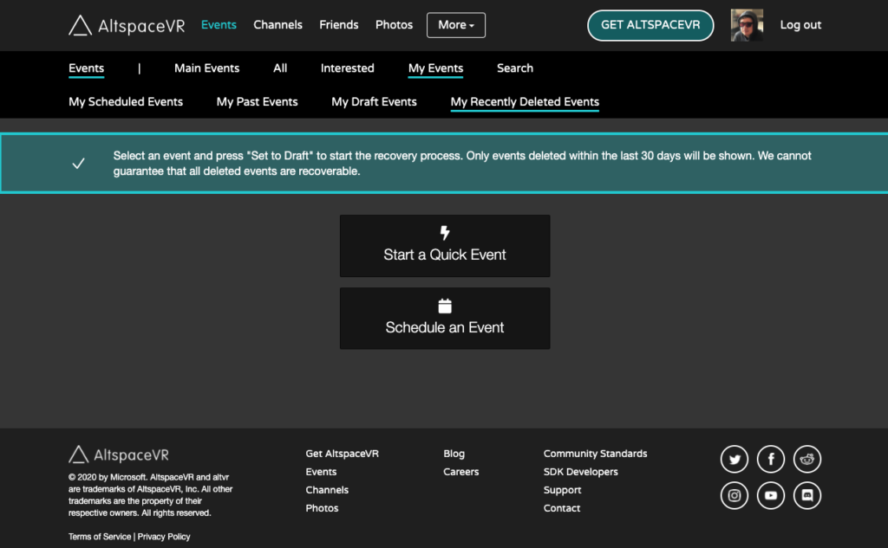

# Recovering deleted events

Accidents happen. That's life. But it can be frustrating to lose a whole event to an unfortunate misclick. If you've accidentally or regrettably deleted one of your events, don't worry. This guide offers step-by-step instruction on the event-recovery process.

1. To begin, first you must log in to your account on the AltspaceVR website.
2. Navigate to the **Events** tab
3. You'll see a **My Recently Deleted Events** tab. Select it.
4. Select an event and select **Set to Draft** (*Only events deleted within the last 30 days will populate in this tab.)

5. Only event owners & admins can see a deleted event's details. All others will see a 404 error page if they go to the direct link.
6. Once you've **Set to Draft** you can make changes to your event.
7. From there, recover your event by selecting **Activate**

> [!NOTE ]
> Not all events may be recoverable. If you're having a hard time recovering your event, reach out to our Help Desk.