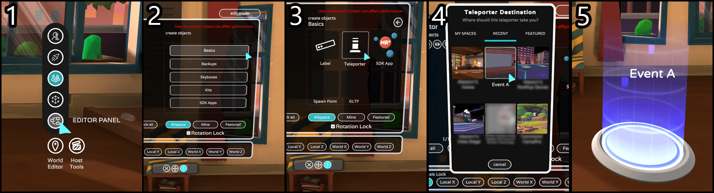

# Using the teleporter

Traveling from one Event or World to another is a great way for you and the community to explore everything AltspaceVR has to offer.

## The short version

## The slightly longer version

First, make sure you're in your Homespace, in an Event or World that you've created or have been given the Terraformer role in. If you are in 2D Mode and don't see the World Editor button toward the bottom right of your UI, right-click the mouse button to toggle that on/off. If you still don't see the World Editor button, you may be in someone else's space. If that's the case, ask the host to give you the Terraformer role.

It'll also help to: 
1. Create the Events or Worlds first
2. Go to where you want to spawn the Teleporter, so your Events / Worlds will populate in the Teleporter Destination panel and make it faster and easier for you to connect them.

Another trick to help you navigate around with Teleporters in 2D Mode is to use Ctrl + Spacebar. It will bring up the Command Prompt and you can type in: back -That will take you back to the last space you were in! 

Now move to the location where you want to spawn a Teleporter and select on World Editor / Editor Panel / Basics / Teleporter.

This will bring up the Teleporter Destination panel. You'll see three categories to choose from:

* **MY SPACES** - List of Worlds that you've created.
* **RECENT** - List of recent Events you've been to. Use this option if you want to travel to an Event, this is the only option that will take you to an Event, the other 2 only let you travel between Worlds. NOTE: See Advanced below if you're connecting Front Row Events that have Imported Worlds, you'll need to spawn and set up the Teleporters in the Imported World and not in the actual Event.
* **FEATURED** - List of Featured Worlds you can set the Teleporter to travel to.

Select the Event or World you want to use, which will spawn the Teleporter and put a text Label of the Event or World name slightly behind. So you could select the Gear icon in Present Objects section to change the Label name.

You can either select on the Teleporter with your cursor (you'll be asked if it's OK to go there, in case it was a misclick) or move your avatar right into the Teleporter and, presto, you're traveling to your destination. Tell them we say hi!

## Advanced features

If you're creating a conference, summit or larger event using Front Row with a custom World (for example, a Foundation World, Unity Uploader Space Template, Re-Import World) you'll need to set up the Teleporter in your Foundation World, and NOT in the actual Event. Make sure you're setting up the Teleporter to travel to the correct Event (must be from the Recent list) in your Foundation World, then Re-Import World in the Event to get the Teleporters to show up in all the Front Row event spaces.

## FAQs

**Error: 'Sorry, we'd like to, but we just can't let you in there'**

Event might have a Group attached to it, so only usernames in the Group can get into that Teleporter to get to that private Group Event.

**How many teleporters can I use in one space?**

Teleporters are using transparent textures with animated particle effects, so it's best to not have too many all in the same spot/overlapping as this might affect performance. Try not to have more than 4 in the same area or more than 10 if they're all spread out in your space.