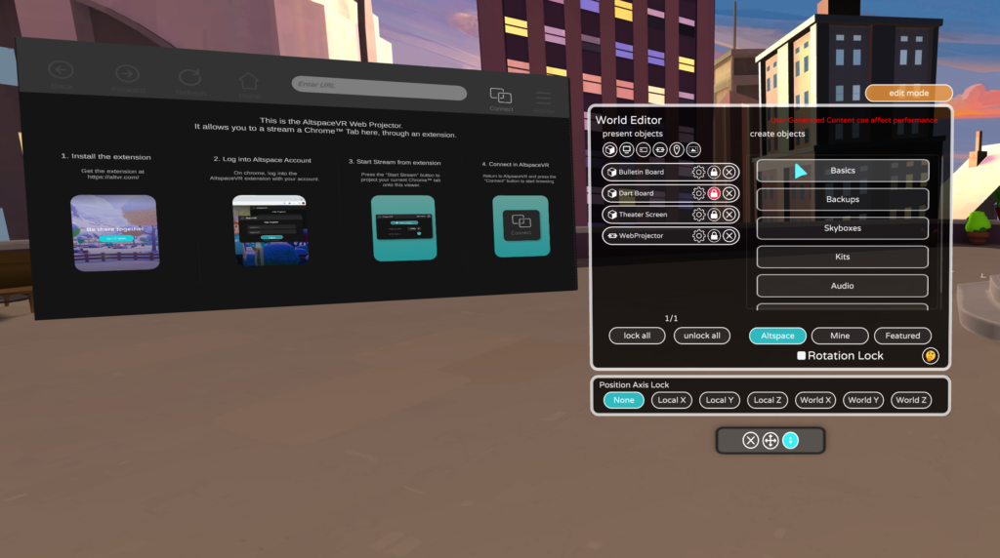

# Using the Web Projector to stream a browser

The AltspaceVR Web Projector is a robust media-sharing solution that allows you to stream a designated browser tab from your desktop PC directly into AltspaceVR. It can be used to share slides, videos, photos, and just about anything else you can open up from a browser.* The Web Projector requires downloading a browser extension and is currently available exclusively through the World Editor. Below is a complete overview of the feature and how to use it:

## Requirements

1. You must use a PC or Mac to stream your browser.
2. The necessary browser extension is currently supported by the Edge browser. (We're working to expand this list.)
3. While you may stream from a Mac computer, the Web Projector isn't yet available in the AltspaceVR Mac client.
4. If you have everything set up correctly (logged into the browser extension/AltspaceVR with the same account, connected/broadcasting with Web Projector in AltspaceVR) but are still seeing a green screen, WebProjector needs TCP port 443 open, as well as UDP port range 20000-20400.

> [!NOTE]
> This feature is primarily intended to stream a browser tab of your choice. If you're attempting to instead stream your Desktop Application, the Web Projector will stream all computer audio (including AltspaceVR) which may result in echo/feedback. You'll need to mute AltspaceVR in order to prevent this from happening. Alternatively, you can also use a separate device to run AltspaceVR while you stream from your PC.

## Getting started

1. To begin, you'll need to download and install the browser extension, which can be found [HERE](https://account.altvr.com/web_projector).
2. Next, [sideload your extension in your Edge browser](https://docs.microsoft.com/microsoft-edge/extensions-chromium/getting-started/extension-sideloading).
    * Once your download is complete, go to the **Extensions** section of your browser. (Found under **Settings**)
    * Unzip the .zip file.
    * Toggle on **Developer Mode** and Select **Load Unpacked**
    * Choose the folder that you just unzipped. This is the Web Projector extension.
    * Once your extension has been added, you can go into **Details** to set up your settings.

## Setting up a shareable browser

Once your extension is downloaded and installed, you're ready to use it!

1. Open a tab in your Edge browser and navigate to the media you'd like to share.
2. Set up your window so you're ready to share. (Note: your whole browser window will be projected in-world)
3. Locate the newly installed extension (which is displayed as an AltspaceVR icon near your URL bar in your browser). Select AltspaceVR. You'll be prompted to log into your account. (*Note: It's important that you log into the same account you'll use to set up your Web Projector.)
4. Once you're logged in, you should see the extension screen offer you a **Start Streaming** option. Select it.

## Projecting your browser in-world

1. Once your browser is set up for projection and you have started streaming via the extension, open AltspaceVR.
2. Set up the Web Projector in your environment of choice by opening your World Editor > Basics > Web Projector
3. Once placed, you can use your World Editor controls to resize the Web Projector. (It will also include instructions, on screen.)
4. Select the **Connect** button to begin streaming your Edge browser.
5. Remember to click **Broadcast** to begin sharing with all guests in the space.
6. Don't forget to **Stop Streaming.** Your session will time out eventually, but until then it will continue to live-project your browser. It's best to end your session as soon as you're done.

**Video-Streaming Tip:** If video stutters, stop streaming, adjust video quality to 480p or 360p, then restart your stream and broadcast. Higher resolutions may strain CPU and upload bandwidth.

> [!NOTE]
> At this time the additional control buttons at the top of the Web Projector are not yet live. They will remain grey and unclickable. This is not a bug, it is by design (for now).

> [!IMPORTANT]
> DISCLAIMER: 
> Note: usage of the Web Projector, like all other features in AltspaceVR, is subject to our [Terms of Service](../community/terms-of-service.md) and our [Community Standards](../community/community-standards.md). As such, the Web Projector may not be used to stream content that is in violation of either agreement. Doing so will result in moderation actions taken by AltspaceVR. Access to the Web Projector Open Beta isn't guaranteed, and may only be granted for a temporary trial. The length of the beta and the length of your participation are at the discretion of the AltspaceVR team. Using the beta version of the Web Projector isn't required, and participation in the beta is purely voluntary. Participants are encouraged to offer feedback about the Web Projector that will help shape the functionality and usability of the feature as development continues. The beta version of the Web Projector may have limited functionality and may be subject to unexpected bugs. Thank you, in advance, for your participation.
