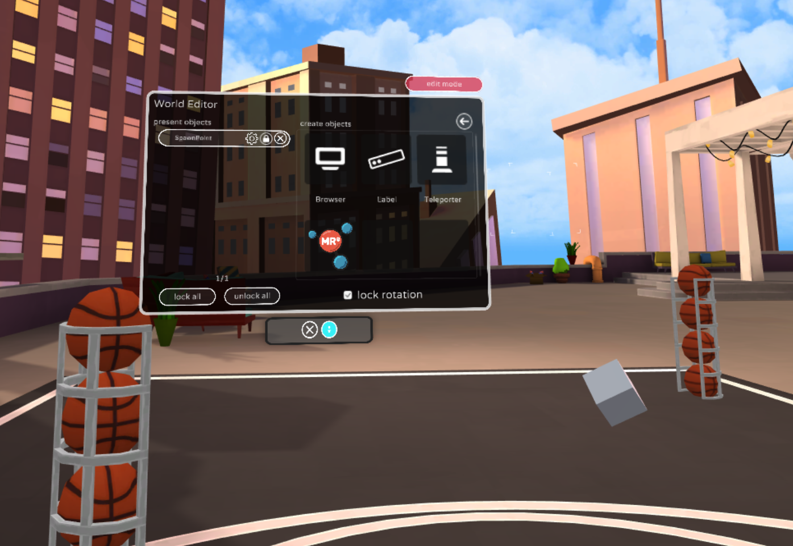
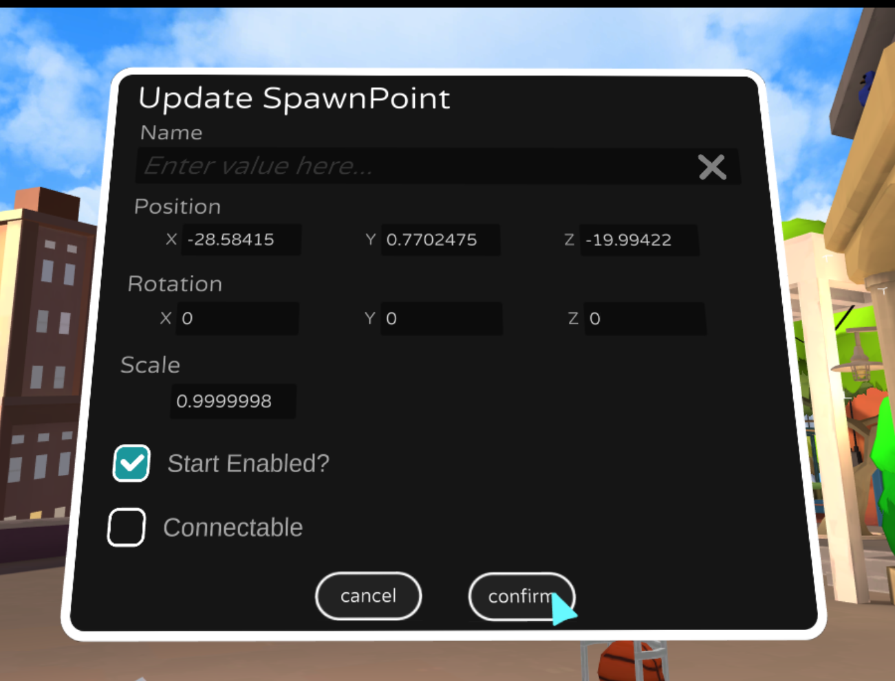

# Adding custom spawn points

People entering your World will **spawn** or appear at the origin, position (0,0,0), when they enter your World. However, you can add one or more Spawn Points if you want to, say, have people start at the entrance to your castle. If you specify multiple Spawn Points, one will be randomly chosen whenever someone enters and the origin won't be included. You can manage Spawn Points to any World or Event where your World Editor is enabled. You control where people spawn (position) and what direction they'll be facing (rotation). Spawn Points will only be visible in Edit Mode. 

1. Go near the spot where you want people to spawn. Open **World Editor > Basics** and make sure **Lock Rotation** is checked. Select **Spawn Point** to create one. Move it to the exact position you want:

2. Select on the settings icon for the Spawn Point and make sure **Rotation > X** and **Rotation > Z** are both **0**. If they are small numbers like **8.537777745E-07**, that's fine too. That's a quirk of how floating point numbers are handled:

3. Reenter your World via **Menu > Settings > General > Reenter Space > Re-Enter**
4. You should spawn at your new Spawn Point!
5. If you want people to face a different direction, select the settings for the Spawn Point and set **Rotation > Y** only. Try setting Y to 180 and both X and Z to 0 (Warning: X and Z are advanced may make people sick). Then select **Confirm** and reenter the World. That should spawn you facing the opposite direction. 

## Troubleshooting

**People still spawning at the origin?**
    * Make sure your Spawn Points are slightly above the ground or surface. If the Spawn Point is overlapping other objects, people spawn at the default location, the origin. This can happen if the Spawn Point inside an object and the height of person varies. 
    * Try resetting your World via **Menu > Settings > Moderate > Reset Space**

**Have multiple Spawn Points but still spawning in the same place?**
You might be unlucky--it's random after all. Try a few reentering at least five times before assuming there's an error. 

**People are uncomfortable or their head is tilted**
You may have forgotten to check **Lock Rotation** or set the X and Z value for Rotation. Those should usually be set to 0 unless you're building an exotic World. 

**People falling when they spawn?**
Don't set the Spawn Point position too high above an object. If they fall too far, they'll be respawned at the origin.