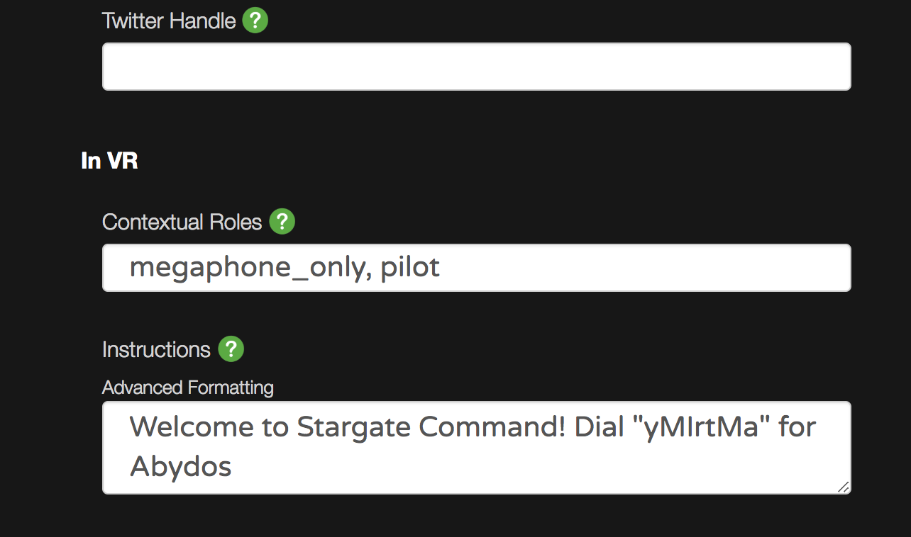

# Adding user abilities

You can’t fly in Events or in the Campfire because it would likely be disruptive. However, in your Worlds, you can let people take off like the Wicked Witch of the East. Here’s how you can grant special abilities.

1. Edit your World on our website. See [How do I manage my Worlds?](managing-worlds.md) for help.
2. Scroll down to the “In VR > Default Contextual Roles” field. You can hover over the green question mark to see more details. All the possible roles are listed.
3. Specify any roles that everyone entering your World will receive. Each role comes with its own abilities.
4. Click “Update”. Users will need to reenter the World to get there new-found abilities!

## Roles and Abilities

* **Pilot** - flying (they will need to activate this in VR by going to Settings > Input > Fly)
* **megaphone_only** - everyone hears you in their ear if enabled
* **musical_performer** - increased audio quality and bandwidth usage
* **Terraformer** - access to the World Editor
* **showcase_new_sdk** - spawn new SDK apps
* more…

## Tips

* If you’re going to let people fly, add “megaphone_only” as well. It’s hard to hear other people in a World where people are flying around.
* Be careful with “terraformer”. People will have the ability to edit your World. Multiple users World-Building together is still experimental.