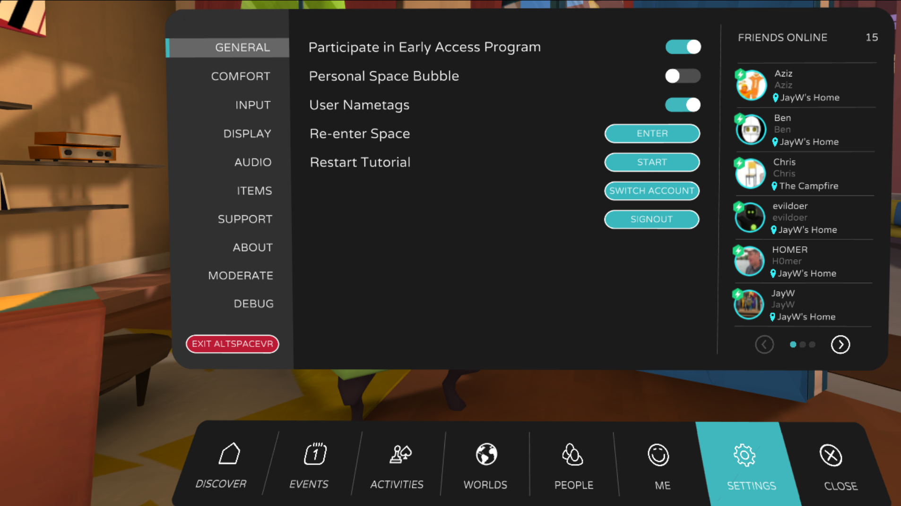
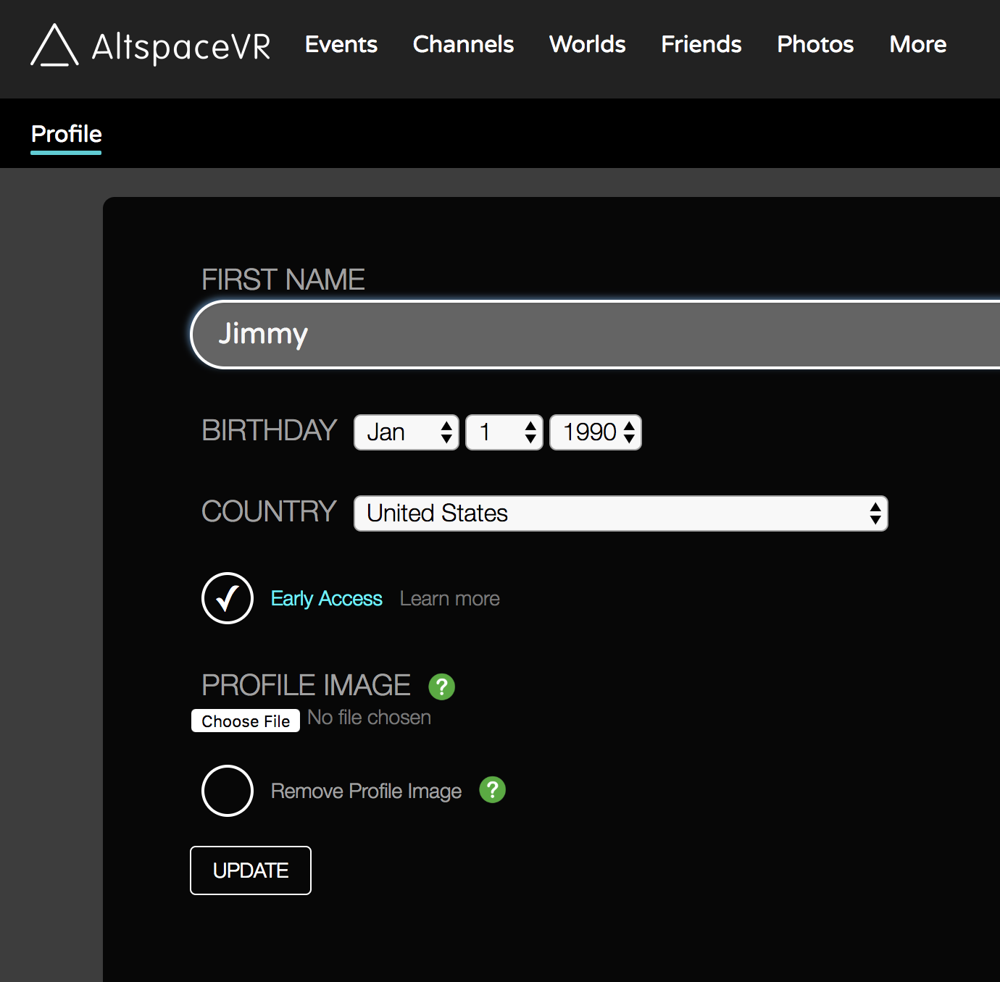

# What is the Early Access Program?

The Early Access program gives you access to the latest features that are still in development and it's free. We’re working on different things and want to give them to you, even if it doesn’t have all of the polish. Why you ask? Because we want to know what you think! Do you like them? Are they valuable to you? Are they annoying? Your feedback is valuable to us and will ultimately help make a better Altspace. Many World-Building features are only available to users who are in Early Access and so here's how you can opt in:

## In VR

1. Open your Menu to **Settings > General** and toggle on **Participate in Early Access Program**:

2. Restart Altspace
3. Explore your new abilities!

## On the Web

1. Edit your Altspace [profile](https://account.altvr.com/users/sign_in)
2. Check the **Early Access** circle and press **Update**:

3. If you're already in Altspace, restart
4. Explore your new abilities!

## Troubleshooting

* I don't have a particular ability
    * Did you restart Altspace? Abilities are loaded when you first start Altspace
    * Are you the latest version of Altspace? Open your Menu to Settings > About to check. Confirm with an admin in the Campfire if necessary
    * Some abilities are only available to admins and some are only available in certain places. For example, you may have special abilities in your Home but not in a public World. Confirm with an admin whether you should have a particular ability in that context