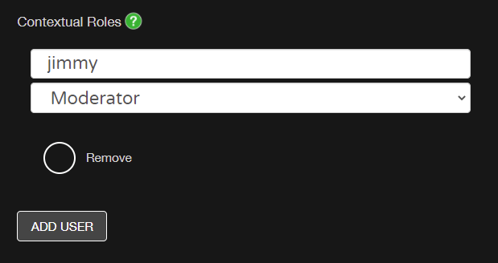

# Granting world roles
>[!Important]
>AltspaceVR is shutting down on March 10, 2023. For more information, please visit https://aka.ms/altvr.

Altspace has a Roles and Abilities system. Each person can have multiple roles and their roles can be different depending on where they are. Each role, in turn, gives you one or more abilities. For example, when you're in your own event, you automatically receive the **host** and **moderator** roles. With those two roles you can kick unruly users, be on stage, and maybe release the confetti.

1. Edit your World and look over to the right column for **Contextual Roles** ([How to manage Worlds](managing-worlds.md))



2. Click **Add User** under the **Contextual Roles** field if you want to grant specific roles to specific users just for this World. For example, if you want to give me **host** + **moderator**, you would add the above and select **Save**. The format is **username**, username is case-insensitive, choose the role from the dropdown menu **Terraformer**, click Add User multiple times to keeping adding more users and then click **Update**.

* In order for the change to take effect in Altspace, you should Reset Space the world forcing everyone to rejoin or have each user with a new role rejoin the world.

3. Edit the **Default Contextual Roles** field, under the **In VR** section, if you want to grant a role to every one that joins your World. For example, if you want to let people fly and use the megaphone so they can hear each other while far part, add the following:

```
pilot,megaphone_only
```

After you select **Update**, Reset Space in the World. This will only affect this World. If you want to grant roles to an entire Universe, edit the same fields on the Universe. The same goes for events, if you want everyone in your event to have these roles you'll need to add this to the **Default Contexual Roles** of the event itself.

## Roles

* **Megaphone_only** - ability to speak into users' ears wherever they are in the World
* **Moderator** - abilities like **kick** to maintain decorum
* **Pilot** - ability to toggle fly mode and spawn the 6DOF flight tool
* **Host** - abilities like being able to be on stage, have megaphone
* **Terraformer** - ability to use the World Editor
More information about ([Roles in events, worlds, groups, and in AltspaceVR](../getting-started/roles.md))

## Troubleshooting

**Can I delete roles?**
Yes, edit your world, click **Remove** below the role you'd like to delete and click **Update**

**Are roles copied when a World is importing from another?**
No, roles aren't copied