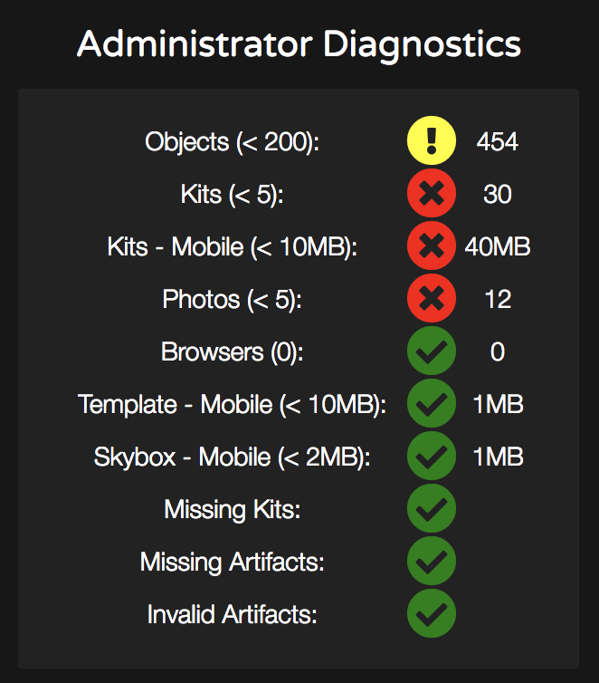

# Improving world performance

We want people to have a good experience so performance, or how well your World runs on VR headsets, matters immensely. Our World Building system is designed for great performance for most common use cases. If you're looking to maximize Presence, this guide is for you. Altspace aspires to support every hardware platform. While we encourage World Builders to push the limits, for public Worlds we recommend you target the Oculus Quest and any PC-based platform like Windows Mixed Reality, Oculus Rift/Rift S, or HTC Vive. To keep it simple, if your World runs well on a Quest, it's probably great for Altspace.

## Tools and Measurement

Administrator Diagnostics is an offline tool available on our website, altvr.com. If you navigate to [Worlds > My Worlds](https://account.altvr.com/users/sign_in), find your World, and select “Diagnostics”, you'll see something like this:

These are more guidelines than requirements. Performance depends on how many Objects you have and how they're arranged. For example, if you have 500 objects spread out over 2 kilometers, the performance will probably be fine. However, if you put the same 500 objects into a tightly packed area, you'll likely see problems. That’s because performance depends on what's within a person's Field of View. The best way to test is to hop into Altspace and teleport around your World. If you notice any glitching or feel any discomfort, those are problem spots you'll want to investigate.

By sticking to these recommendations, you set yourself up for success. Let’s go over this sample diagnostic taken from an actual Featured World: 

* **Objects** - Total number of Objects in the World. Everything is an Object--Artifacts, Photos, Spawn Points, and so on. We recommend you stay under a certain number but this is flexible. If you go over, we indicate our concern with a yellow exclamation mark, as shown here. However, in this case, there are two separate areas in this World so the density isn’t high.
* **Kits** - Total number of unique World-Building Kits used. This impacts initial download time when loading the World. Kits contain Artifacts, the menu of Objects you can spawn into the World. 

> [!NOTE] 
> If a single Artifact is used from a Kit, that Kit’s assets need to be downloaded. So it's awfully expensive to just use a few Artifacts from a single Kit. 

* **Kits--Mobile** - Total size of all the Kit assets that a person on a Quest has to download before entering the World. Try not to make people wait 5 minutes to download everything they need for your World.
* **Photos** - Total number of photos used, which tend to have a higher performance impact than Artifacts. Use sparingly.
Template--Mobile - If you're using the Unity Uploader, keep the download size low.
* **Skybox--Mobile** - If you're using custom Skyboxes, keep the file size small so people don’t get “black screen” (run out of video memory).
* **Missing/Invalid Kits/Artifacts** - References to problematic Kits or Artifacts
... Have an idea for a metric? Let us know!
Once again, these aren't requirements so we show green, yellow, red status icons. Even a World with a bunch of red indicators may still be featured. We test in Altspace so you should too. [Reach out to us if you need help](getting-help.md). 

## Load Time

When a person starts traveling to your world (attempts to enter), they'll first load the Template. They'll download the Template assets (files) for their platform and see “Loading Environment”. Then they'll download the Skybox and Kit assets. Finally, they'll load all the Objects while they see “Loading Objects”. Downloading all the assets can take upwards of a few minutes depending on their internet bandwidth—Object loading is fairly quick. While the assets download from fast servers all around the world, Altspace uses caching techniques to avoid redownloading the same files repeatedly. Technically, initial load time doesn't affect a person’s performance after they enter the World, but it’s part of the overall experience so try not to make people wait too long when traveling to your World. We suggest you think carefully about what Kits to use and be imaginative by doing more with less.

## Troubleshooting and Tips

**People are seeing a “black screen”**
Typically, this is because the device ran out of video memory. Try to reduce the number of Objects in the problem area of the World and reduce the sizes of things like your Skybox or Template or the number of Photos. Those types tend to have the highest impact on video memory usage.

**People are crashing**
    * Sometimes a broken Kit or Artifact can cause this.
    * Crazy shaders or animations might cause this too.
    * Watch out for things in custom Templates and Kits.
    * Back up your World often, especially during early development. Use those backups to hone in on what you have added recently that is causing people to crash.

**Leave “headroom”**
    * Remember that you may have 20-30 people in the World at the same time. What if all those people were huddled around a campfire. Would you still want to put 200 pebbles by the fire? Probably not a good idea. Leave some room for Avatars and Interactables (like basketballs).
    * Less is more.

**Plan Ahead**
Think about what you want to create and space things out. It's easy to get around in Altspace.

**Use the Diagnostics Tool Early and Often**
Bookmark it and refresh it once in a while. Eventually, similar tools will exist in VR that will be more accessible.

**Make friends with Oculus Quest users**
Invite them to come into your World to help you test. Test thoroughly and often! Test each others’ Worlds! Nothing beats testing on the real thing.

**Add friends as "Admins" for your World**
Edit your world and add your friends to the Admin list. This will let them see the Diagnostics tool for your World. Be careful though because they can also edit other aspects of your World. 

**Performance optimization is hard so our community is eager to help**
Join the [Official AltspaceVR Discord](https://discordapp.com/invite/altspacevr) 
    *Visit the #world-building channel for general assistance with worlds.
    * Visit the MRE SDK channels for specific assistance with more technical and Unity Uploader related help (Templates and custom Kits)