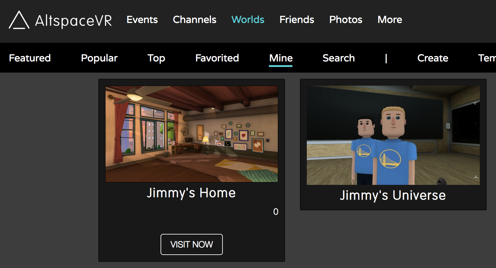
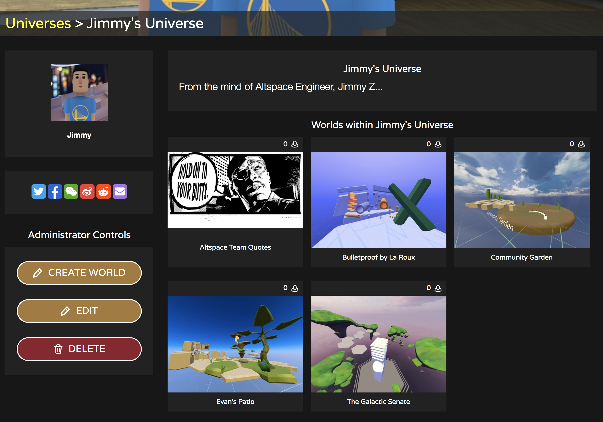
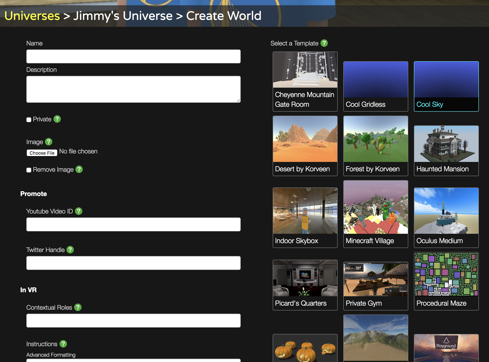
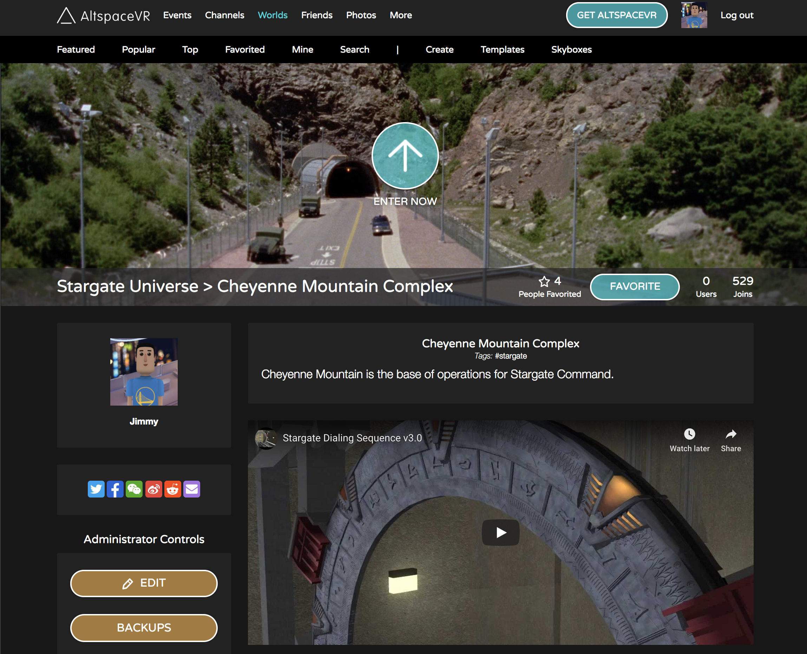

# Managing worlds

You’re in luck! See our [World-Building Getting Started Guide](world-building-getting-started.md) to visit your first personal World. If you want to use advanced features or create other Worlds and Universes, this guide is for you. Limited World controls are available in VR and full controls are available on our website.

## Creating extra Worlds

1. Navigate to [Worlds > Mine](https://account.altvr.com/worlds/my)

2. You should see your Home and your default Universe. A Universe is a collection of Worlds. It makes it easier to organize all the amazing Worlds you’re going to build. Choose your default Universe and then select “Create World”:

3. Your default Universe will have a default World.
4. Choose a Template. You'll start with a few basic ones. Check out the [Unity Uploader](world-building-toolkit-getting-started.md) if you’re interested in creating your own Templates. Fill in the details and make sure you upload an image. That will give people an idea of how your World looks. Select “Create” when you’re ready.

5. Congrats on your brand new World! You can choose “Enter Now” to launch Altspace or share the link to this page with your friends. In VR, you can find it under Worlds > My Worlds. There’s no limit to the number of Worlds you can create.

## Advanced Features

* Private Worlds - Check the “private” box if you want some privacy. You can Allow List people to join you by adding them to the In VR > Allow List field.
* Promotion - You can embed widgets from social media sites to show on your World's webpage, this doesn't add these into your in VR World.
* Instructions - This message is shown to people every time they enter
* Unlisted Worlds - Hide your world from Worlds > Popular and Search
* Import from World- You can import from another one of your Worlds.
* Search - Add tags to make your World more search-friendly.
* Roles and Abilities - Give specific people abilities by granting them roles

## Creating Extra Universes

Under Worlds / My Worlds / Universes, there’s a “Create Universe” button at the top. That will create a new Universe. Universes aren’t surfaced in VR yet.