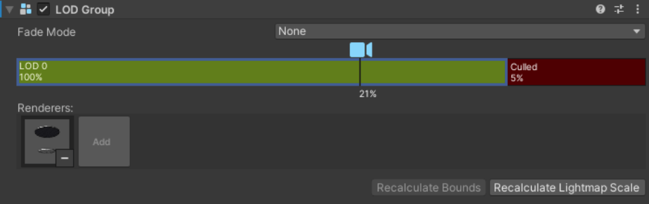
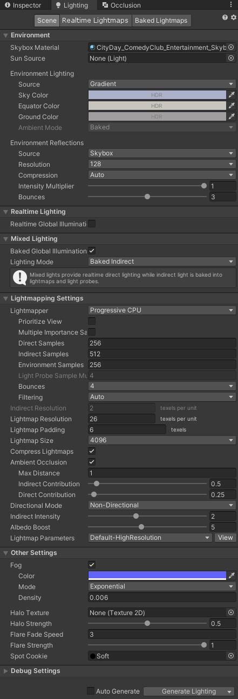
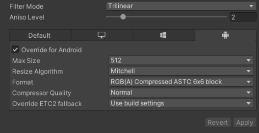

# AltspaceVR Mobile Performance Guide

## **Main Points:**

* **72 FPS** on Oculus Quest 1 and 2, is the target.
* **Reducing Draw Calls via Static Batching** is essential, aim for **less than 25 drawcalls**
* **One material per object** to encourage Static Batching (split up multi-material objects into separate objects).
* **Objects** in an environment should be set to **‘Static’** in most cases.
* **One lightmap per scene**, one 2k or one 4k for the whole scene, ~25 texels per unit, lightmap scaling should be tuned per object (scaling chart below)
* **Use Mobile-quality shaders** (that is, ‘Mobile/Diffuse’, etc.), avoid the Unity Standard shader/PBR/Reflection Probes/Light Probes as they are heavy operations and in the case of the probes will add draw calls.
* **Less than 100k triangles** on-screen
* **Occlusion Culling** can help reduce on-screen polygons, although there is an up-front cost to having occlusion culling enabled so measure the effect on framerate in Altspace using the Diagnostics Panel.
* For all **textures** in a scene, use **‘Override for Android’** and set them to **RGB(A) Compressed ASTC 6x6 block format**.  Leave your Android Build Settings compression to default (found in: File/Build Settings/Android/Texture Compression: ‘Don’t override’), so that Lightmaps don’t get ASTC compression.  By doing the above, and by sharing materials across objects, we try to keep our scene’s unity package to around **10-20 MB for Android**.

The general goal is to hit an acceptable framerate across devices – on Oculus Quest 1 and 2 ideally the scene will run at 72 FPS from all vantage points when the scene is populated, although a range of 60-72 FPS is often a more realistic target.

Framerate can be measured within AltspaceVR on whichever device that you’re using (found in the AltspaceVR app under **Settings/Support/Show Diagnostics Panel/FPS**).

A rundown of the standard Unity tools available to help you to better-optimize your scenes:

## **Stats Panel/Frame Debugger/Profiler**

* These tools will be your best friends in improving your scene's performance.  They can **only be referenced while the scene is Playing in-editor**, as their values will be different from when the scene is not playing (that is, Automatic static batching won't be happening when the scene isn't playing)

* **Stats Panel** (viewable in Game View under 'Stats') will show you the amount of **Batches/Batches Saved, SetPass Calls, and Framerate**.

    * Batches – the amount of current draw calls that are visible from the current camera's perspective.  **Fewer than 25 batches** for an environment is a good target to aim for.
    * Batches Saved (only visible when the scene is Playing)  – the amount draw calls that have been reduced via **Static Batching or GPU Instancing**
    * SetPass Calls – the number of different visible materials in a scene
    * Framerate – the amount of frames-per-second in the Game view (gives you an approximate idea of what's happening; scenes should always be tested in-app, in-headset, using the Oculus Framerate panel as the fps readout will always be different than what's in-editor)

* **Frame Debugger** (found under Window/Analysis/Frame Debugger).  The Stats Panel on steroids that, when enabled, will allow you to see what the GPU is drawing to create the final image, showing you a list of drawcalls from first to last.  It will give you reasons for why a draw call wasn't batched with a previous draw call (that is, 'This object uses a different Material' or 'This object uses a different Lightmap'), and is an excellent way towards developing an understanding both of what's happening in your scene, and how and why certain visual choices can be computationally expensive.

* **Profiler** will show you what parts of the computer are being used at any point in time while the game is running. Helpful in determining where performance is bottlenecking.  For instance, if you are seeing heavy CPU usage in your scene, it could be that there are too many draw calls, or if you're seeing heavy GPU usage, there might be too much overdraw happening (that is, the number of times that a single pixel is rendered to produce the final image) which can be caused by having multiple transparent surfaces, or objects not being culled when out of view.

## **Draw Calls (Shaders/Materials/Objects)**

* Every time that a shader, material or object needs to be rendered, the CPU has to instruct the GPU of the switch (also known as 'draw calls', colloquially **'drawcalls'**).  That is, if you have 5 shaders, 10 materials, and 20 objects, with whichever is greatest; you'll have approximately 20 drawcalls.  Other things that can multiply drawcalls include having objects on different lightmaps or having more than one real-time light in a scene (that is, one point light will add another drawcall to every object that is within its range), so generally anything other than a scene's directional light should be avoided.  Reflection probes and light probes will also multiply draw calls on whichever objects that they hit, so they should be avoided.

* **Static Batching** will batch objects that share like-materials into a single object when sent to the GPU (with Occlusion Culling discarding meshes that are out of view), so by setting all objects in the above example to 'Static', you would reduce the scene to approximately 10 drawcalls, 1 for every material. 

* **Material batches** occur when an object has the exact materials as another object, however if an object has multiple materials, it won't batch with an object that has fewer materials.  For this reason: **Objects MUST only have 1 material**, and objects that use several materials should be split into separate objects per material.  **Material batches** can be reduced through **Texture Atlasing** (combining multiple unique object's textures to share a single texture sheet so that they all use the same material).  Try to keep the amount of Atlases down to a single 2k or 4k texture/material per scene if possible.

## **Scene Complexity**

* **Geometry** – try to keep onscreen triangles for environments below 100k.  Use the ‘Stats’ tab in Unity’s Game panel to see what triangle counts you’re hitting from various vantage points in the scene.  Props as such should be in the ‘hundreds’ of triangles range, with only important ‘hero’ props in the thousands of triangles range. 

* You can technically use **LODs** (level of detail meshes), although Unity’s default lightmap solution does not share lightmap data between LODs, so you may get lightmapping artifacts when the LODs switch at this resolution.  Alternatively, you can use the LOD Group component for simple Distance Culling, even if the object doesn’t have lower LOD meshes:

* **Occlusion Culling** reduces the number of objects that are rendered to only what is within the camera's view frustum, and that are immediately visible (that is, objects that are Occluded from view are Culled).  Occlusion culling should almost always be baked for your scene, and levels should be designed to support it (that is, if you have a large level, walls or large objects can be used to break up the player's line-of-sight, so that they can't always see through to the opposite end of the level.  The default bake settings should work, although you may have to shrink the 'Smallest Occluder' or 'Smallest Hole' values.  For objects like fences where you may be able to see through cracks in the object, or transparent objects, you should turn off the object's 'Occluder' status in the 'Static' drop-down menu so that objects behind it aren't erroneously occluded. 

## **Lightmaps**

* Ideally just **one lightmap per scene** (one 2k or one 4k for everything), if not; fewer lightmaps of higher resolutions are better than many lightmaps of lower resolutions.
* Having multiple lightmaps can also affect the number of draw calls, as objects that either have or don't have lightmaps will be on different batches, and other lightmaps will also be on different batches.
* Generally, a Lightmap Resolution of around **25 texels per unit** should suffice (set resolution in the Lighting/Scene settings).  If you have extra room in your lightmap, you can increase this value.
* Change the **Lightmap Scaling** setting per object so that the resolution is saved for objects that need it. 

* **Lightmap Scaling Chart** (rule of thumb) 
    * **Foreground** (Traversable level geo): 1 
    * **Props** (especially props smaller than a human): **2-3** (to avoid lightmap artifacts and seams on your objects) 
    * **Midground** (Geometry that is just outside of the traversable area and/or large objects like buildings): **0.5**
    * **Background** (Vista/distant objects): **0.02** 
    * **Transparent Surfaces** (like glass): **0** (with 'Cast/Receive Shadows’ disabled) 

Also, as a baseline, here are some settings that were used for the Screen Door Effect environment:

Note: If you are using these settings, you can set the Lightmapper to 'GPU Lightmapper' and set the Lightmap Size to '2048' for much faster preview bakes, and then back up to CPU and 4k for your final bake.

## **Texture Compression/File Size**

* For our Android build, we try to keep our Unity package scene size down to around 10-20 MB total.  We do this by sharing generic materials across many objects, using vertex color to tint the objects, and also by setting manual overrides for Android so that textures use **ASTC 6x6 block compression**, which will be smaller than the default compression.

* The reason that we don't set the Android build settings to use ASTC is because lightmaps do not look good with that compression (lots of blocky artifacts), and we’d have to set the lightmap to use ETC after every bake, so it is easier instead to set up the override for all scene textures once than it is to update the lightmap’s compression settings after every bake.

* Also, setting Textures to use Trilinear Filter Mode with a 2 Anisotropic Level can help them remain sharp at glancing angles.

More performance tips and tricks can be found in the [Improving world performance documentation](improving-performance.md).
