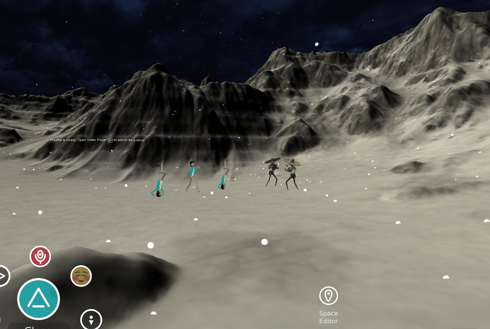
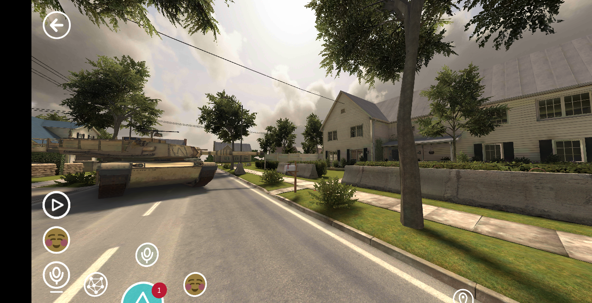
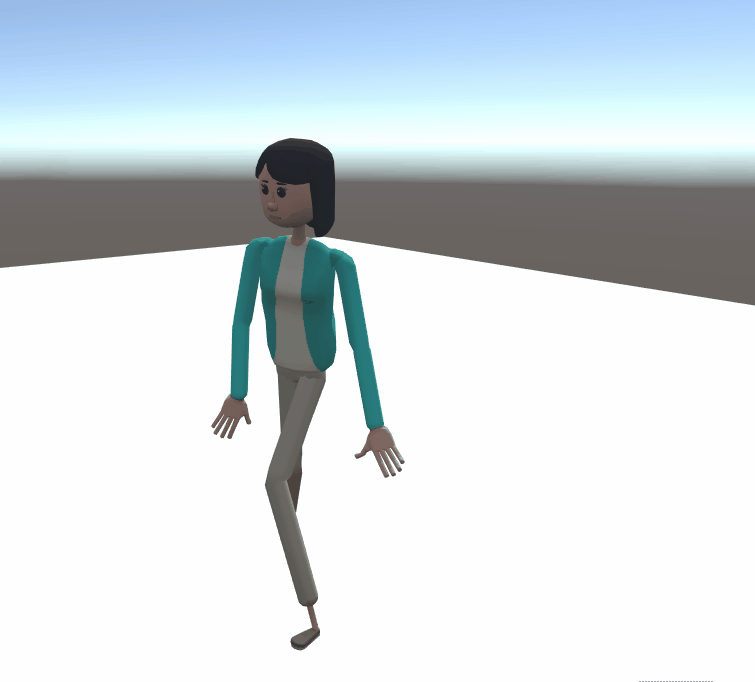

# Unity Uploader help

**1. How awesome is this tool?**

<!-- Need video uploaded to Channel9 -->

That's my Stargate Unity scene with an SDK app powering the Gate and DND

**2. I'm a video learner, where's my videos?**

<!-- Need video uploaded to Channel9 -->

**3. Where can I find examples?**

[Featured Worlds](https://account.altvr.com/worlds/featured) and [Jimmy's Examples](https://account.altvr.com/worlds/1046572460192825569) are good places to start

**4. Will this work with Kits and the new SDK?**
Yes, you can use all the tools together if you'd like. We're trying to develop them to work seamlessly together.

**5. Does it support particle effects?**

**6. Can I get spatialized audio?**
Not right now but you can place audio sources to play in localized areas. 

**7. Does baked lighting work?**
Yes, but your lights have to be set to "baked" and not "mixed"

**8. Does global illumination work?**
Yes

**9. Do you always have to reset the World?**
Yes. We have to reload the Unity Asset Bundles every time. 

**10. Can I use my own custom materials and shaders?**

**11. Can I upload to one platform only?**
Yes, using the Uploader tool. However, people who are on Android won't see anything in your World until you upload the scene for their platform. 

**12. Are scripts allowed?**
No, for security reasons we can't allow scripts or script references. If your upload contains scripts or script references, it will be rejected. Take a look at the new SDK if you World needs scripting. 

**13. How big of a scene can I upload?**
We suggest you start small and be mindful of people in Altspace who don't have monster PCs. That said, we've had games bring in their maps for live streams (for example, Onward, a VR shooter game)

**14. Do I have to host the scene files?**
No, Altspace is serving up the files once you upload them

**15. Are shadows allowed?**
Yes

**16. How quickly can I iterate using the Uploader?**
If you're already in your World, you can press Upload in the Uploader, reset your World, and see the updated scene in as little as 10 seconds. Typically, you'll see loops of 30 seconds to a few minutes depending on the complexity of your scene. Have a drink, you deserve it for being a World-Builder!

**17. Where do I get 3D models?**
Sketchfab, Sketchup, Minecraft, Unity Asset Store, and so on.

**18. Does it support animations?**

**19. How can I set up spatial audio?** 
Import the wav file of choice, create an empty game object in the scene and select this object. Drag and drop your imported sound to the inspector of the object and it will create an audio source. Afterwards adjust the volume to no more than 0.5, change the spatial blend to 3D, and adjust the min and Max distance to create a proper area of sound. This is displayed as sphere like colliders by default. To get a true drop off, you'll need to adjust the drop off curve to your liking. [(via @IsThatToasted)](https://www.youtube.com/watch?v=ktb2vAAwknw&list=PLGmYIROty-5bpzKQNK3mRMi4pmh_LinV4&t=642s&index=29)

**20. How come I'm seeing cross-eyed / weirdness?**
Sometimes the Uploader doesn't successfully override your rendering settings. "Go to Edit > Project Settings > Player". Make sure "XR Settings > Virtual Reality Supported" is checked and "Stereo Rendering Method" is "Single Pass" or "Single Pass (Preview)" for both PC and Android (select the robot icon). Afterwards build + upload again and reset your World. 