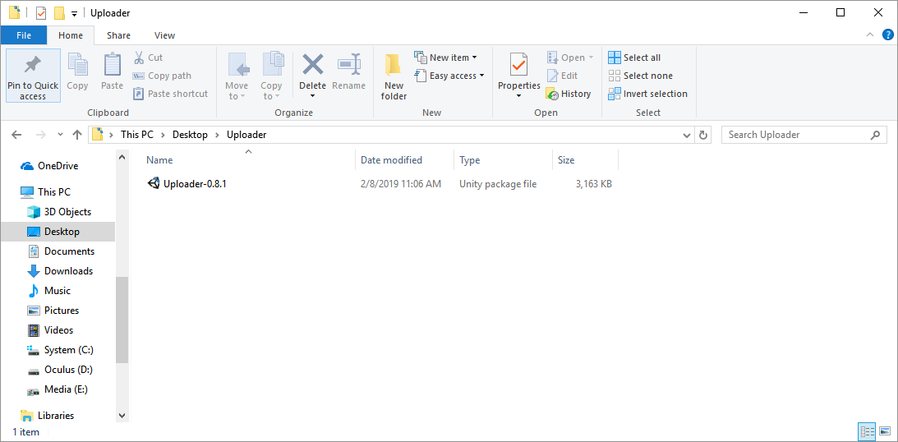
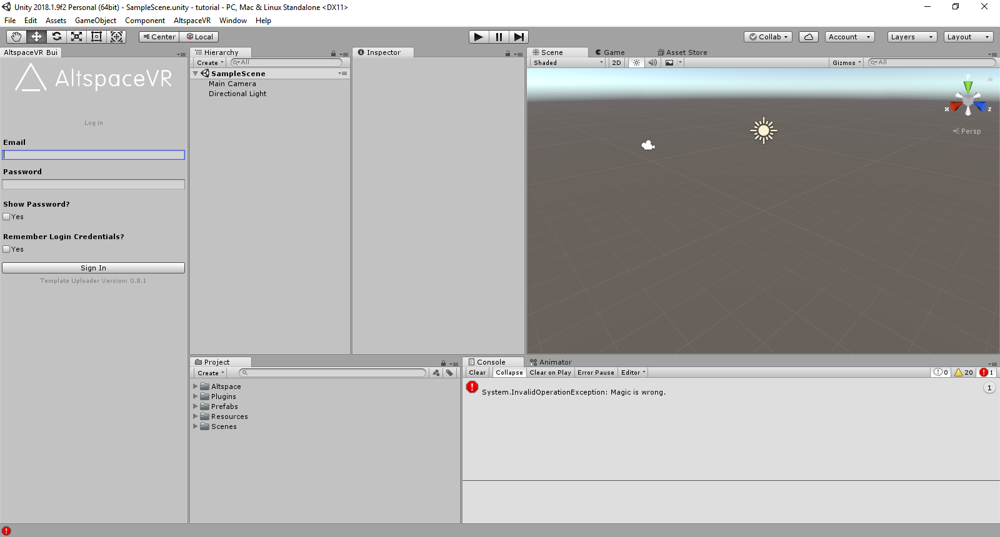
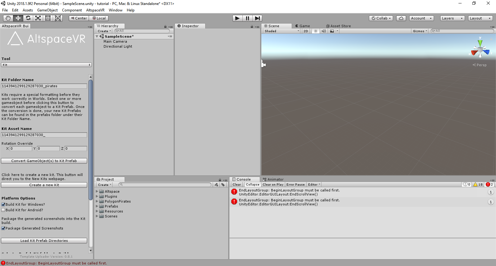
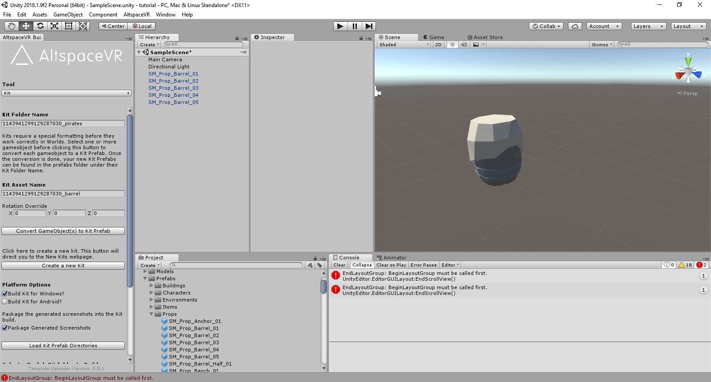

# Uploading custom kits

The World Editor has Kits containing Artifacts that you can spawn into your World. For example, the [Campfire Kit](https://account.altvr.com/kits/993516233267609824) has many types of trees--each type of tree is an Artifact. To create your own Kit, you have to create Unity AssetBundles and upload a .zip file containing a Unity Prefab for each Artifact and register each Artifact on our website. Fortunately, the community-driven Unity Uploader automates most of the workflow. Once uploaded, you can spawn objects from your own Kits in your Worlds and other users can automatically see them. Later, you can share your Kit with your friends or even with the entire Community by being featured.

## Prerequisites

1. [Install Unity Hub and Unity](world-building-toolkit-getting-started.md)
2. Download the latest version of the [Unity Uploader](https://altvr.com/download-latest-unity-uploader/)

## Setup 

<!-- Need video uploaded to Channel9 -->

1. Create a Kit on our website at [Worlds > Kits](https://account.altvr.com/kits)
2. Copy the Kit ID from your browser's address bar to your clipboard (this step will be easier in Uploader versions 0.9+)
3. Create a new Unity Project
4. Import the Unity Uploader by double-clicking the package

5. Sign in to the Uploader with your Altspace email and password

## Generate and upload your kit

<!-- Need video uploaded to Channel9 -->

1. Fill in "Kit Folder Name" with your Kit ID as the prefix and a theme (for example, "1137484494681408069_pirates") and fill in "Kit Asset Name" with your Kit ID as the prefix. All the assets will need to have this prefix.

2. For each Artifact or set of Artifacts:
* Drag your source Prefab(s) into the Hierarchy tab
* Select the ones you want to include in a set, say five types of barrels
* Update the "Kit Asset Name" with "barrel"
* Select "Convert GameObject(s) to Kit Prefab"
* Verify that new Prefabs and Screenshots were created in the Assets/Prefabs folder

> [!NOTE]
> If you want to make any modifications to a generated Prefab, drag it back into the Hierarchy, make changes, and then click "Apply" in the Inspector tab to update the Prefab. 

3. When you're ready, scroll down the Uploader tab and let's prepare to generate a zip file with the Asset Bundle
4. For faster iteration, uncheck the "Build Kit for Android?". Remember to build and upload a version for Android later when you're done iterating or want to share/feature your Kit. 
5. Select "Load Kit Prefab Directories"
6. Choose "Build" next to the one matching your Kit Folder Name. It's common to produce multiple Kits from the same Unity project. This may take a while depending on the size of your Kit. When it's done, the folder containing your zip file will open automatically. 
7. Go to the website, edit the Kit you created earlier, and upload the zip file you produced. This upload may take a while depending on the file size.
    * If successful, you’ll see on the left side under “Uploads” the file sizes and for PC and Android and when they were last updated
    * If unsuccessful, make sure you don't have any scripts, we don't support scripts, we check for those for security and try again.

Congratulations! You're ready to build Worlds with your own Kit!

## Troubleshooting 

* **Are there limits?**
    * There are no hard limits yet but remember that users need to download the AssetBundle for their platform for the entire Kit even if only one Artifact is used. Try to keep the download per-platform to 5 MB or less. One way to do that is to split up things into smaller Kits. For example, 200 props should split in half. 
* **Seeing “split eye”?**
    * Reimport the latest Uploader to get the right rendering settings
* **Updates/changes not reflected?**
    * Check the updated time on the Kit page
    * Reentering the World will not work-- restart client. Even then it may take a few minutes to update
    * Make sure there are no spaces in your folder names or prefab names "for example, 'party_favors' vs 'party favors'"
* **It keeps saying I have a script but I don't**
    * The AssetBundle Browser automatically includes files sometimes. Try to isolate the model you're bringing in. For example, don't drag it in when it's part of another Prefab already
* **What about Particle Systems and Animations?**
    * For these, next them under a 1x1x1 Cube positioned at the origin with Mesh Rendering and Collision disabled. Particle Systems should have looping enabled and "Scaling" should be set to "Hierarchy" so that we can scale them in Altspace properly. After you generate the prefabs for all the animations, disable the collisions on the "collision" objects for each.
* **The Artifacts are dark**
    * Did you set the model's material shader to "Mobile/Vertex lit-only directional lights"?
* **The Artifact isn't facing the right way**
    * Rotate the "model" and "collider" and update the Prefab. Rotating the parent won't do anything--that's ignored. You can use the "Rotation Override" field to do this easily.
* **Can these Artifacts be used with the SDK's "CreateFromLibrary" function?**
    * Yes