# Uploading custom kits

The World Editor has Kits containing Artifacts that you can spawn into your World. To create your own Kit, you have to create Unity AssetBundles and upload a .zip file containing a Unity Prefab for each Artifact and register each Artifact on our website. Fortunately, the community-driven Unity Uploader automates most of the workflow. Once uploaded, you can spawn objects from your own Kits in your Worlds and other users can automatically see them. Later, you can share your Kit with your friends or even with the entire Community by being featured.

## Prerequisites

1. In the AltspaceVR app, you will need to first **Enable Worlds Beta**. Go to the **Title Screen**, select **Main Menu**. Click on **Settings**, and select **Enable Worlds Beta**.

   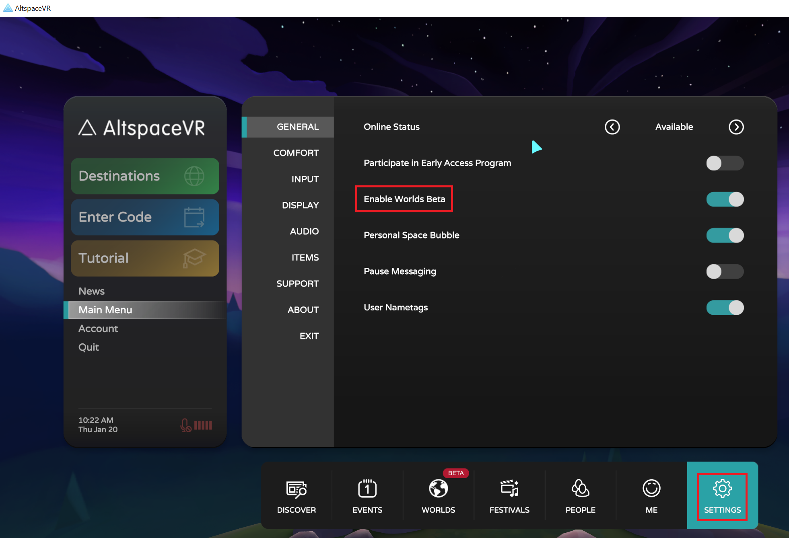

1. [Install Unity Hub and Unity](world-building-toolkit-getting-started.md)
1. Download the latest version of the [Unity Uploader](https://altvr.com/download-latest-unity-uploader/)

## Setup 

1. Go to our website and select [**More > Kits**](https://account.altvr.com/kits) from the top Menu dropdown.

    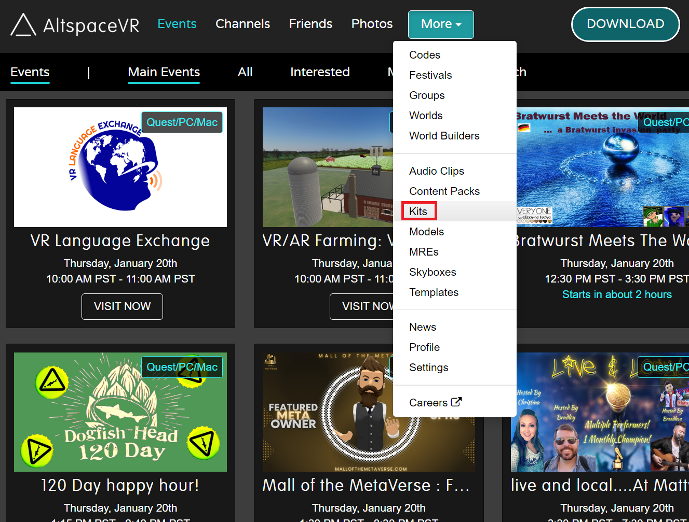

1. Click on **Create** to go to the **Create Kit** page.

    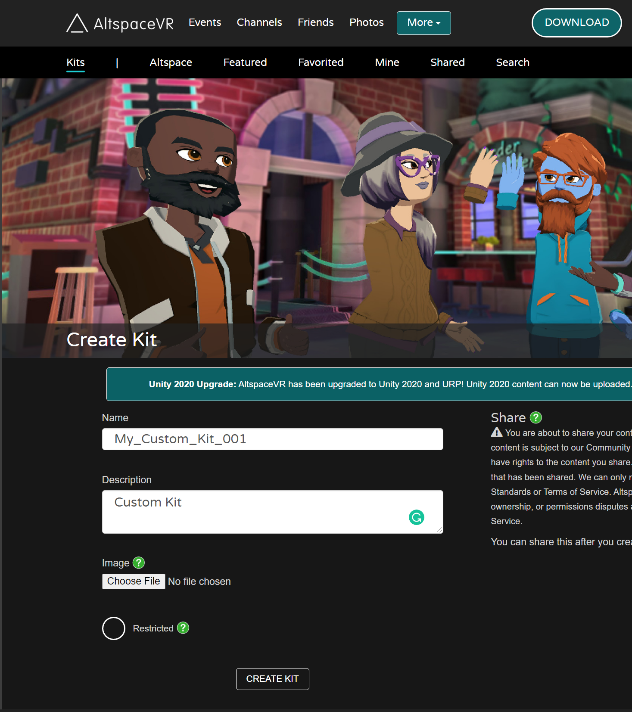

1. Create a new Unity Project
1. In the Unity **Package Manager**, select **Add package from tarball...**.
    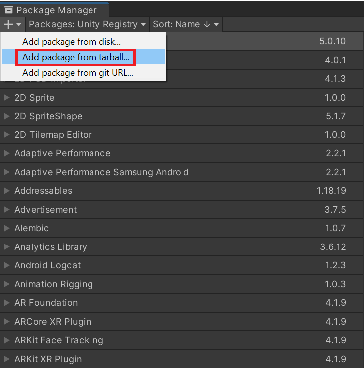

## Generate and upload your kit

1. On the top menu click **AltspaceVR**, and select **Kits** from the dropdown.

    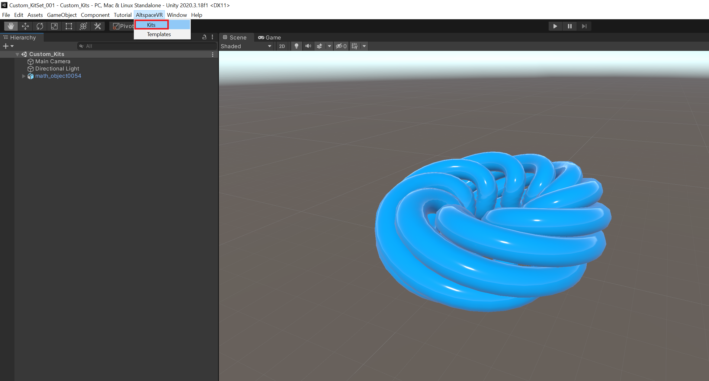

1. In the **Kits** dialog box, select your kit.

    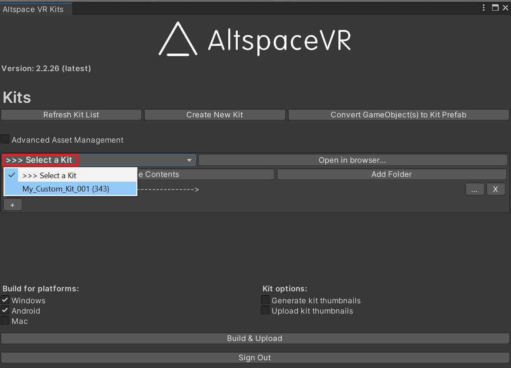

1. Then select **Convert GameObject(s) to Kit Prefab**.

    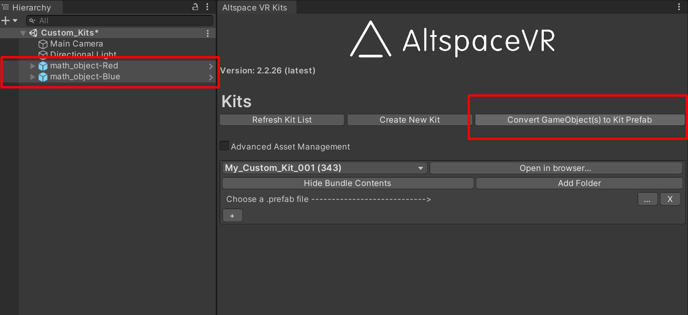

1. In the **AltspaceVR Kit Prefab Formatter** dialog box, choose your custom kit.

    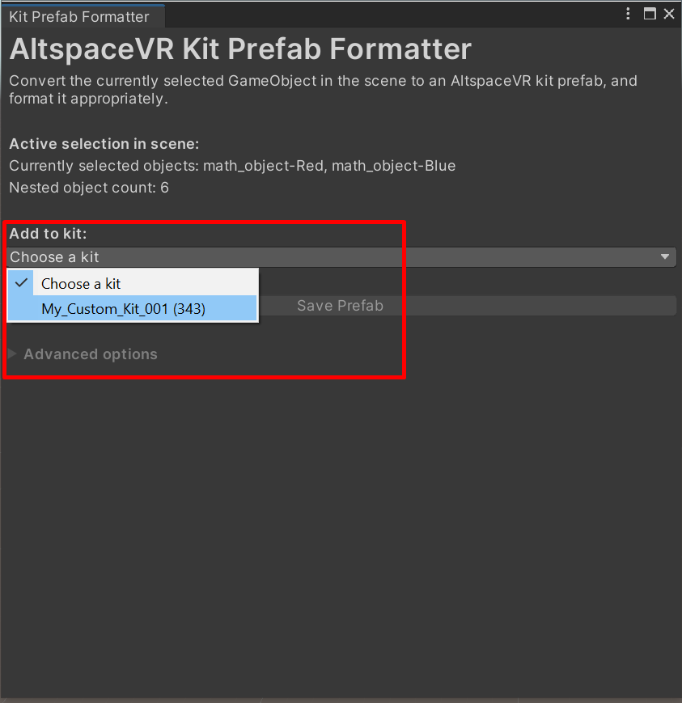

1. Now you're ready to build and upload your custom kit to AltspaceVR.  In the **Kits** dialog box, click **Build & Upload**.

    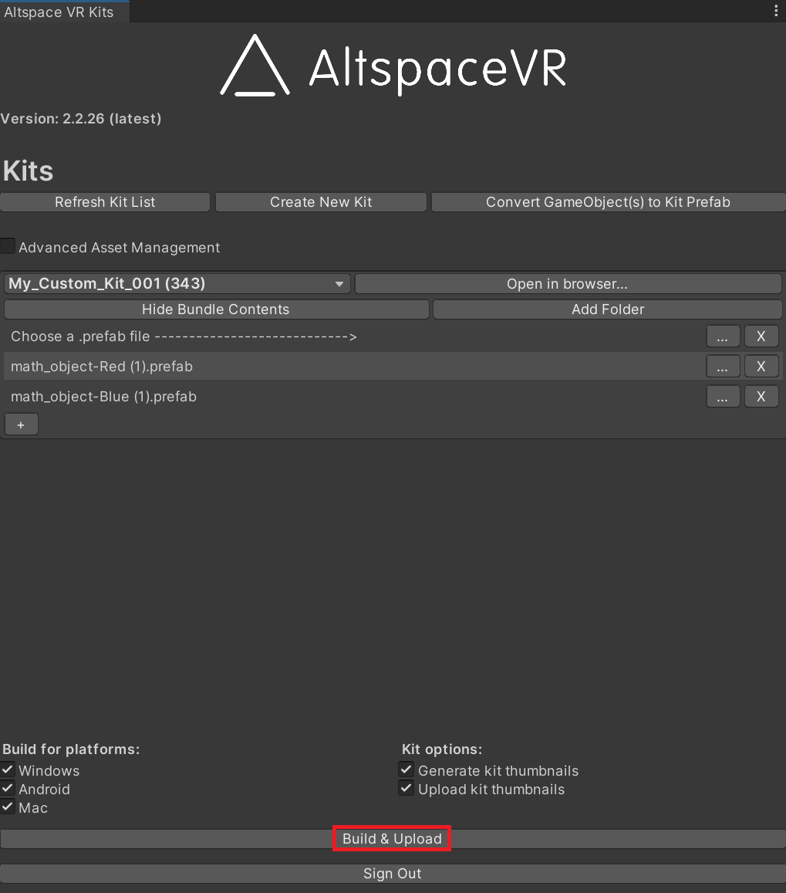

> [!NOTE]
> If you want to make any modifications to a generated Prefab, drag it back into the Hierarchy, make changes, and then click **Build & Upload** to update your kit. 

Congratulations! You're ready to build Worlds with your own Kit!

## Add kit to your world

1. Now you can check your kit on the AltspaceVR website.

    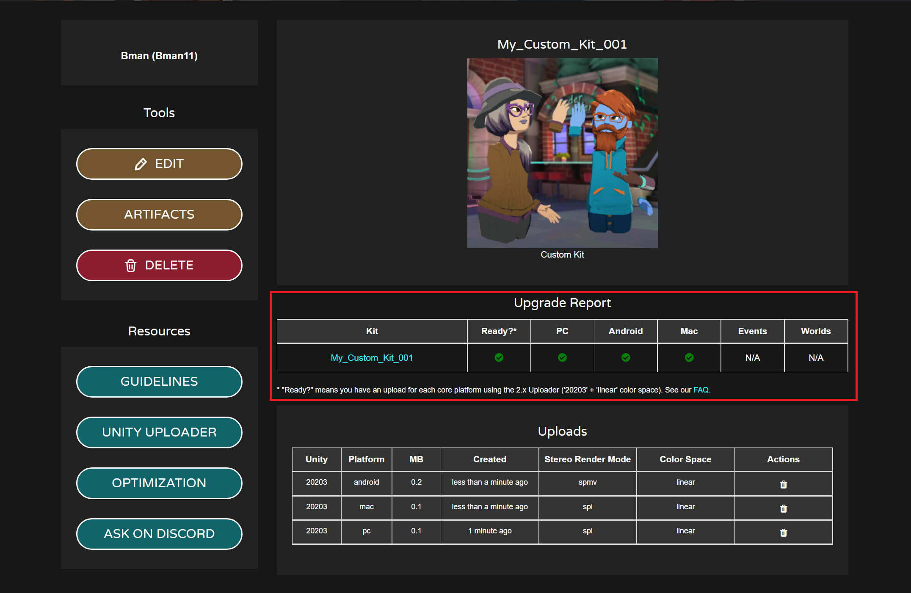

1. Enter your world, and select the **Editor Panel** in **World Editor**.

    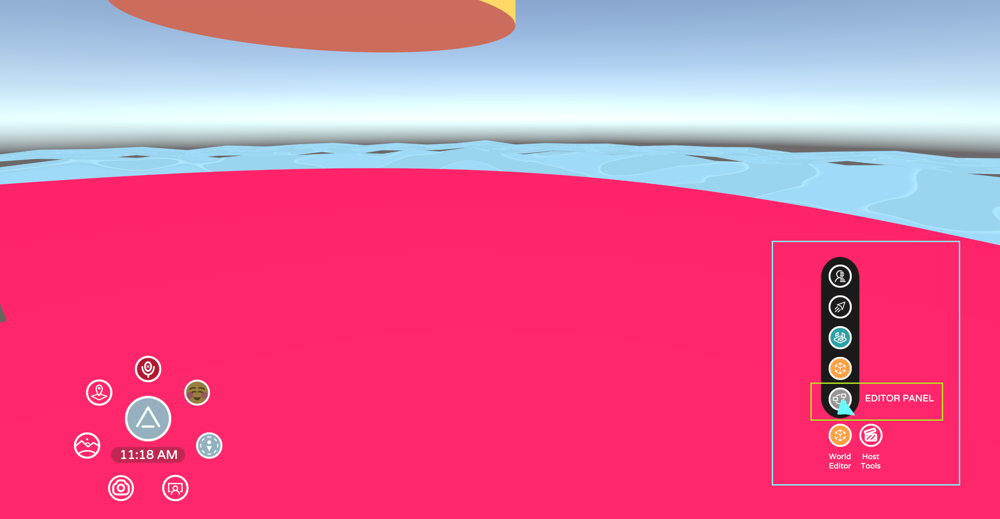

1. In the **World Editor Panel**, click on **Mine**.  Select **Kits**.

    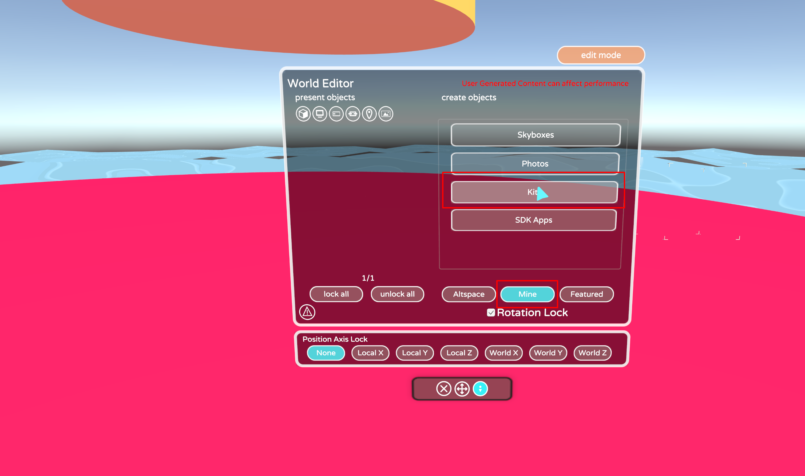

1. Choose your kit.

    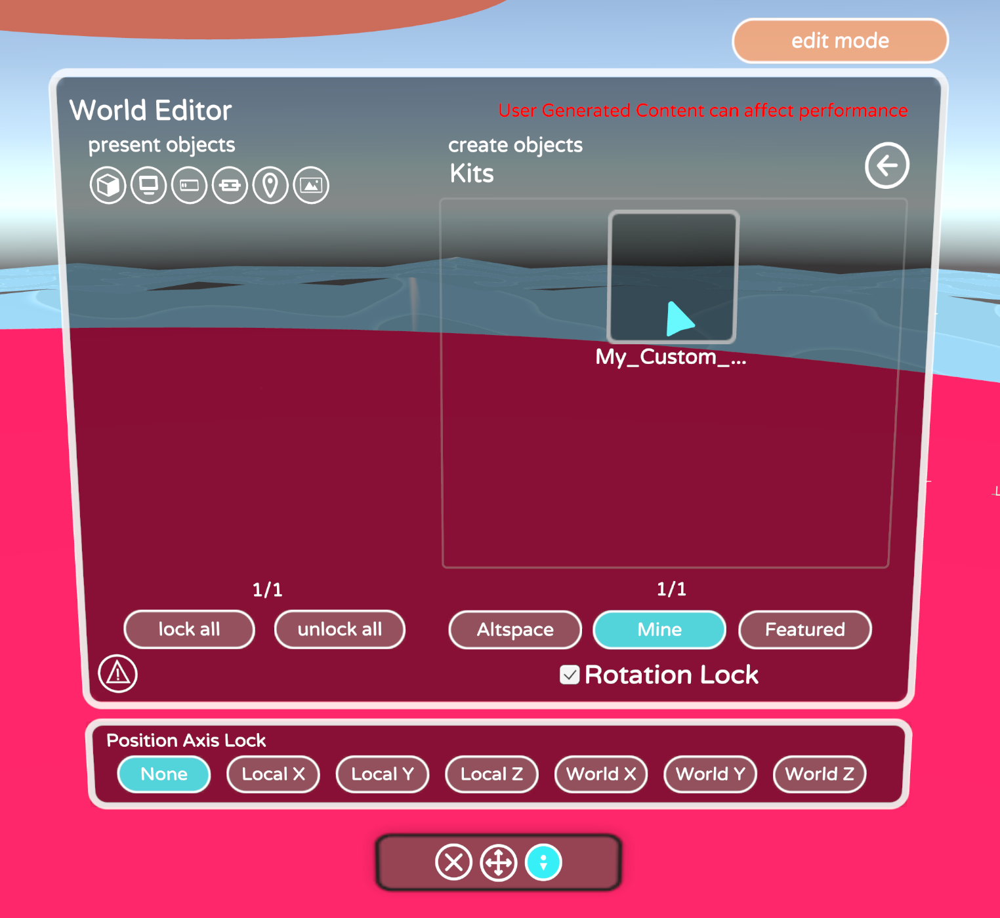

    And select your artifact to be placed in your world.

    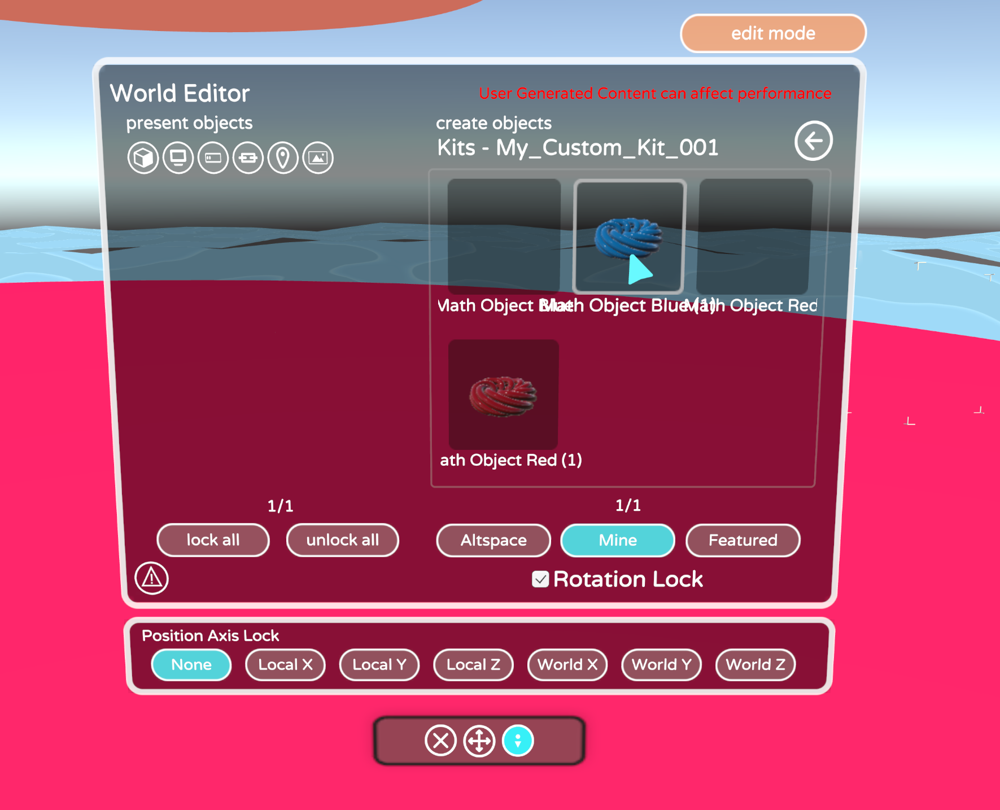

1. Now you can place the artifact anywhere in your world.

    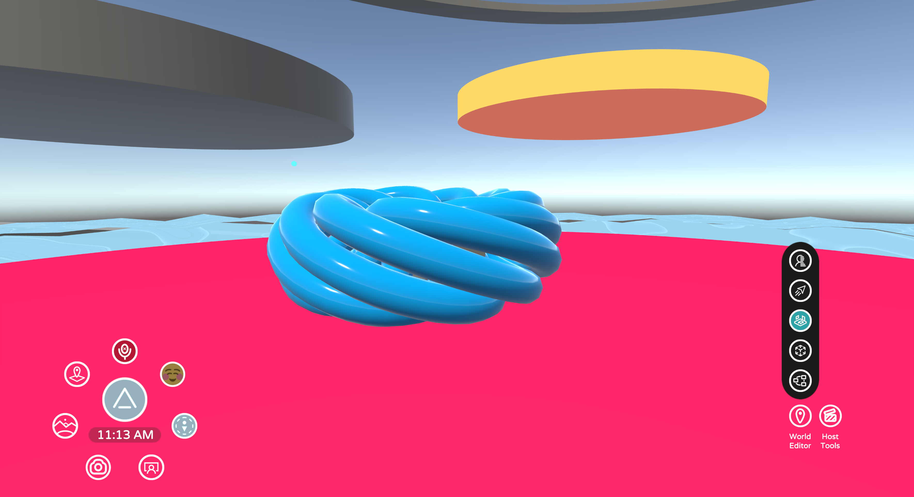

## Troubleshooting 

**Are there limits?**
There are no hard limits yet but remember that users need to download the AssetBundle for their platform for the entire Kit even if only one Artifact is used. Try to keep the download per-platform to 5 MB or less. One way to do that is to split up things into smaller Kits. For example, 200 props should split in half. 

**Seeing “split eye”?**
Reimport the latest Uploader to get the right rendering settings

**Updates/changes not reflected?**
    * Check the updated time on the Kit page
    * Reentering the World will not work-- restart client. Even then it may take a few minutes to update
    * Make sure there are no spaces in your folder names or prefab names **for example, 'party_favors' vs 'party favors'**

**It keeps saying I have a script but I don't**
The AssetBundle Browser automatically includes files sometimes. Try to isolate the model you're bringing in. For example, don't drag it in when it's part of another Prefab already

**What about Particle Systems and Animations?**
For these, next them under a 1x1x1 Cube positioned at the origin with Mesh Rendering and Collision disabled. Particle Systems should have looping enabled and **Scaling** should be set to **Hierarchy** so that we can scale them in Altspace properly. After you generate the prefabs for all the animations, disable the collisions on the **collision** objects for each.

**The Artifacts are dark**
Did you set the model's material shader to **Mobile/Vertex lit-only directional lights**?

**The Artifact isn't facing the right way**
Rotate the **model** and **collider** and update the Prefab. Rotating the parent won't do anything--that's ignored. You can use the **Rotation Override** field to do this easily.

**Can these Artifacts be used with the SDK's **CreateFromLibrary** function?**
Yes