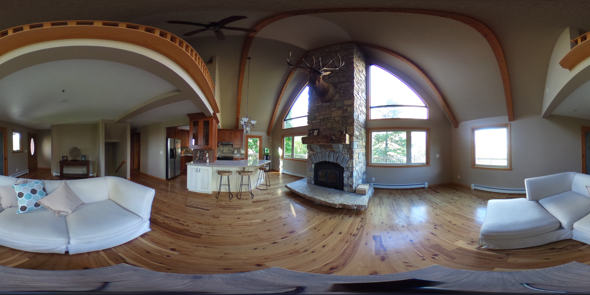
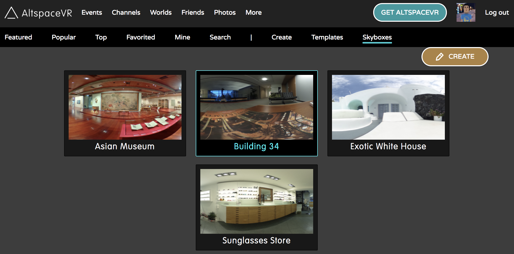
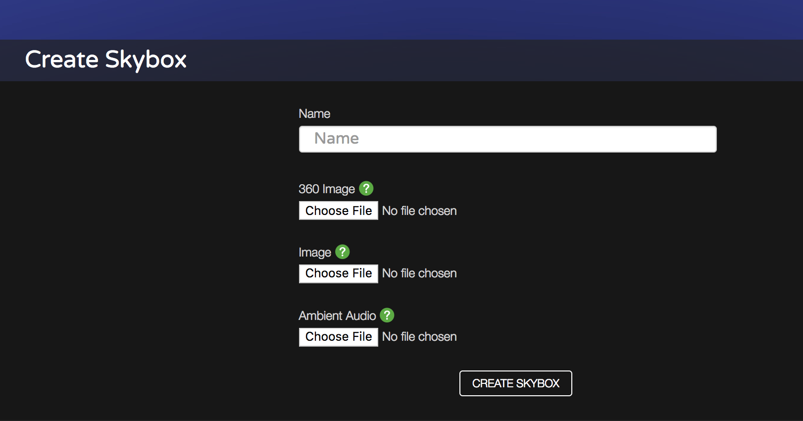

# Uploading custom Skyboxes

A Skybox is a way to create a **background** for your World that makes the experience more immersive. There are different kinds of Skyboxes but we currently support **equirectangular**. Here's an example taken with a 360 camera (more example [here](http://moments.mankindforward.com/)): 

You can also use the [Unity Uploader](world-building-toolkit-getting-started.md) but this approach is simpler.

1. Navigate to [Worlds > Skyboxes](https://account.altvr.com/skyboxes) and press the **Create** button on the right

2. Fill in a name and specify your 360 image. It doesn't have to be a photo, there are programs that let you draw your own or you can search for some online. When you're ready, select **Create**. 

3. You can optionally upload a **preview** image so you can easily identify this skybox. You can also upload ambient audio in WAV format. 

> [!IMPORTANT]
> We recommend you upload preview images and ambient audio separately, after you upload the 360 image. If you upload them together the file sizes can be large enough to stall the process. [Jetsons World](https://account.altvr.com/worlds/1004174988393054363/spaces/1084431533181240311) is a great example of how to use a Skybox with ambient audio. Notice how the World-Builder kept the audio volume low and sounds you hear are sporadic so people don't get annoyed. 

4. Enter your World and open the World Editor. Under Skyboxes, select your new Skybox. In a few seconds, the sky will literally change. Others in your World will also see the sky change. To switch back, choose the **default** skybox in that same list. 

## Troubleshooting

**Upload failed**
    * try uploading just the 360 image on its own
    * try with another, smaller file as a test

**I can't find a 360 photo**
    * Flickr is a good source (change the filters to find creative commons ones)
    * Take your own! We've had success with Ricoh's cameras. 
**The sky looks grainy or blocky**
You may need to find a higher-resolution image. Typically around 2-5 MB and ~5000 px x 2000 px

**It hurts my World's framerate!**
The image is probably too large. Some generated skyboxes can be 8k. They usually come with mobile-friendly 2k versions--use that.

**Help me with the ambient audio**
    * Use free software like Audacity to lower the volume or create your own loops. Remember that the audio will be repeated and playing in people's ears so keep it low and not annoying
    * [Free Sound](https://freesound.org/) is a good source of royalty-free sounds
