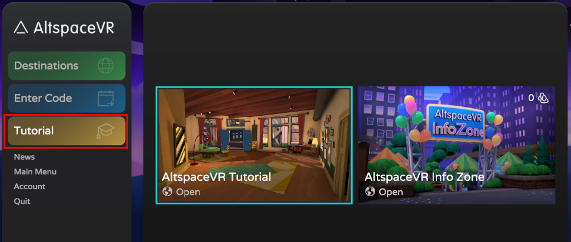
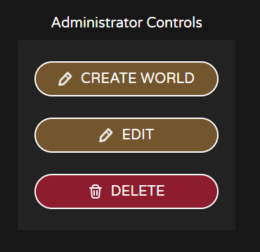
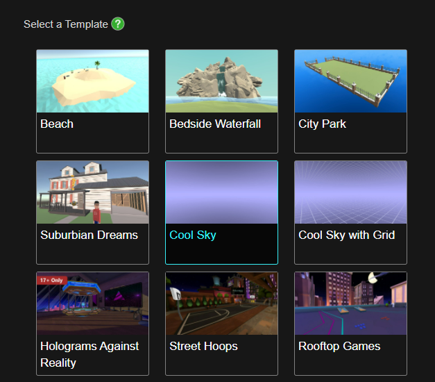
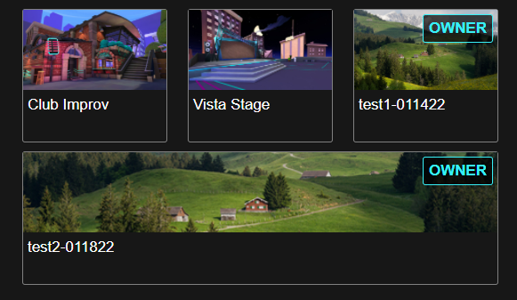
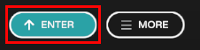

# Creating your first AltspaceVR world

Welcome, World-Builder!

This guide will help you create and share your first AltspaceVR World! The instructions below step you through creating a world in your browser. You can also create worlds using the AltspaceVR app in your headset.

## Create a world on the AltspaceVR website

1. Sign up for your free AltspaceVR account if you haven't done so already.
1. If you're new to AltspaceVR, we recommend that you complete both of the tutorials. To reach them, open the AltspaceVR app, and on the main screen, click **Tutorials**.

1. In your browser, go to [https://altvr.com/](https://altvr.com/) and sign in.
1. In the top-level menu bar, click **More**, and then select **Worlds**.

1. In the **Worlds** menu bar, select **My Worlds**.
1. Click the **Create Universe** button.
1. On the **Create Universe** screen, enter a **Name** and a **Description** for your universe.
1. Under **Image**, select **Choose File**, and then select an image. This image will be used to promote your universe on the Web and in VR.
1. Under **Profile Image**, select **Choose File**, and then select an image. This image will be also used to promote your universe on the Web and in VR but it appears on the Universe page.
1. If needed, fill in the remaining text boxes:

    **Youtube Video ID**

    **Twitter Handle**

    **Tags**

1. Click the **Create Universe** button.

    After your universe is created, it appears on a new page and these options become available on the lower left (you have to scroll down a little to see them):

    

1. Click the **Create World** button.
1. Enter a **Name** and a **Description** for your universe.
1. Under **Privacy Settings**, select **Private** or **Unlisted**.<!-- Need more info on this. -->
1. If needed, fill in the remaining text boxes and the Advanced options:

    **Default Contextual Roles**

    **Advance Formatting**

    You need to select a template so you'll have a virtual environment to start with. You can change this later.

1. On the right side of the screen, select a template.

    

    You can choose a template provided by AltspaceVR or one that you've built. To see your templates (which contain the label **OWNER**), scroll down to the bottom of the screen.

    

1. Click the **Create World** button.

You can view the worlds you create on the Universes page.

## View your world in the AltspaceVR app

1. Go to the AltSpaceVR app and, on the main page, click **Main Menu**.

    

1. Click the **Settings** button.
1. Turn the **Enable Worlds Beta** setting on.

    

    This makes the **WORLDS** button appear in the button bar.

    

1. Click the **WORLDS** button, and then, in the top menu bar, click **MY WORLDS**. This displays the **FEATURED WORLDS** window, which displays the world you created on the AltSpaceVR website.
1. Move the cursor over the world you created, and note that two buttons appear: **ENTER** and **INFO**. Click the **INFO** button and view the details about your world. When you have finished, click the **ENTER** button in the lower left of the Info screen.

    

Congratulations! You've created and entered your first Altspace World, your own multiplayer social VR experience! Play around with the World Editor, starting with Kits that contain objects you can place and manipulate.

## Sharing

1. Go to the Campfire (or wherever the people you want to share with are)
2. Open your Menu, find your World again, and select **Info**:

3. Select **Portal** to spawn a portal:

4. Wait for people to use the portal to join your party and when you're ready, select the portal again to take your party to your World:

5. Let the party begin! Your friends will see your World changes as you build so dazzle them with your creativity.

You should be world-building in minutes; however, if you do run into issues check out these resources:
* [Where can I get help with world-building?](getting-help.md)

Finally, join our [Early Access Program](early-access.md) (free) and submit your World to be Featured when you're ready. We're excited to see what you will make!