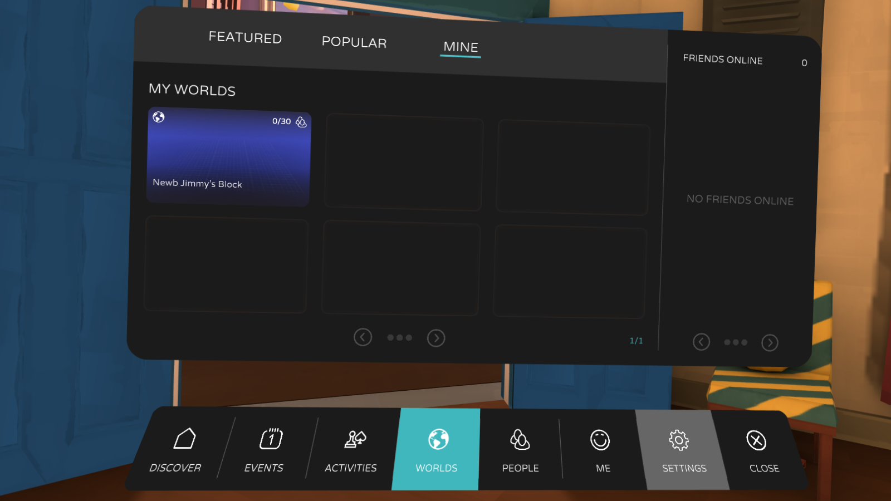
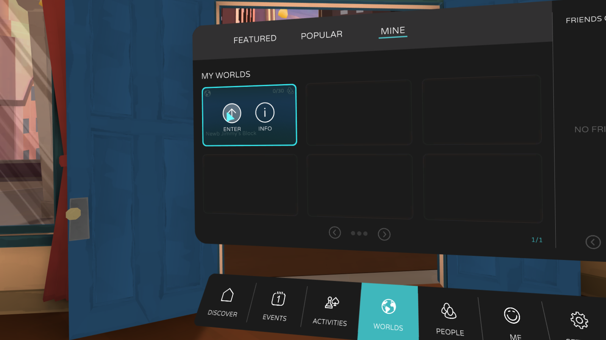
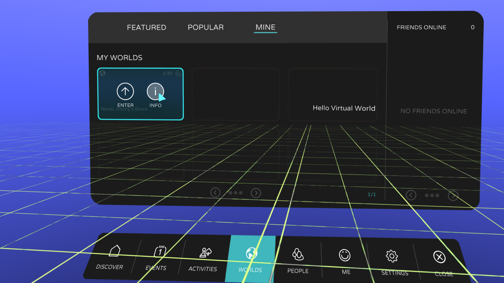
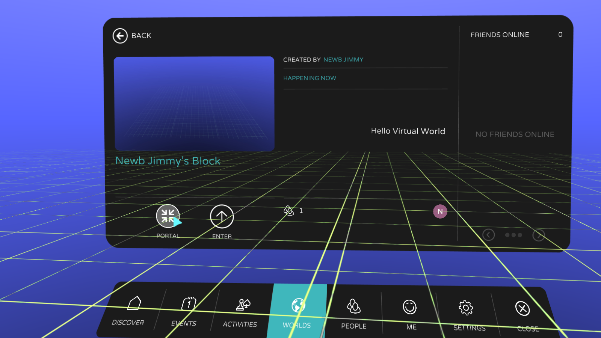
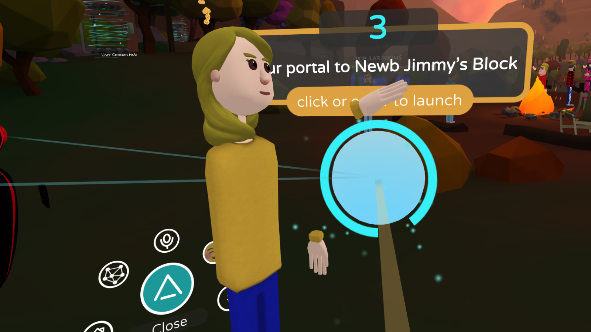
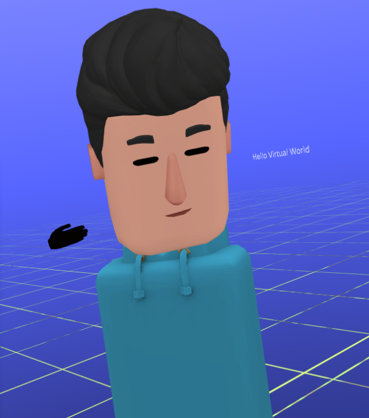

# Creating your first AltspaceVR world

Welcome, World-Builder!

This guide will help you create and share your first Altspace World!

## Creating

1. Sign up (for free, if you haven't already) for your AltspaceVR account and complete the tutorial in the AltspaceVR app.
2. Open your Menu and navigate to Worlds > My Worlds:

3. Join the first World (Surprise! We've pre-created one for you):

4. Use the World Editor to make a label:

<!-- Need video uploaded to Channel9 -->

Congratulations! You've created your first Altspace World, your own multiplayer social VR experience! Play around with the World Editor, starting with Kits that contain objects you can place and manipulate.

## Sharing

1. Go to the Campfire (or wherever the people you want to share with are)
2. Open your Menu, find your World again, and select "Info":

3. Select "Portal" to spawn a portal:

4. Wait for people to use the portal to join your party and when you're ready, select the portal again to take your party to your World:

5. Let the party begin! Your friends will see your World changes as you build so dazzle them with your creativity.

You should be world-building in minutes; however, if you do run into issues check out these resources:
* [Where can I get help with world-building?](getting-help.md)
* more soon...

Finally, join our [Early Access Program](early-access.md) (free) and submit your World to be Featured when you're ready. We're excited to see what you will make!