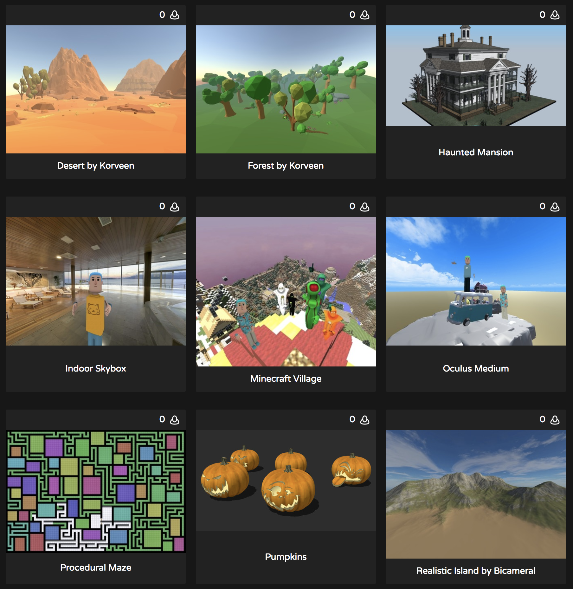
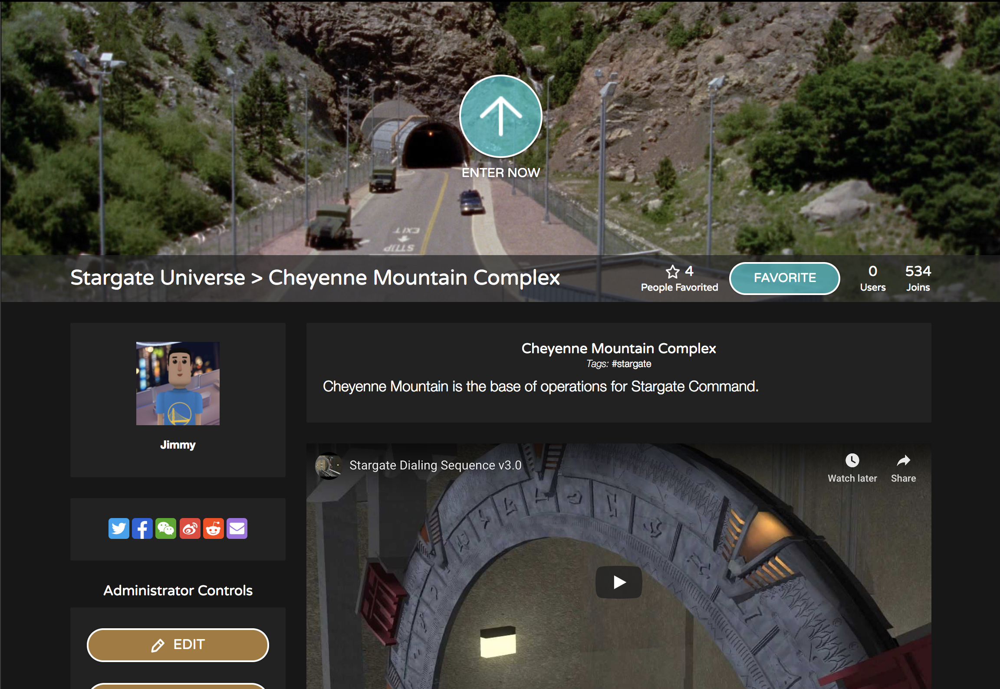
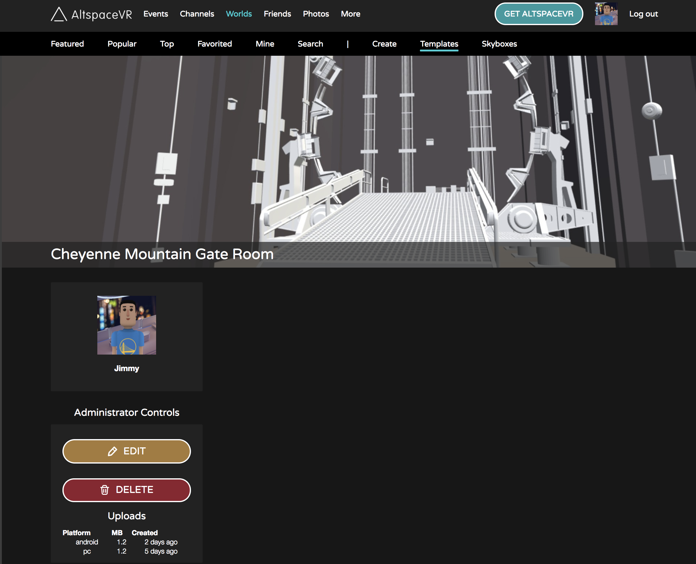

# Introducing the World Building Toolkit

> [!NOTE]
> The World Building Toolkit is a community project run by our awesome friend, [Anthony Madden](https://twitter.com/chigamesstudio), with support from us. If you're interested, please join the [Official AltspaceVR Discord](https://discordapp.com/invite/altspacevr) and visit the #world-building channel. We currently have a Mac Trial Beta right now, [more details](https://altvr.com/altspacevr-mac)

The Uploader allows you to use a Unity scene as a Template for your Worlds. You can bring in a haunted house for Halloween or your favorite creation from Minecraft. If you can import it into Unity, you can probably get it into Altspace this way. Here are a few [example Worlds](https://account.altvr.com/worlds/1046572460192825569).

## Setup 

1. Join the [Official AltspaceVR Discord](https://discordapp.com/invite/altspacevr) and visit the #world-building channel - Friends don't let friends build Worlds alone.
2. Read our [World-Building Getting Started Guide](world-building-getting-started.md) for the basics
3. [Install Unity Hub](https://blogs.unity3d.com/2018/01/24/streamline-your-workflow-introducing-unity-hub-beta) and install **Unity 2019.4.2f1**. The Uploader won't work unless you match this version exactly. You'll need a free Unity account if you don't have one and choose "Personal" since you're doing this for fun! During the install, make sure you check the "Android Builds" option and disable auto-update.
4. [Download the latest Unity Uploader](https://aka.ms/AsvrCommunityUploader)
5. [Create a Template](https://account.altvr.com/space_templates/new) on our website. Name it "Hello World Template".
6. [Create a World](https://help.altvr.com/hc/en-us/articles/360015529094-How-do-I-manage-my-Worlds) and name it "Hello World". Select "Hello World Template" as the Template.

## Upload your scene

<!-- Need video uploaded to Channel9 -->

1. Open Unity Hub and create a new Unity 2019.4.2f1 project.
2. With your project open, import the Uploader by double-clicking the file you downloaded (it's a Unity package). You should now see a new tab called "AltspaceVR". You'll need to import the package for every Unity project you want to use with Altspace
3. Open Menu > AltspaceVR > Build Settings
4. Sign in with your Altspace account credentials
5. Select "Load Templates" and then select "Hello World Template"
6. Add a cube to your scene and save.
7. Check "Build for Windows?" and uncheck "Build for Android?"
8. Select "Upload". In about a minute, you should see "Upload" complete. 
9. Join "Hello World" by launching Altspace and entering from Menu > Worlds > My Worlds
10. Reset the World from Menu > Settings > Moderate > Reset Space
11. You should see the cube. If you do it fast like in the video above, you can see changes within as little as 10 seconds.

## What's supported

* Yes: models, collision, animations, particle effects, audio, skyboxes, and so on
* No: scripts. For security purposes, uploads containing scripts will be rejected
* Maybe: fancy stuff like dynamic global illumination
* Upload scenes for different platforms separately or together
* See [Featured Worlds](https://account.altvr.com/worlds/featured), many were built using the Uploader

## Tips

* Join the [Official AltspaceVR Discord](https://discordapp.com/invite/altspacevr).
* On the Template page on the left side, we show you the latest uploads by platform. If it was successful, you'd see "1-2 mins ago".Screen_Shot_2019-01-11 _at_1.21.04_AM.png

* You can be in-World when you update. The moment the Uploader says "Upload Complete" you can reset the World to see the changes.
* Building for PC-only with a simple scene should take less than 1 minute to see a change in Altspace
* Set your World to be Private and Unlisted to avoid distractions.
* Place a cube at the origin so you can see where people will spawn by default. Hide the cube when uploading.

## Troubleshooting

* I'm falling or can't teleport onto anything
    * You need to add collision to objects to teleport onto them.
* Nothing changed
    * Did you save the scene in Unity?
    * Did you choose the platform you're testing on?
    * Are you in the right World? Did you choose the right Template in the Uploader AND in the World form?
    * Did you check the Template page stats?
* Upload fails or times out
    * Most common upload error is having the wrong Unity version. It must match the required version exactly. 
    * Your upload might be too large. Try to keep PC scenes < 100 MB. Start small and build up. Optimize, optimize, optimize. 
    * Try with a fresh project with a simple cube.
    * Don't force quit during a build--it can corrupt your scene. Try reuploading.
* It's a slow process
    * We recommend building for PC only while iterating and for Android later.
    * Try removing unused files. For whatever reason Unity gets overzealous sometimes.
* I can't sign in with my Altspace credentials
    * Emails are case-sensitive.
    * Try with a new project.
    * Make sure your Altspace account is in good standing.

## See also

* [Unity Learn](https://unity3d.com/learn)
* [Unity Forums](https://forum.unity.com)