# Introducing the AltspaceVR Uploader

> [!NOTE]
> If you're trying to revive an old space, see the [upgrade guide](upgrading-old-unity-projects.md).

## World Building Toolkit (Unity Uploader)

The Uploader lets you use a Unity scene as a Template for your Worlds. You can bring in a haunted house for Halloween or your favorite creation from Minecraft. If you can import it into Unity, you can probably get it into AltspaceVR this way. Here are a few [example Worlds](https://account.altvr.com/worlds/1046572460192825569).

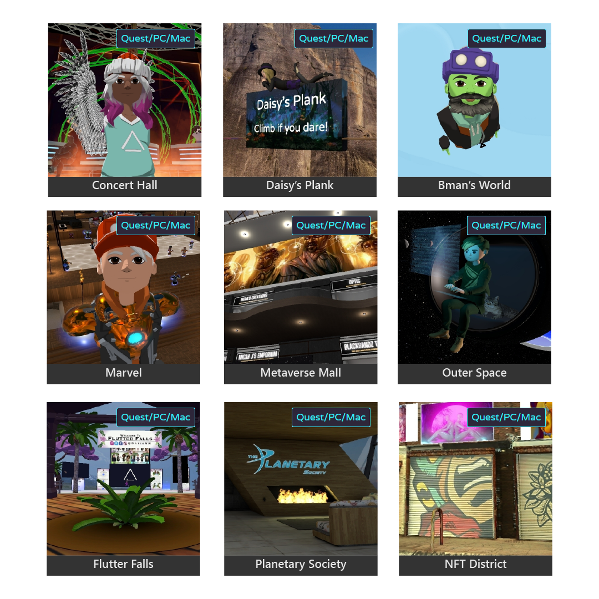

## Setup

1. We recommend that you [join the official AltspaceVR Discord](https://discordapp.com/invite/altspacevr) and visit the #world-building channel. This is a place where you can interact with the Altspace community and share tips and ideas.
1. For the basics on World-building, read our [Getting Started Guide](world-building-getting-started.md).
1. [Install Unity Hub](https://blogs.unity3d.com/2018/01/24/streamline-your-workflow-introducing-unity-hub-beta) and install [Unity version 2020.3.18f1](https://unity3d.com/unity/whats-new/2020.3.18). The Uploader won't work unless you match this version exactly. You'll need a free Unity account if you don't have one. For the Unity license, choose **Personal** since you're doing this for fun! During the install, make sure you check the **Android Builds** option and disable auto-update.

    * Include the **Android Build Support** module.

    * On Windows, include the **Mac Build Support (Mono)** module.
    
    * On Mac, include the **Windows Build Support (Mono)** module.

1. [Download the latest Unity Uploader](https://altvr.com/download-latest-unity-uploader).

    The Uploader is a set of files, contained in a .tgz file, that you'll import into Unity. These files give you menu items and the **Altspace VR Templates** window which provides the options you need to get your Unity scene into AltspaceVR.

1. [Create a Template](https://account.altvr.com/space_templates/new) on our website. Name it **Hello World Template**.

    > [!NOTE]
    > A Template is a container for a Unity scene. Every World needs one.

1. [Create a World](https://account.altvr.com/worlds/my) and name it **Hello World**. Select **Hello World Template** as the Template.

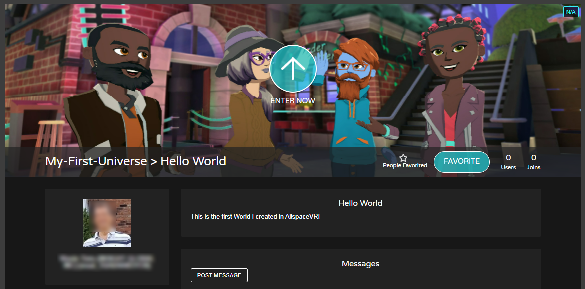

## Import the AltspaceVR Uploader

> [!NOTE]
> A more detailed step-by-step guide can be found [here](https://buildingthemetaverse.medium.com/how-to-make-your-own-altspace-templates-and-kits-unity-2020-3-9-uploader-2-x-5b40e92bb759).

1. Open Unity Hub and create a new Unity 2020.3.18 project. For your template, select **Universal Render Pipeline**.

    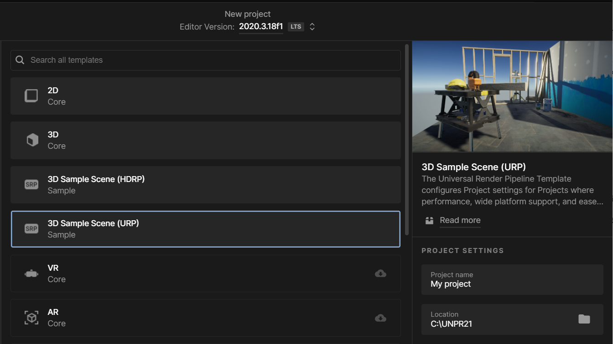

1. Navigate to the folder that you downloaded the AltspaceVR Uploader (in other words, the .tgz file) to and then copy or move it from that folder to the root folder of your new Unity project.
1. In Unity on the menu bar, select **Window** > **Package Manager.**
1. In the Package Manager menu bar, select the plus sign drop down ("+"), and then select **Add package from tarball**.
1. Navigate to the folder that contains the .tgz file, then select it, and then click **Open**.  

    After the package loads, you should see it in the Package Manager:

    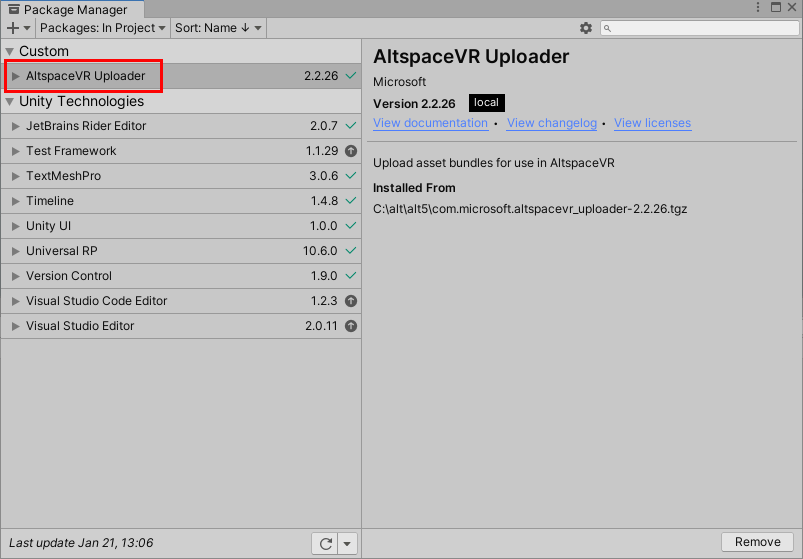

    You'll also see a new **AltspaceVR** menu listed on the menu bar:

    

    > [!NOTE]
    > You'll need to import the AltspaceVR Uploader package into every Unity project you want to use with AltspaceVR.

## Build and upload your Unity scene

### Select a template

1. On the menu bar, select **AltspaceVR > Templates**.
1. In the **Altspace VR Templates** window, sign in with your AltspaceVR account credentials or MSA. If you've only ever logged into AltspaceVR with your Microsoft account, you'll need to create a password using the "Forgot your password" option on the website.

    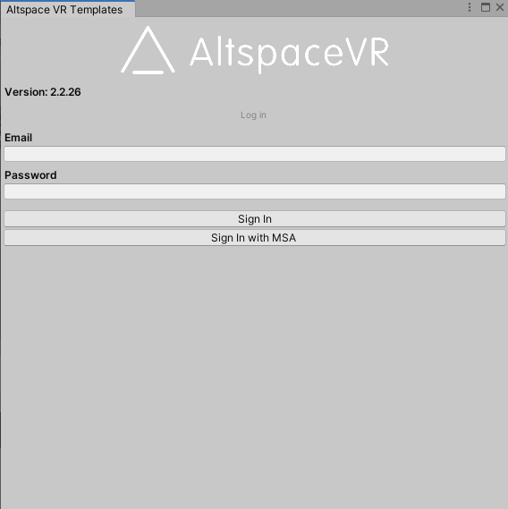

1. Click the **Select a Template** drop down, and then select **Hello World Template**.

### Create your own custom scene

The current scene, which was loaded automatically when you created the project and chose the Universal Rendering Pipeline, contains some default game objects depicting the construction of a house. You'll want to create a new scene with game objects that you choose and make that the scene that you upload to AltspaceVR.

1. In the **Project** window, navigate to the **Assets** > **Scenes** folder.
1. Right-click inside that folder to open the context menu, and then select **Create** > **Scene**.
1. Name the scene "Hello World Scene."
1. Double-click your new scene to open it.
1. In the **Altspace VR Templates** window, click the **Choose a .unity file** ellipsis button (three dots), then navigate to the **Assets** > **Scenes** folder in your project, and then select **Hello World Scene.unity** and open it. Note that the scene is now listed in the **Altspace VR Templates** window.

    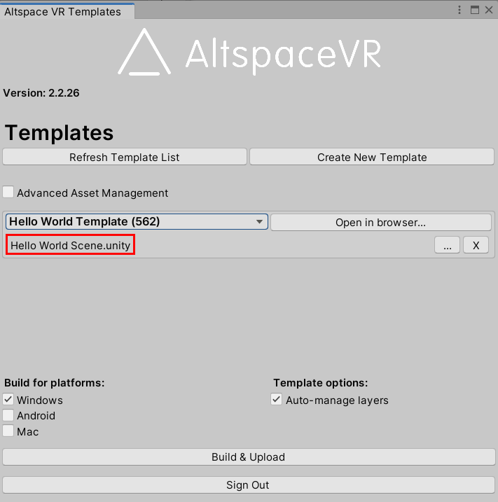

    > [!IMPORTANT]
    > Don't overlook that last step! If you don't have a scene added in the **Altspace VR Templates** window, this whole process will fail.

    Let's add a couple of objects to the scene:

1. On the menu bar, select **GameObject** > **3D Object** > **Plane**.
1. On the menu bar, select **GameObject** > **3D Object** > **Capsule**.
1. In the scene, drag the capsule upward on the Y axis so it looks like it's sitting on the plane.

    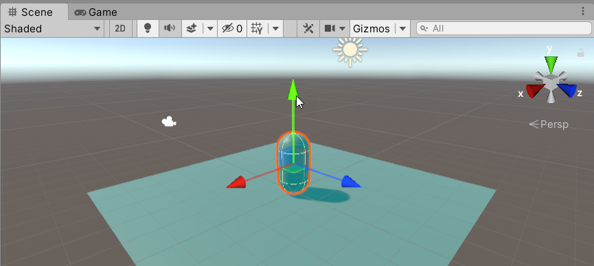

1. Under **Build for platforms:**, make sure **Windows** is selected. For now, the other two options, **Android** and **Mac**, should **not** be selected. Once you want people to visit, you should build and upload for all platforms."
1. Select the **Build & Upload** button. This process may take a minute or two.

## Enter your World

1. Launch AltspaceVR, and then select **Main Menu**.

    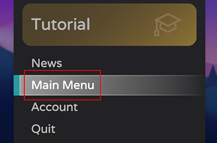

1. On the Button bar, click the **Worlds** button, and then, on the top menu bar, select **My Worlds**.

    > [!NOTE]
    > If you don't see the **Worlds** button on the button bar, it means you haven't activated the "Enable worlds" option. To do so:

    - Click the **Settings** button.
    - Turn the **Enable Worlds Beta** setting on.

    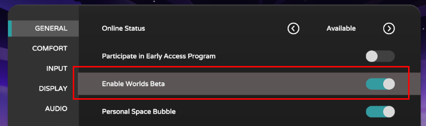

    This makes the WORLDS button appear in the button bar and also enables the My Worlds option on the AltspaceVR website.

    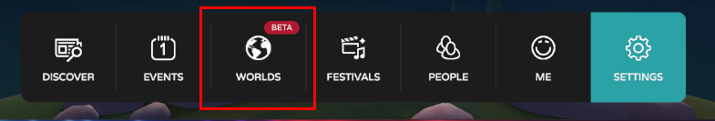

1. Navigate to the **Hello World** World and then enter it.

    Your scene should be similar to what you saw in the Unity Editor. You may have to scroll around a bit to get a better view.

    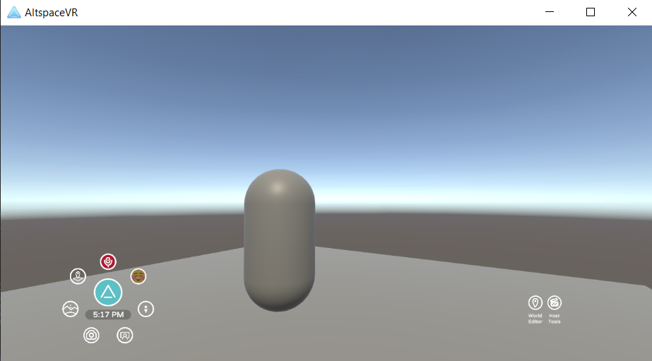

## What's supported

* Yes: models, collision, animations, particle effects, audio, skyboxes, and so on.
* No: scripts. For security purposes, uploads containing scripts will be rejected.
* Maybe: fancy stuff like dynamic global illumination.
* You can upload scenes for different platforms separately or together.

To see many scenes that were built using the Uploader, go to [Featured Worlds](https://account.altvr.com/worlds/featured).

## Tips

* Join the [Official AltspaceVR Discord](https://discordapp.com/invite/altspacevr).

* On every Template page, we show you the latest uploads by platform. If your upload was successful, you'll see it listed under **Uploads**.

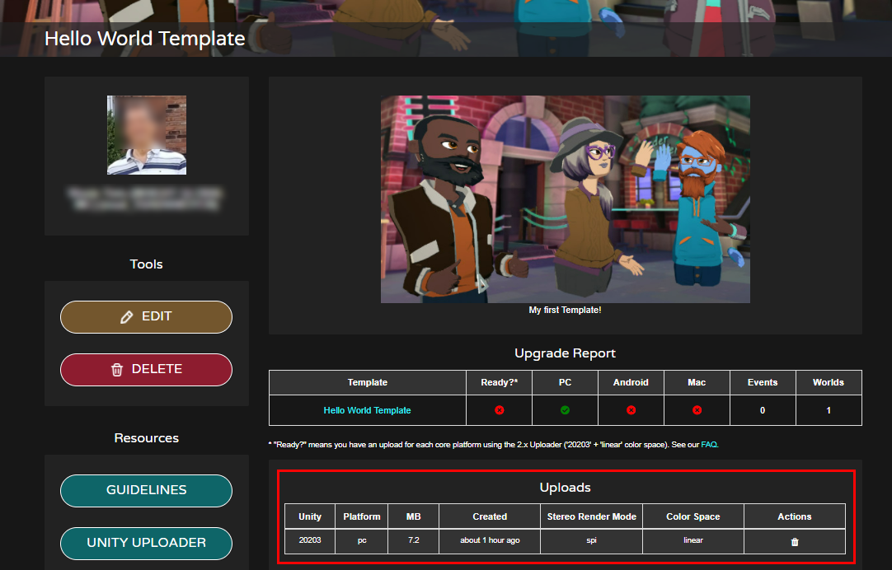

* You can be in-World when you update. The moment the Uploader says **Upload Complete** you can reset the World to see the changes.
* When building for PC-only with a simple scene, it should take less than one minute to see a change in AltspaceVR.
* To avoid distractions, set your World to be Private and Unlisted.
* Place a cube at the origin so you can see where people will spawn by default. Hide the cube when uploading.

## Troubleshooting

**I'm falling or can't teleport onto anything**

You need to add collision to objects to teleport onto them.

**Nothing changed**

* Did you save the scene in Unity?

* Did you choose the platform you're testing on?

* Are you in the right World? Did you choose the right Template in the Uploader AND in the World form?

* Did you check the Template page stats?

**Upload fails or times out**

* The most common upload error results from having the wrong Unity version. You must match the required version exactly.

* Your upload might be too large. Try to keep PC scenes smaller than 100 MB. Start small and build up. Optimize, optimize, optimize.

* Try with a fresh project that contains a simple cube.

* Don't force quit during a build--it can corrupt your scene. Try re-uploading.

**It's a slow process**

* We recommend that, while iterating, you build for PC only. Build for Android later.

* Try removing unused files. For whatever reason, Unity gets overzealous sometimes.

**I can't sign in with my AltspaceVR credentials**

* Emails are case-sensitive.

* Try with a new project.

* Make sure your AltspaceVR account is in good standing.

## See also

* [Unity Learn](https://unity3d.com/learn)
* [Unity Forums](https://forum.unity.com)  
